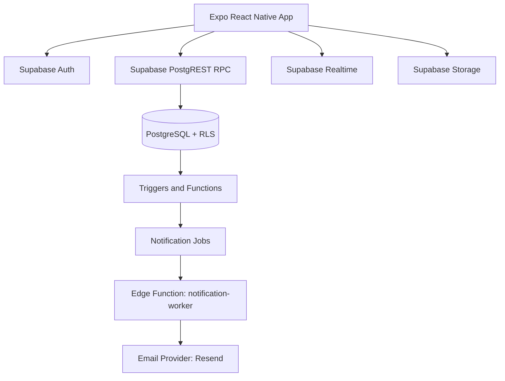

# High-Level Design

## Architecture Summary

Grove uses a mobile-first client backed by Supabase platform services with RLS-first access control.

## Client Layers

- Navigation and route orchestration (`app/`)
- Data hooks and mutations (`hooks/`)
- Service and utility layer (`lib/`)
- Auth and notification state stores (`stores/`)

## Backend Layers

- Authn/Authz: Supabase Auth + RLS
- Domain model: PostgreSQL tables, views, policies
- Orchestration: SQL functions and triggers
- Async processing: edge functions + notification jobs
