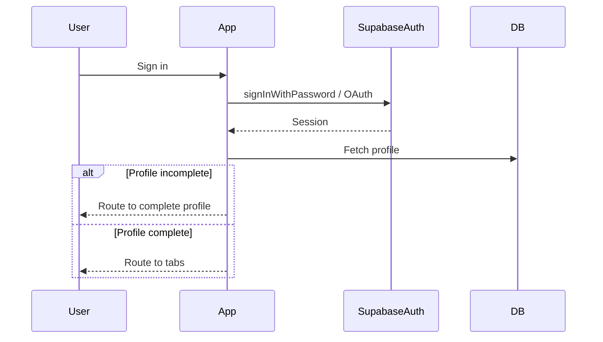
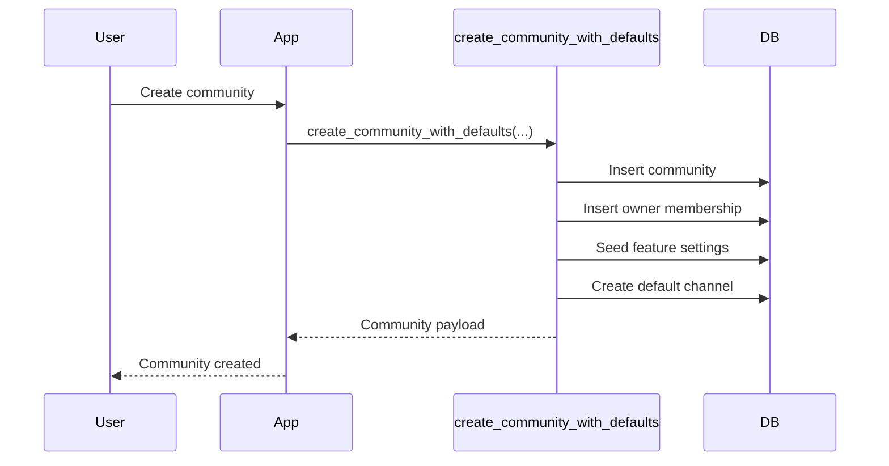
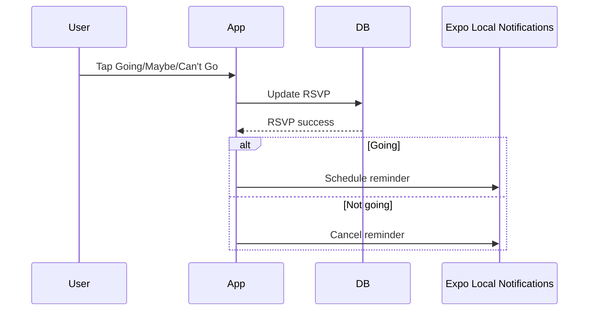
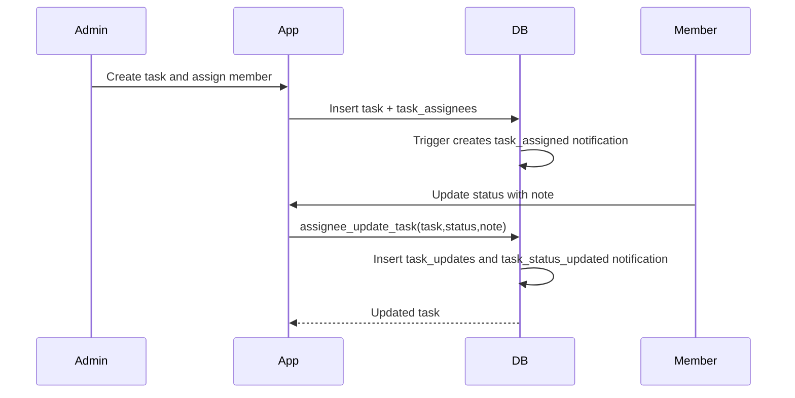
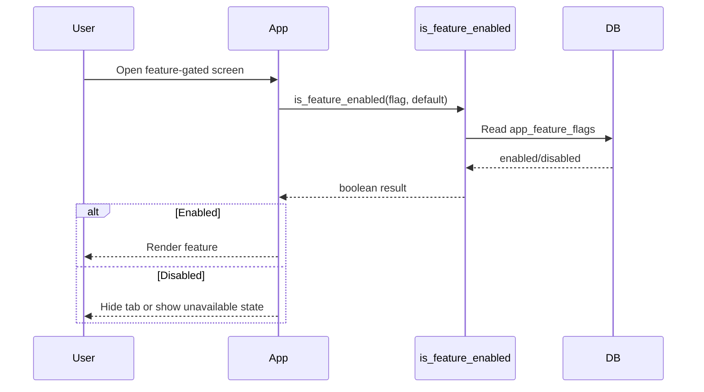

# Sequence Diagrams

## Login and Profile Onboarding

```mermaid
sequenceDiagram
  participant User
  participant App
  participant SupabaseAuth
  participant DB

  User->>App: Sign in
  App->>SupabaseAuth: signInWithPassword / OAuth
  SupabaseAuth-->>App: Session
  App->>DB: Fetch profile
  alt Profile incomplete
    App-->>User: Route to complete profile
  else Profile complete
    App-->>User: Route to tabs
  end
```

## Community Create with Defaults

```mermaid
sequenceDiagram
  participant User
  participant App
  participant RPC as create_community_with_defaults
  participant DB

  User->>App: Create community
  App->>RPC: create_community_with_defaults(...)
  RPC->>DB: Insert community
  RPC->>DB: Insert owner membership
  RPC->>DB: Seed feature settings
  RPC->>DB: Create default channel
  RPC-->>App: Community payload
  App-->>User: Community created
```

## Event RSVP and Reminder

```mermaid
sequenceDiagram
  participant User
  participant App
  participant DB
  participant LocalNotif as Expo Local Notifications

  User->>App: Tap Going/Maybe/Can't Go
  App->>DB: Update RSVP
  DB-->>App: RSVP success
  alt Going
    App->>LocalNotif: Schedule reminder
  else Not going
    App->>LocalNotif: Cancel reminder
  end
```

## Task Assignment and Status Feedback

```mermaid
sequenceDiagram
  participant Admin
  participant App
  participant DB
  participant Member

  Admin->>App: Create task and assign member
  App->>DB: Insert task + task_assignees
  DB->>DB: Trigger creates task_assigned notification
  Member->>App: Update status with note
  App->>DB: assignee_update_task(task,status,note)
  DB->>DB: Insert task_updates and task_status_updated notification
  DB-->>App: Updated task
```

## Feature Flag Runtime Evaluation

```mermaid
sequenceDiagram
  participant User
  participant App
  participant RPC as is_feature_enabled
  participant DB

  User->>App: Open feature-gated screen
  App->>RPC: is_feature_enabled(flag, default)
  RPC->>DB: Read app_feature_flags
  DB-->>RPC: enabled/disabled
  RPC-->>App: boolean result
  alt Enabled
    App-->>User: Render feature
  else Disabled
    App-->>User: Hide tab or show unavailable state
  end
```
