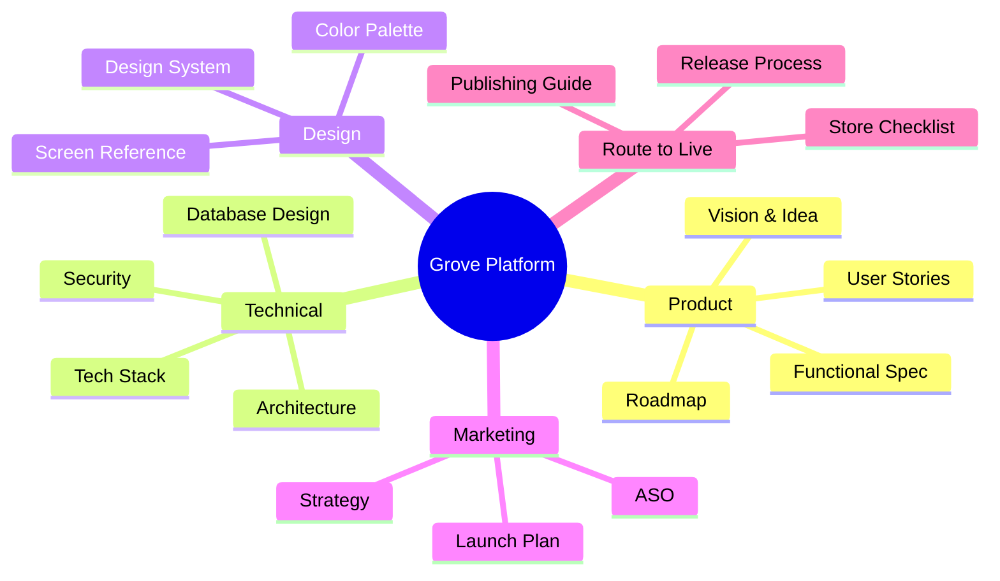

# Grove Documentation Hub

Welcome to the comprehensive documentation for **Grove** - a mobile-first community platform that helps local groups coordinate events, communicate, and manage their activities in one unified app.

---

## Documentation Overview

### Product Documentation

Understand what Grove is, who it's for, and how it works.

| Document | Description |
|----------|-------------|
| [The Idea](/docs/product/idea) | Origin story and problem we're solving |
| [Value Proposition](/docs/product/value-proposition) | Why Grove over alternatives |
| [Target Customers](/docs/product/target-customers) | Who we're building for |
| [Functional Specification](/docs/product/functional-spec) | Complete feature specification with diagrams |
| [User Stories](/docs/product/user-stories) | Detailed user stories with acceptance criteria |
| [Roadmap](/docs/product/roadmap) | 90-day, 6-month, and 12-month priorities |

---

### Technical Documentation

Deep dive into architecture, implementation, and technology decisions.

| Document | Description |
|----------|-------------|
| [Technical Overview](/docs/technical/overview) | High-level technical vision and principles |
| [System Architecture](/docs/technical/architecture) | Complete architecture with Mermaid diagrams |
| [Database Design](/docs/technical/database) | Schema, ER diagrams, and data model |
| [Technology Stack](/docs/technical/tech-stack) | All technologies with rationale |
| [Integrations](/docs/technical/integrations) | External services and APIs |
| [Observability](/docs/technical/observability) | Monitoring, alerting, and operations |
| [Security & Privacy](/docs/technical/security-privacy) | Security architecture and compliance |

---

### Design Documentation

Visual identity, design system, and screen references.

| Document | Description |
|----------|-------------|
| [Design Overview](/docs/design/overview) | Design principles and color palette |
| [Screen Reference](/docs/design/screen-reference) | Screenshot gallery and UI patterns |

---

### Marketing Documentation

Go-to-market strategy and growth planning.

| Document | Description |
|----------|-------------|
| [Marketing Strategy](/docs/marketing/strategy) | Positioning, messaging, and channels |
| [Launch Plan](/docs/marketing/launch-plan) | Pre-launch, launch, and post-launch phases |
| [App Store Optimization](/docs/marketing/app-store-optimization) | ASO strategy and keywords |

---

### Route to Live

Everything needed to publish and maintain the app.

| Document | Description |
|----------|-------------|
| [Publishing Guide](/docs/live/publishing-guide) | Complete Play Store & App Store guide |
| [App Store Checklist](/docs/live/app-store-checklist-table) | 61-item launch checklist |
| [Store Listing](/docs/live/store-listing) | Required assets and copy |
| [Smoke Test](/docs/live/smoke-test) | Pre-release testing checklist |
| [Release Notes](/docs/live/release-notes) | Version release template |
| [Review Notes](/docs/live/review-notes) | App store review preparation |

---

### Legal Documentation

Privacy and terms documentation.

| Document | Description |
|----------|-------------|
| [Privacy Policy](/docs/legal/privacy-policy) | Full privacy policy |
| [Terms of Service](/docs/legal/terms-of-service) | User agreement |

---

## Quick Links

### For Developers
- [System Architecture](/docs/technical/architecture) - Start here for technical overview
- [Database Design](/docs/technical/database) - Understand the data model
- [Tech Stack](/docs/technical/tech-stack) - See all technologies used

### For Product Managers
- [Functional Specification](/docs/product/functional-spec) - Complete feature spec
- [User Stories](/docs/product/user-stories) - All user stories with acceptance criteria
- [Roadmap](/docs/product/roadmap) - What's coming next

### For Launch
- [Publishing Guide](/docs/live/publishing-guide) - How to publish to app stores
- [App Store Checklist](/docs/live/app-store-checklist-table) - Everything you need before launch

---

## Contributing

To contribute to this documentation:

1. Add new pages under the relevant section directory
2. Use Markdown with Mermaid diagrams where helpful
3. Keep content concise and avoid redundancy
4. Update the sidebar if adding new sections

---

## Technology

This documentation is built with:
- **Docusaurus 3.9** - Documentation framework
- **Mermaid** - Diagrams and flowcharts
- **GitHub Pages** - Hosting

Visit the live documentation at: [sridivya811996.github.io/grove-documentation](https://sridivya811996.github.io/grove-documentation/)
