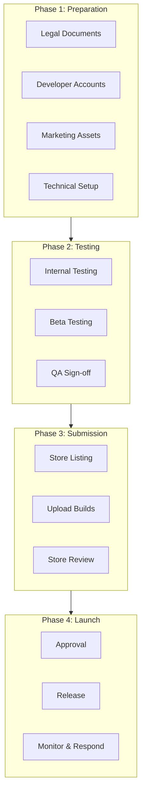
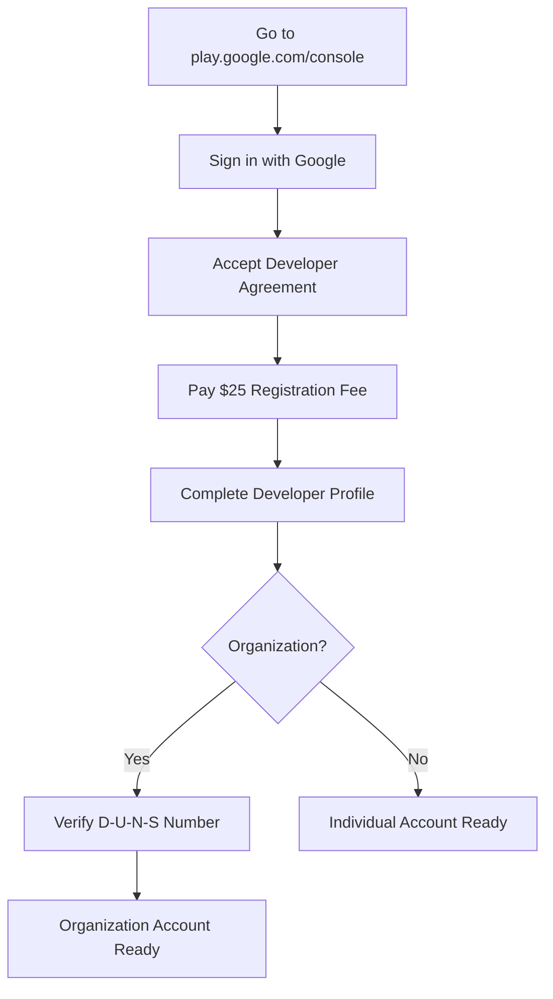
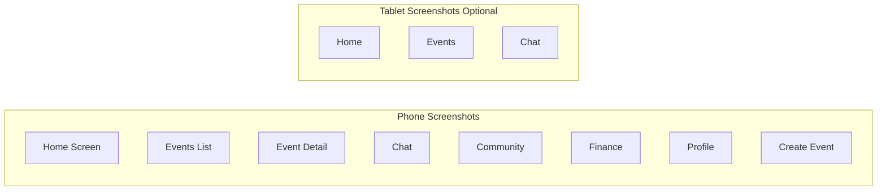
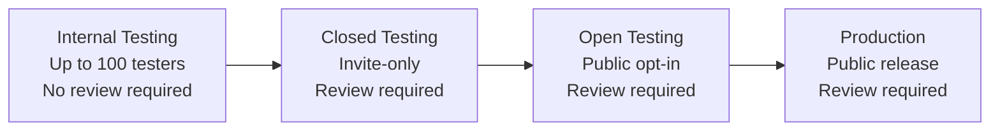
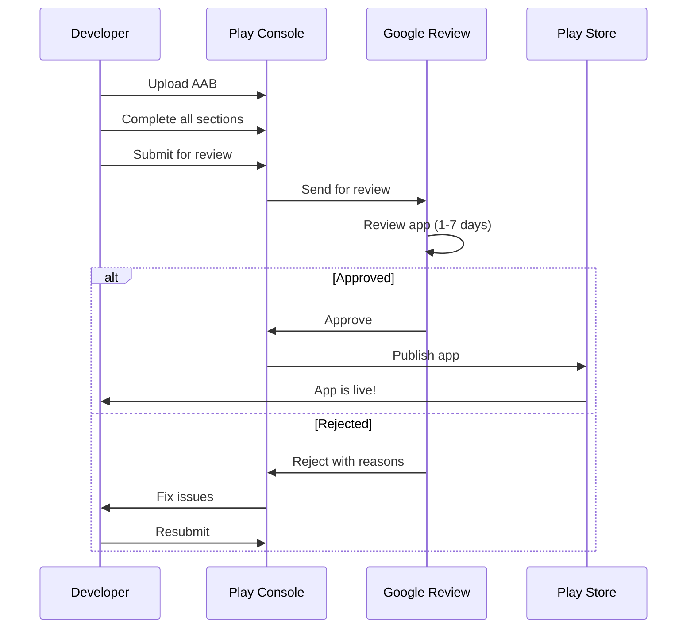
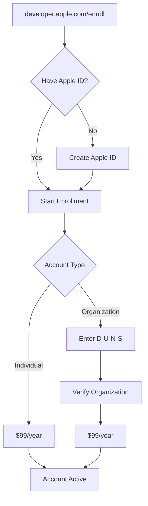
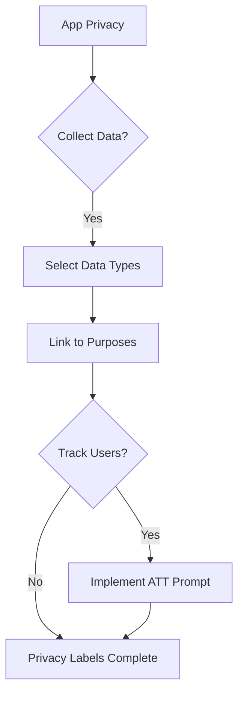
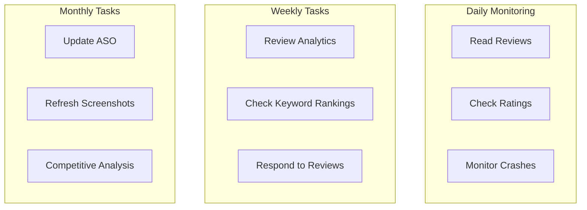
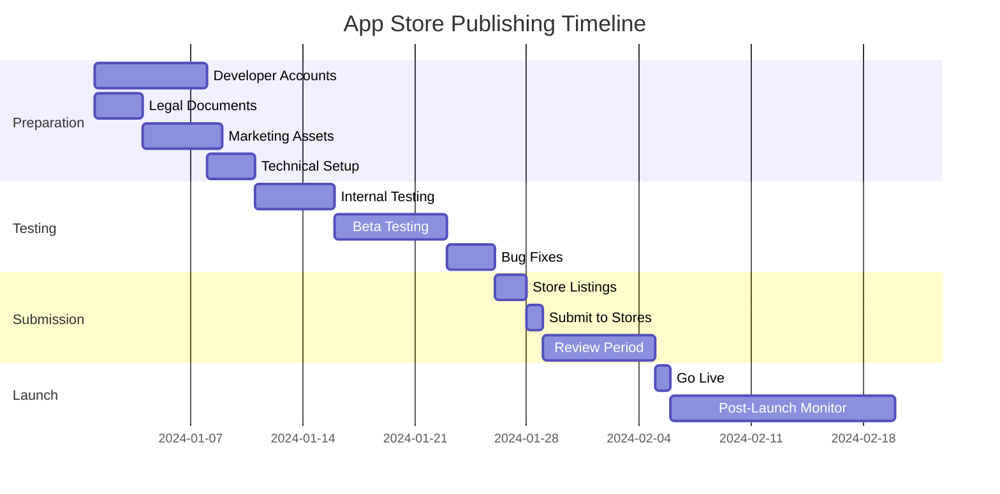

# App Store Publishing Guide

This comprehensive guide covers everything you need to publish Grove on both the Google Play Store and Apple App Store. Follow this guide as your roadmap from development to live app.

## Publishing Overview



---

## Google Play Store

### Step 1: Create Developer Account

**Prerequisites:**
- Google account
- Valid payment method
- $25 one-time registration fee

**Process:**



**Developer Profile Requirements:**

| Field | Required | Notes |
|-------|----------|-------|
| Developer name | Yes | Displayed on Play Store |
| Email | Yes | For Google communications |
| Phone | Yes | Verification |
| Website | Recommended | Your landing page |
| Physical address | Yes | Required for contact |

**Timeline:** 2-5 business days for verification (longer for organizations)

---

### Step 2: Create Your App Listing

**Navigate to:** Play Console → Create app

**App Details:**

| Field | Value | Notes |
|-------|-------|-------|
| App name | Grove | Max 30 characters |
| Default language | English | Primary language |
| App or Game | App | Community app |
| Free or Paid | Free | Premium via IAP later |

#### Store Listing Content

**Short Description (80 characters):**
```
Coordinate your community - events, chat, finance, all in one place.
```

**Full Description (4000 characters):**
```
Grove is the all-in-one app for community organizers and members. Whether you're
running a neighborhood association, sports club, faith community, or hobby group,
Grove brings everything together in one simple app.

KEY FEATURES

📅 EVENTS & MEETINGS
• Create one-time or recurring events
• Track RSVPs and attendance
• Send automatic reminders
• Add meeting agendas and notes

💬 COMMUNICATION
• Real-time group chat
• Community feed for announcements
• @mention community members
• Push notifications for updates

💰 FINANCE TRACKING
• Track community income and expenses
• Create contribution requests
• Split costs among members
• Settlement tracking

✅ TASKS & ACTIVITIES
• Assign tasks to members
• Track completion status
• Link tasks to events

👥 MEMBER MANAGEMENT
• Multiple join methods (invite code, request, public)
• Role-based permissions (Owner, Admin, Member)
• Member directory

WHY GROVE?

Unlike generic messaging apps, Grove is purpose-built for communities. No more
scattered WhatsApp groups, shared spreadsheets, and email chains. Everything
your community needs is in one place.

• Simple to use, no training required
• Works offline with sync
• Privacy-focused - your data stays yours
• Free for communities up to 100 members

GET STARTED

1. Download Grove
2. Create or join a community
3. Invite your members
4. Start coordinating!

Perfect for:
• Neighborhood associations
• Sports clubs and teams
• Faith communities
• Volunteer organizations
• Parent groups
• Hobby clubs
• Professional networks

Have questions? Contact us at support@grove.app

Privacy Policy: https://grove.app/privacy
Terms of Service: https://grove.app/terms
```

---

### Step 3: Prepare Visual Assets

#### Required Screenshots



**Screenshot Specifications:**

| Asset | Dimensions | Format | Quantity |
|-------|------------|--------|----------|
| Phone screenshots | 1080 x 1920 min | JPEG/PNG | 2-8 |
| 7" tablet | 1024 x 500 | JPEG/PNG | Optional |
| 10" tablet | 1024 x 500 | JPEG/PNG | Optional |
| Feature graphic | 1024 x 500 | JPEG/PNG | Required |
| App icon | 512 x 512 | PNG | Required |

**Screenshot Best Practices:**
1. Show real app screens, not mockups
2. Add captions highlighting features
3. Use device frames for professional look
4. First 2 screenshots are most important
5. Show variety of features

#### Feature Graphic Design

```
┌─────────────────────────────────────────┐
│                                         │
│    [Grove Logo]                        │
│                                         │
│    "Your Community,                    │
│     Organized"                         │
│                                         │
│    [App Screenshot Preview]            │
│                                         │
└─────────────────────────────────────────┘
1024 x 500 pixels
```

---

### Step 4: Content Rating

Complete the **Content Rating Questionnaire** in Play Console:

**Common Answers for Grove:**

| Question | Answer |
|----------|--------|
| Violence | No |
| Sexual content | No |
| Profanity | No (user-generated - moderate) |
| Drugs/alcohol | No |
| Gambling | No |
| User interaction | Yes (chat, posts) |
| Data collection | Yes (see privacy policy) |

**Expected Rating:** Everyone (E) or Teen (T) depending on user-generated content responses

---

### Step 5: Data Safety Declaration

Complete the **Data Safety Form**:

**Data Collection:**

| Data Type | Collected | Shared | Purpose |
|-----------|-----------|--------|---------|
| Name | Yes | No | Profile, display |
| Email | Yes | No | Authentication |
| Phone | Optional | No | Profile |
| Photos | Yes | No | Profile, posts |
| Messages | Yes | No | Chat feature |
| Device ID | Yes | No | Analytics |
| Crash logs | Yes | No | Debugging |

**Security Practices:**
- Data encrypted in transit ✓
- Data encrypted at rest ✓
- User can request deletion ✓
- Data deletion on uninstall: No (cloud-stored)

---

### Step 6: Testing Tracks



#### Internal Testing (Recommended First)

1. Go to **Testing → Internal testing**
2. Create a release
3. Upload your AAB file
4. Add tester emails (up to 100)
5. Share opt-in link
6. Testers can access immediately (no review)

#### Closed Testing

1. Go to **Testing → Closed testing**
2. Create a track
3. Upload AAB
4. Add testers via email or Google Groups
5. Submit for review
6. Wait for approval (usually 1-3 days)

---

### Step 7: Production Release

**Pre-submission Checklist:**

- [ ] Store listing complete
- [ ] All screenshots uploaded
- [ ] Feature graphic uploaded
- [ ] Privacy policy URL added
- [ ] Content rating completed
- [ ] Data safety form completed
- [ ] App signing configured
- [ ] AAB uploaded
- [ ] Release notes written

**Release Process:**



---

## Apple App Store

### Step 1: Create Developer Account

**Prerequisites:**
- Apple ID
- Valid payment method
- $99/year subscription
- D-U-N-S number (for organizations)

**Process:**



**Timeline:**
- Individual: 24-48 hours
- Organization: 1-2 weeks (D-U-N-S verification)

---

### Step 2: App Store Connect Setup

**Navigate to:** App Store Connect → My Apps → + New App

**App Information:**

| Field | Value |
|-------|-------|
| Platforms | iOS |
| Name | Grove |
| Primary Language | English |
| Bundle ID | com.grove.app |
| SKU | grove-community-app |

---

### Step 3: App Store Listing

#### App Information

**Subtitle (30 characters):**
```
Community Coordination Made Easy
```

**Keywords (100 characters):**
```
community,events,groups,club,organization,scheduling,rsvp,chat,members,coordination
```

**Description:**
Same as Google Play (adapt formatting for iOS style)

**What's New (Release Notes):**
```
Version 1.0.0 - Initial Release

• Create and join communities
• Schedule events with recurring options
• Real-time group chat
• Track community finances
• Manage tasks and activities
• Push notifications for updates

We'd love your feedback! Contact support@grove.app
```

#### Screenshots

**iPhone Screenshots Required:**

| Device Size | Dimensions | Required |
|-------------|------------|----------|
| 6.9" Display | 1320 x 2868 | Yes |
| 6.5" Display | 1284 x 2778 | Yes |
| 5.5" Display | 1242 x 2208 | Yes |

**iPad Screenshots (if supporting iPad):**

| Device Size | Dimensions | Required |
|-------------|------------|----------|
| 13" Display | 2064 x 2752 | If iPad |
| 12.9" Display | 2048 x 2732 | If iPad |

---

### Step 4: App Privacy Details

Complete the **App Privacy** section:



**Data Types to Declare:**

| Category | Data Type | Usage |
|----------|-----------|-------|
| Contact Info | Email | Account, communications |
| Contact Info | Name | Profile display |
| Contact Info | Phone Number | Profile (optional) |
| User Content | Photos | Profile, posts |
| User Content | Other User Content | Messages, posts |
| Identifiers | User ID | App functionality |
| Usage Data | Product Interaction | Analytics |
| Diagnostics | Crash Data | Bug fixing |

**Data Linked to User:**
- Contact Info
- User Content
- Identifiers

**Data NOT Used to Track:**
- All data (Grove does not track across apps)

---

### Step 5: App Review Information

**Demo Account Credentials:**
```
Email: reviewer@grove.app
Password: [secure password]
Notes: This account has access to a demo community with sample events, messages, and finance records.
```

**Review Notes:**
```
Thank you for reviewing Grove!

IMPORTANT STEPS TO TEST:
1. Sign in with the demo account above
2. You'll see a demo community called "Test Community"
3. Navigate through Events, Chat, Finance, and Profile tabs
4. Try creating a new event (will be visible to demo members)

FEATURES REQUIRING NETWORK:
- Real-time chat requires internet connection
- Push notifications work on physical device only

SIGN-IN OPTIONS:
- Email/password (use demo account)
- Sign in with Google (requires Google account)
- Sign in with Apple (iOS 13+)

If you have questions, contact: support@grove.app
```

---

### Step 6: Build and Submit

#### Create Production Build

```bash
# Configure EAS
eas build:configure

# Create iOS production build
eas build --platform ios --profile production

# Submit directly to App Store Connect
eas submit --platform ios
```

#### Manual Upload (Alternative)

1. Download .ipa from EAS
2. Open Transporter app (macOS)
3. Upload .ipa file
4. Wait for processing in App Store Connect

---

### Step 7: Submit for Review

**Pre-submission Checklist:**

- [ ] App Information complete
- [ ] Pricing set (Free)
- [ ] All screenshots uploaded
- [ ] App Privacy completed
- [ ] Age Rating completed
- [ ] Review Information filled
- [ ] Build selected
- [ ] Version number correct
- [ ] Export compliance answered

**Common Rejection Reasons:**

| Reason | Prevention |
|--------|------------|
| Incomplete metadata | Fill all required fields |
| Broken links | Test all URLs |
| Login required, no demo | Provide demo account |
| Crashes | Test on multiple devices |
| Privacy policy missing | Host and link policy |
| Guideline 4.2 (minimum functionality) | Ensure core features work |

---

## Post-Launch Checklist

### Monitoring



### Review Response Templates

**Positive Review Response:**
```
Thank you so much for the kind words! We're thrilled that Grove is helping
your community stay organized. If you ever have suggestions for new features,
we'd love to hear from you at feedback@grove.app! 🌳
```

**Bug Report Response:**
```
We're sorry to hear you experienced this issue. Our team is looking into it.
Could you please email us at support@grove.app with details about your device
and the steps that led to the problem? We want to make sure we fix this for you.
```

**Feature Request Response:**
```
Thank you for the suggestion! We're always looking for ways to make Grove better
for communities like yours. We've added this to our feature consideration list.
Keep the ideas coming at feedback@grove.app!
```

---

## Timeline Summary



---

## Cost Summary

| Item | Google Play | Apple App Store |
|------|-------------|-----------------|
| Developer Account | $25 (one-time) | $99/year |
| App Review | Free | Free |
| Updates | Free | Free |
| **Total First Year** | **$25** | **$99** |
| **Annual Renewal** | **$0** | **$99** |

**Optional Costs:**

| Item | Cost Range |
|------|------------|
| Professional screenshots | $100-500 |
| App preview video | $0-300 |
| ASO tools | $0-100/month |
| Designer for assets | $100-500 |

---

## Troubleshooting

### Common Issues

| Issue | Solution |
|-------|----------|
| Build rejected (iOS) | Check rejection reason in Resolution Center |
| AAB upload fails | Verify signing configuration |
| Screenshots rejected | Check dimensions and content guidelines |
| Review taking too long | Normal for new accounts; wait or contact support |
| App crashes on review | Test on clean device, check for API key issues |

### Support Contacts

- **Google Play Console Help:** support.google.com/googleplay/android-developer
- **Apple Developer Support:** developer.apple.com/contact
- **EAS Build Issues:** expo.dev/support
