# Functional Specification

This document provides a complete functional specification for the Grove community platform, detailing features, user flows, and acceptance criteria for MVP and future phases.

## Executive Summary

Grove is a mobile-first platform that helps local communities coordinate their activities through a unified app experience. The platform replaces fragmented tools (WhatsApp groups, spreadsheets, email chains) with a purpose-built solution for community management.

### Key Value Propositions

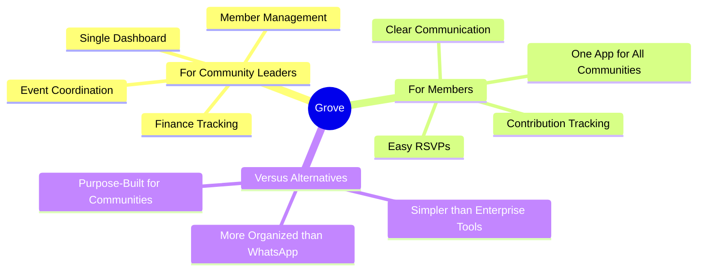

---

## MVP Scope (Phase 1)

### Core Features Overview

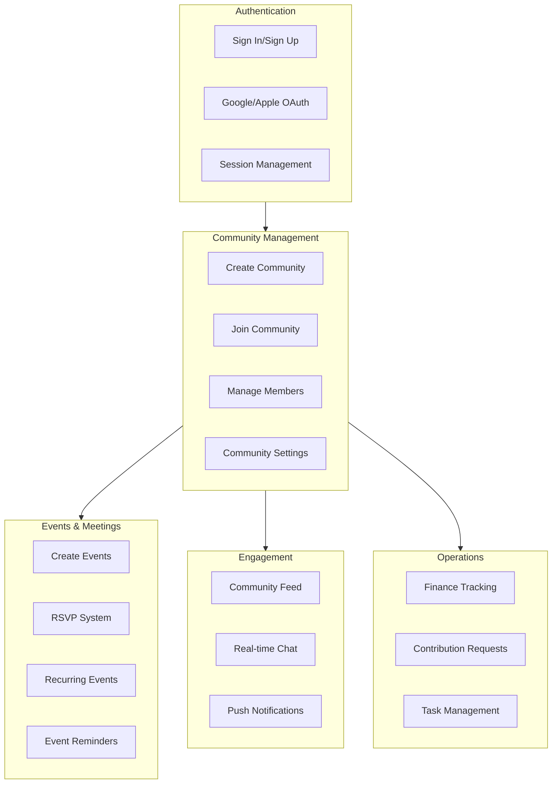

---

## Feature Specifications

### 1. Authentication

#### 1.1 Email Authentication

**User Flow:**

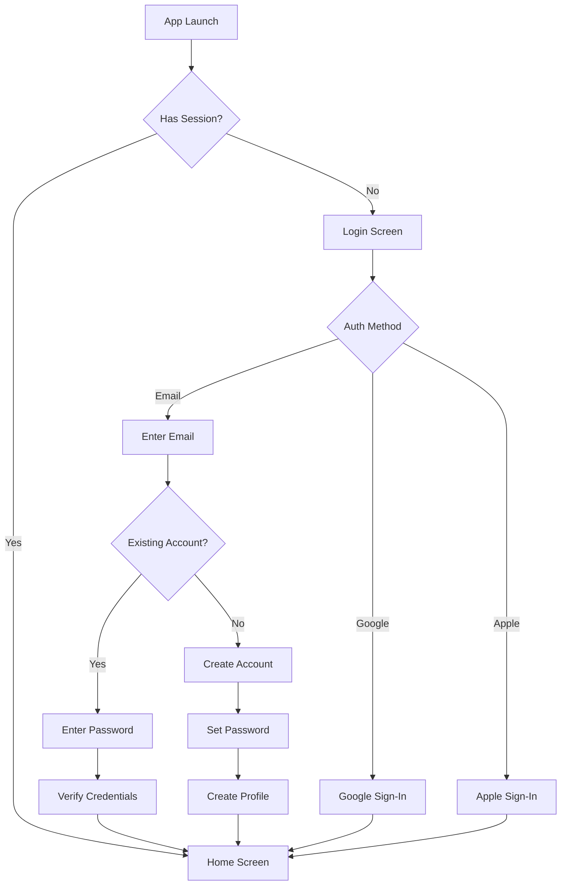

**Acceptance Criteria:**

| Scenario | Expected Behavior |
|----------|-------------------|
| Valid email + password | User logged in, redirected to home |
| Invalid password | Error message, retry allowed |
| New email | Prompt to create account |
| Weak password | Show password requirements |
| Network error | Offline message with retry |

#### 1.2 OAuth Sign-In

**Supported Providers:**
- Google Sign-In (iOS, Android)
- Apple Sign-In (iOS only, required by Apple)

**Flow Diagram:**

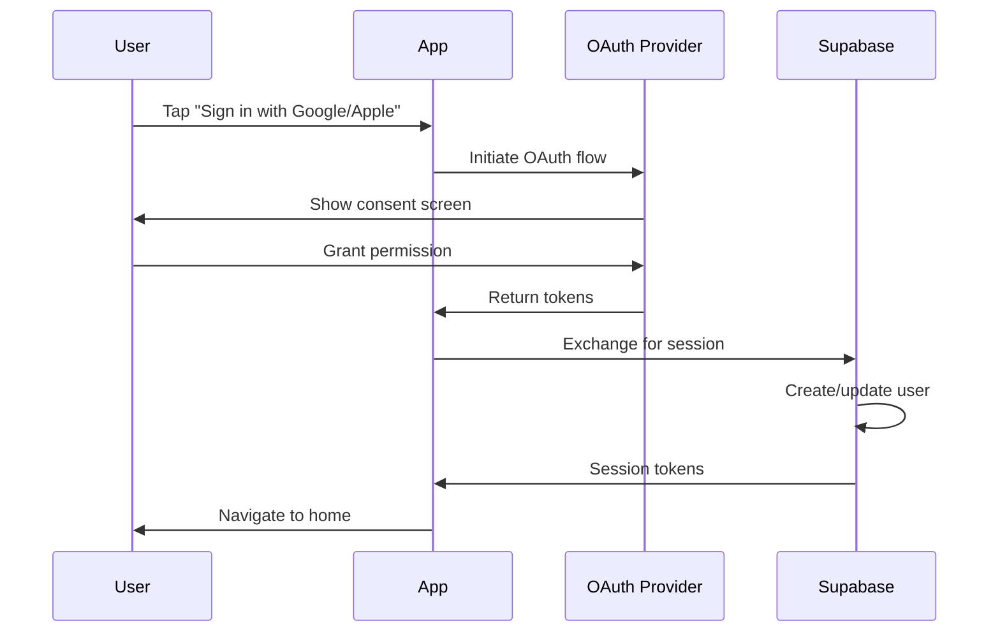

#### 1.3 Password Recovery

**Flow:**
1. User taps "Forgot Password"
2. Enter registered email
3. Receive reset link via email
4. Click link to open app
5. Enter new password
6. Password updated, redirected to login

---

### 2. Community Management

#### 2.1 Create Community

**Form Fields:**

| Field | Type | Required | Validation |
|-------|------|----------|------------|
| Name | Text | Yes | 3-50 characters |
| Description | Textarea | No | Max 500 characters |
| Category | Select | No | Predefined list |
| Location | Text | No | City/Region |
| Image | Image | No | Max 5MB, JPEG/PNG |
| Join Mode | Radio | Yes | Private/Request/Public |

**Flow Diagram:**

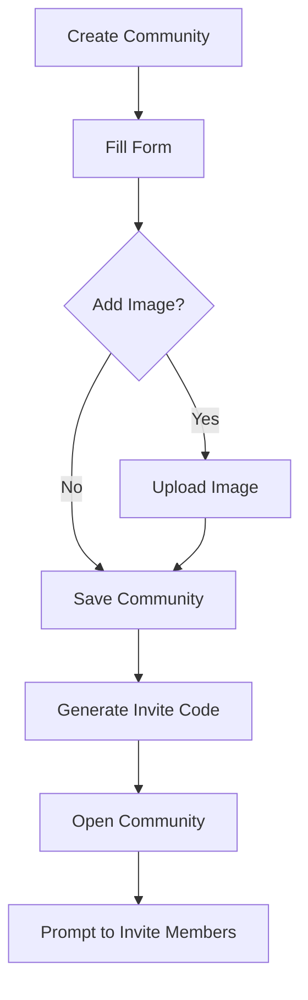

#### 2.2 Join Community

**Three Join Methods:**

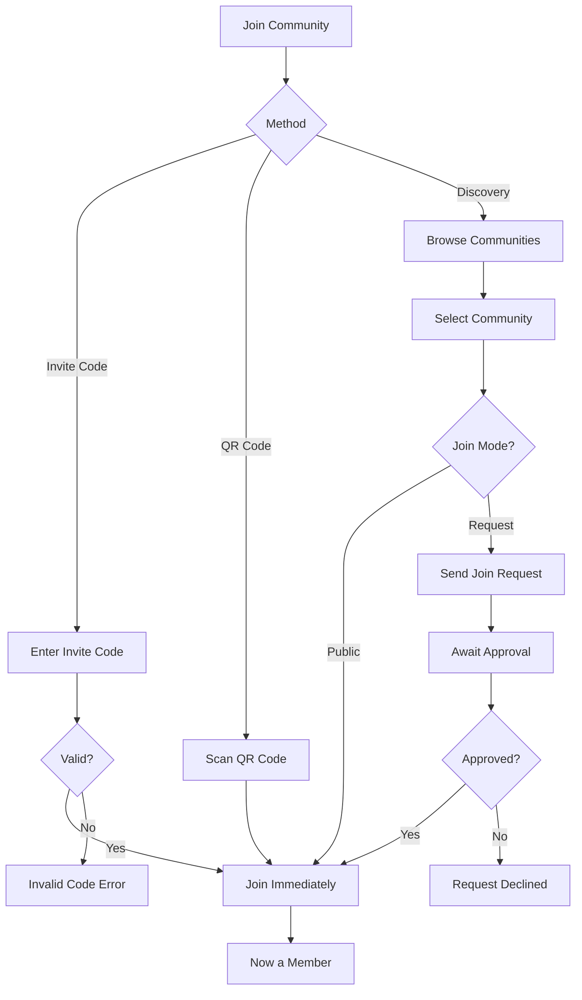

#### 2.3 Member Management

**Admin Capabilities:**

| Action | Owner | Admin | Member |
|--------|-------|-------|--------|
| View members | Yes | Yes | Yes |
| Invite members | Yes | Yes | No |
| Approve requests | Yes | Yes | No |
| Remove members | Yes | Yes (not owner) | No |
| Change roles | Yes | No | No |
| Transfer ownership | Yes | No | No |

**Member List Screen:**
- Display name and avatar
- Show role badge (Owner/Admin/Member)
- Join date
- Admin actions menu

---

### 3. Events & Meetings

#### 3.1 Create Event

**Event Creation Flow:**

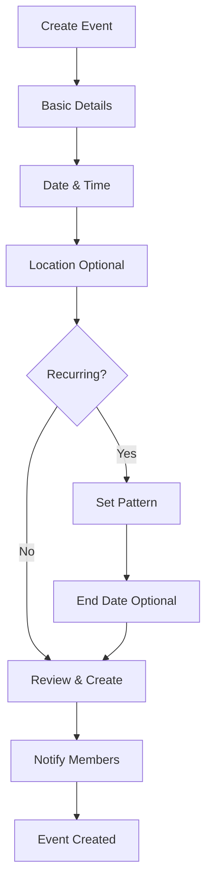

**Event Fields:**

| Field | Type | Required | Notes |
|-------|------|----------|-------|
| Title | Text | Yes | Max 100 characters |
| Description | Textarea | No | Max 1000 characters |
| Start Date/Time | DateTime | Yes | Must be future |
| End Date/Time | DateTime | No | After start time |
| Location | Text | No | Free text |
| Agenda | Textarea | No | Meeting agenda |
| Is Recurring | Toggle | No | Default: No |
| Recurrence Type | Select | If recurring | Daily/Weekly/Biweekly/Monthly/Yearly |
| Recurrence Days | Multi-select | If weekly | Sunday-Saturday |
| Recurrence End | Date | If recurring | Optional end date |

#### 3.2 Recurring Events

**Recurrence Patterns:**

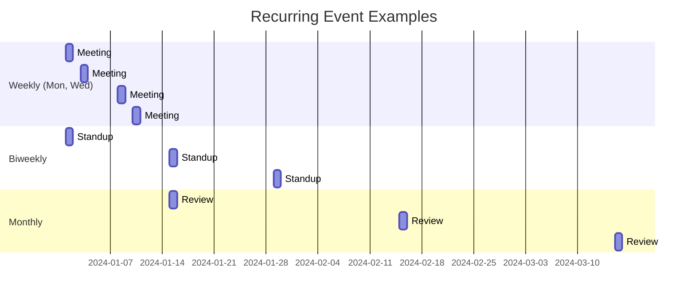

#### 3.3 RSVP System

**RSVP States:**

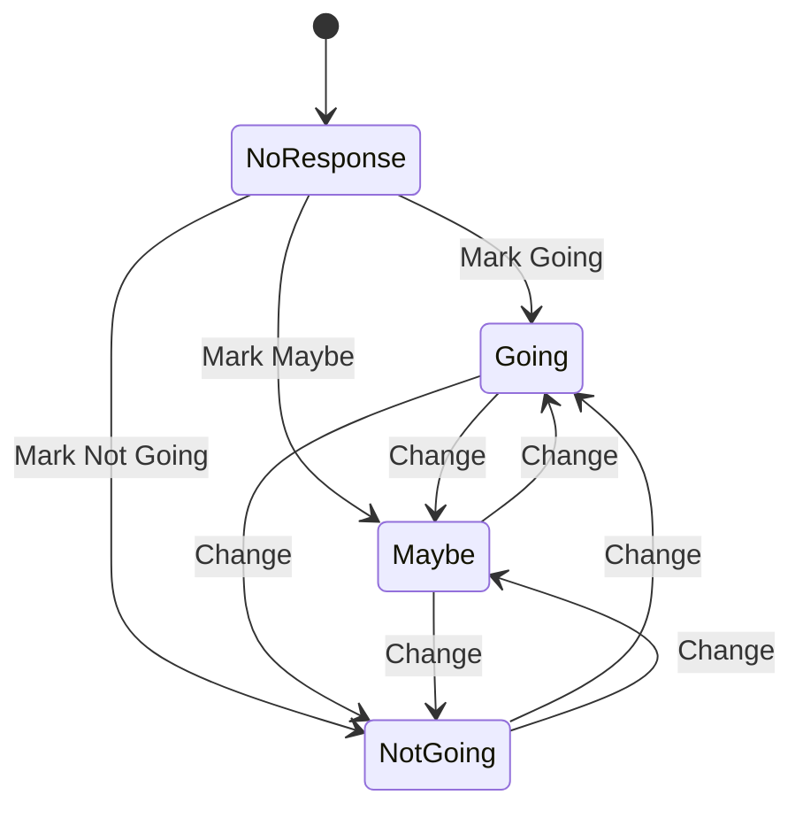

**RSVP Display:**
- Going count with member avatars
- Maybe count
- Not Going count
- No Response count
- Quick actions to change status

---

### 4. Communication

#### 4.1 Community Feed

**Post Types:**
- Text post
- Image post (up to 4 images)
- Mixed text and images

**Feed Features:**
- Chronological display
- Pull to refresh
- Infinite scroll pagination
- Post author with avatar
- Timestamp (relative)
- Comment count
- Quick comment access

**Post Actions:**
- Add comment
- Edit (own posts only)
- Delete (own posts or admin)

#### 4.2 Real-time Chat

**Chat Flow:**

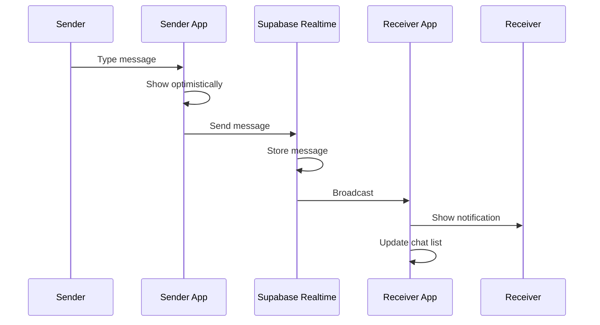

**Message Features:**
- Text messages
- Image attachments (up to 4)
- Delivery status indicators
- Typing indicators (future)
- Read receipts (future)

#### 4.3 Notifications

**Notification Types:**

| Type | Trigger | Sound | Badge |
|------|---------|-------|-------|
| Event Reminder | 1 hour before | Yes | Yes |
| New Message | Message in channel | Yes | Yes |
| Task Assigned | Task assignment | Yes | Yes |
| Join Request | User requests | Yes | Yes |
| Request Approved | Admin approves | Yes | Yes |
| Contribution Due | Payment reminder | Yes | Yes |

---

### 5. Finance & Contributions

#### 5.1 Transaction Tracking

**Transaction Types:**

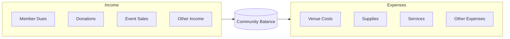

**Transaction Fields:**

| Field | Type | Required |
|-------|------|----------|
| Type | Select | Yes (Income/Expense) |
| Amount | Number | Yes |
| Currency | Select | Yes (default from settings) |
| Description | Text | Yes |
| Category | Select | No |
| Date | Date | Yes (default today) |
| Receipt | Image | No |

#### 5.2 Contribution Requests

**Contribution Flow:**

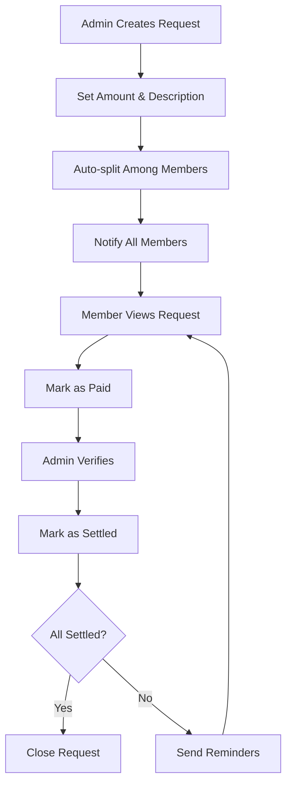

**Request Features:**
- Total amount and per-member split
- Due date
- Settlement tracking per member
- Payment confirmation
- Outstanding balance view

---

### 6. User Profile

#### 6.1 Profile Fields

| Field | Editable | Visibility |
|-------|----------|------------|
| Full Name | Yes | Community members |
| Avatar | Yes | Community members |
| Email | No (from auth) | Settings only |
| Phone | Yes | Optional |
| Bio | Yes | Community members |
| Preferred Currency | Yes | Self only |

#### 6.2 Profile Actions

- Edit profile
- Change password
- Notification settings
- Community list
- Leave community
- Sign out
- Delete account

---

## Phase 2 Enhancements

### Planned Features

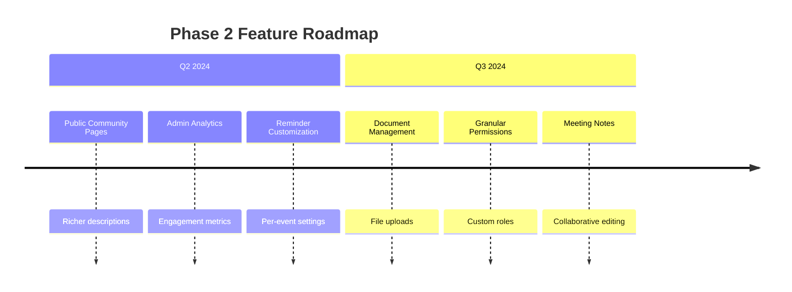

**Feature Details:**

| Feature | Description | Priority |
|---------|-------------|----------|
| Public Pages | SEO-friendly community pages | High |
| Analytics Dashboard | Event attendance, engagement trends | High |
| Custom Reminders | Configure reminder timing per event | Medium |
| Document Storage | Upload and share files | Medium |
| Custom Roles | Define custom permission sets | Low |
| Meeting Notes | Collaborative note-taking | Medium |

---

## Phase 3 Long-term

### Future Capabilities

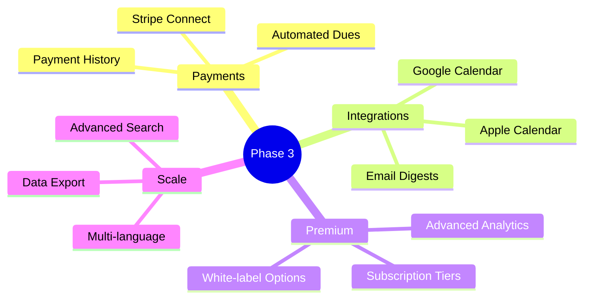

---

## Out of Scope (MVP)

The following features are explicitly excluded from MVP:

| Feature | Reason | Future Phase |
|---------|--------|--------------|
| Real-time video | Complexity, infrastructure | Phase 3+ |
| Payment processing | Regulatory, complexity | Phase 2 |
| Advanced moderation | Manual review sufficient | Phase 2 |
| Public discovery | Focus on invited communities | Phase 2 |
| Desktop/web app | Mobile-first priority | Phase 3 |
| API for integrations | Internal use only | Phase 3 |

---

## Non-Functional Requirements

### Performance

| Metric | Target |
|--------|--------|
| App launch | < 2 seconds |
| Screen navigation | < 300ms |
| API response (p95) | < 500ms |
| Image upload | < 5 seconds |
| Push delivery | < 10 seconds |

### Reliability

| Metric | Target |
|--------|--------|
| App crash rate | < 0.1% |
| API availability | 99.9% |
| Data durability | 99.99% |

### Security

See [Security & Privacy](/docs/technical/security-privacy) documentation.

### Accessibility

- VoiceOver/TalkBack support
- Minimum touch targets (44pt)
- Color contrast compliance (WCAG AA)
- Screen reader labels

---

## Success Metrics

### MVP Launch Criteria

- [ ] All P0 features functional
- [ ] < 1% crash rate
- [ ] < 500ms p95 API latency
- [ ] Passing security review
- [ ] Privacy policy published
- [ ] App store compliance

### Key Performance Indicators

| Metric | Target (Launch +30d) |
|--------|---------------------|
| Daily Active Users | 100+ |
| Communities Created | 20+ |
| Events Created | 50+ |
| User Retention (D7) | > 30% |
| App Store Rating | > 4.0 |
