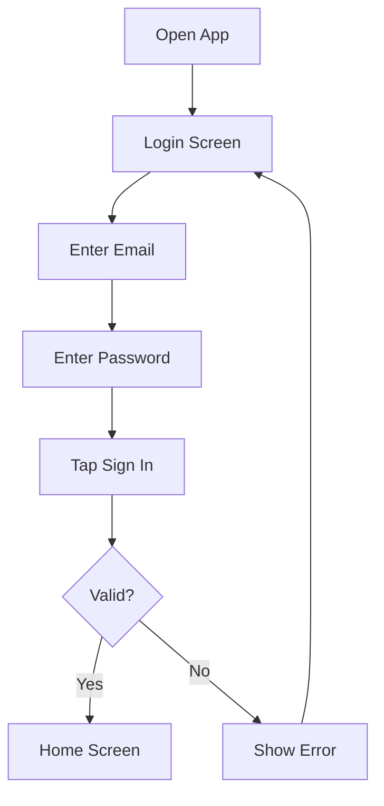
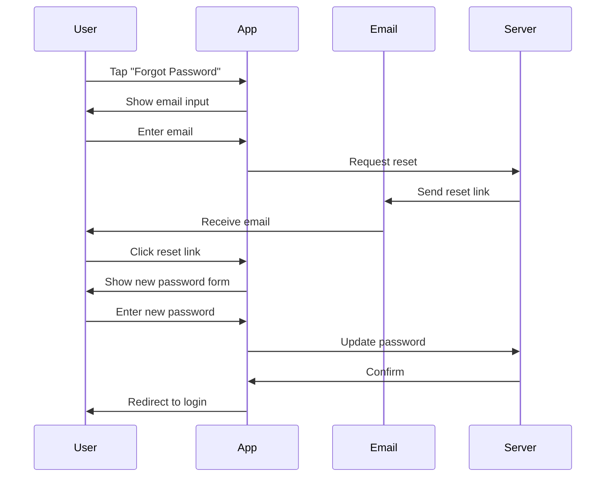
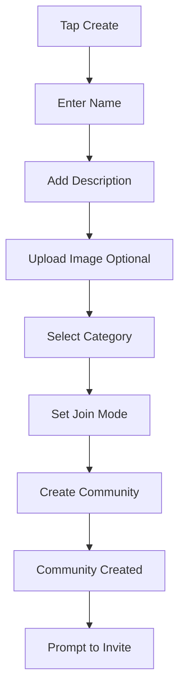
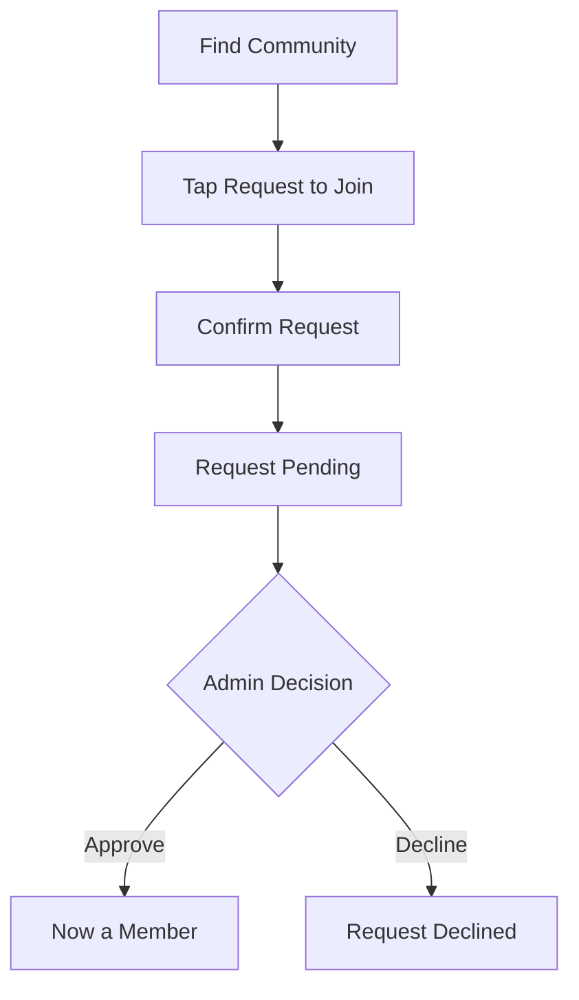
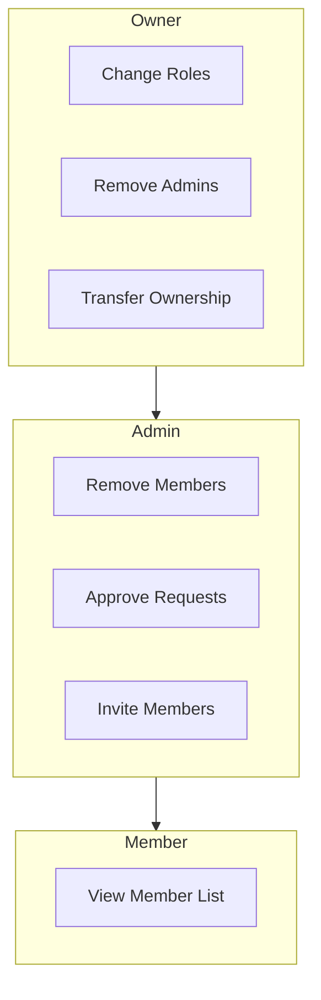
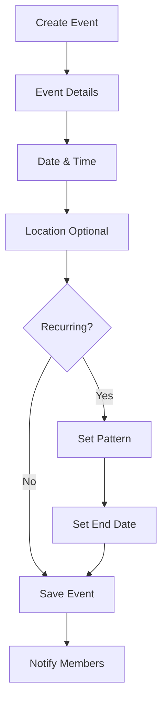
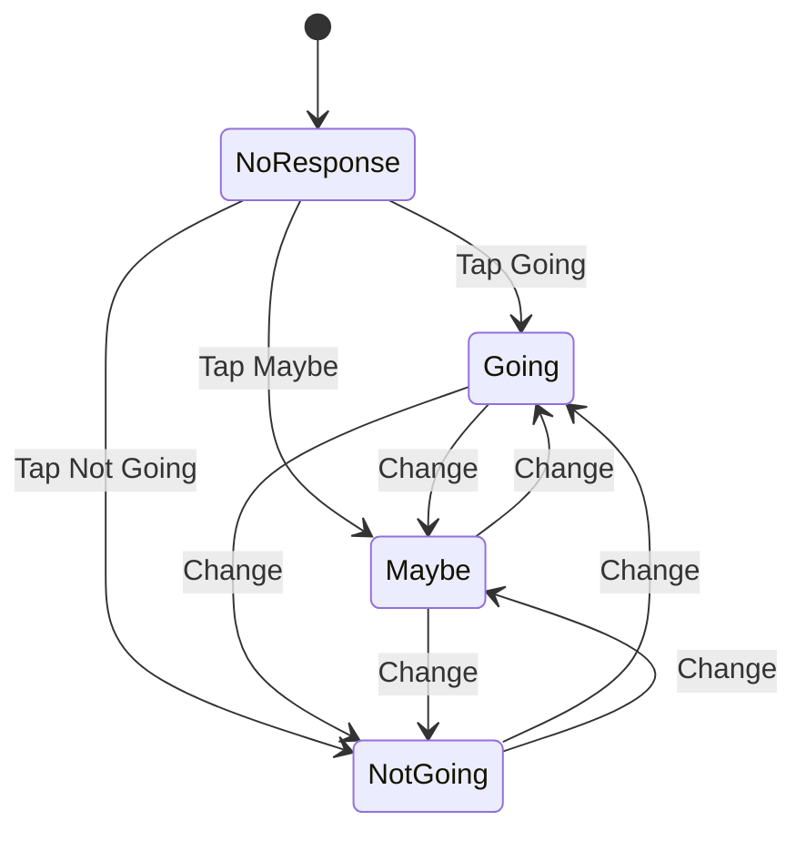
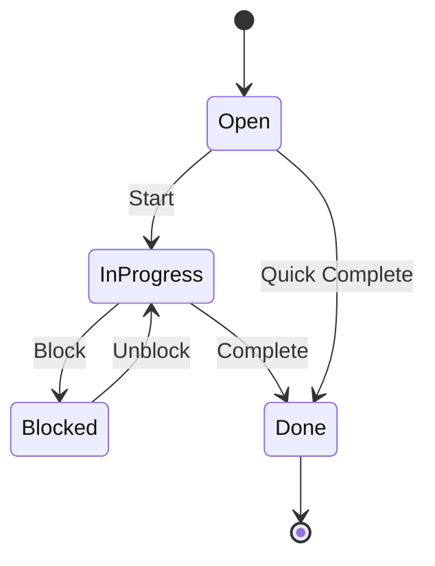
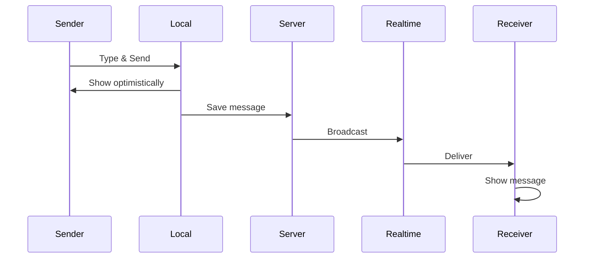
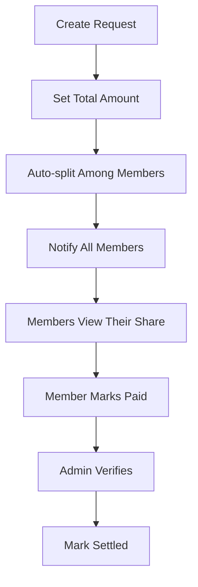

# User Stories

This document contains detailed user stories organized by functional area. Each story includes acceptance criteria, priority, and implementation notes.

## Story Format

Each user story follows this format:
- **As a** [role]
- **I want to** [capability]
- **So that** [benefit]

With acceptance criteria defining when the story is complete.

---

## Authentication

### AUTH-001: Sign in with Email

**Priority:** P0 (MVP)

**Story:**
> As a user, I want to sign in with my email and password so that I can access my community data securely.

**Acceptance Criteria:**

| Criterion | Expected Behavior |
|-----------|-------------------|
| Valid credentials | User logged in, redirected to home |
| Invalid email format | Show "Invalid email" error |
| Wrong password | Show "Invalid credentials" error |
| Empty fields | Show "Required" field errors |
| Network error | Show "Unable to connect" with retry |
| Session persistence | Stay logged in after app restart |

---

### AUTH-002: Sign in with Google

**Priority:** P0 (MVP)

**Story:**
> As a user, I want to sign in with Google so that I can start using the app quickly without creating a new password.

**Acceptance Criteria:**

| Criterion | Expected Behavior |
|-----------|-------------------|
| Google account selected | User authenticated and redirected to home |
| First-time user | Profile created from Google data |
| Existing user | Linked to existing account |
| OAuth cancelled | Return to login screen gracefully |
| OAuth failed | Show error with retry option |

---

### AUTH-003: Sign in with Apple (iOS)

**Priority:** P0 (MVP - Required for iOS)

**Story:**
> As an iOS user, I want to sign in with Apple so that I can use my existing Apple ID and protect my privacy.

**Acceptance Criteria:**

| Criterion | Expected Behavior |
|-----------|-------------------|
| Apple ID authenticated | User logged in via Face ID/Touch ID |
| Hide My Email selected | App receives relay email address |
| First-time user | Profile created (name may be hidden) |
| Existing user | Linked to existing account |

---

### AUTH-004: Password Recovery

**Priority:** P1 (MVP)

**Story:**
> As a user, I want to reset my password via email so that I can regain access if I forget my password.

**Flow:**

**Acceptance Criteria:**

| Criterion | Expected Behavior |
|-----------|-------------------|
| Valid email entered | Reset email sent within 1 minute |
| Invalid/unknown email | Generic success message (security) |
| Reset link clicked | Open app to password reset screen |
| Valid new password | Password updated, redirect to login |
| Expired link | Show "Link expired" with resend option |

---

### AUTH-005: Stay Signed In

**Priority:** P0 (MVP)

**Story:**
> As a user, I want to stay signed in so that I don't have to log in every time I open the app.

**Acceptance Criteria:**

| Criterion | Expected Behavior |
|-----------|-------------------|
| App reopened | User remains authenticated |
| Token expired | Auto-refresh in background |
| Refresh failed | Prompt to sign in again |
| Sign out | Clear all tokens, return to login |

---

## Community & Membership

### COMM-001: Create Community

**Priority:** P0 (MVP)

**Story:**
> As an organizer, I want to create a community so that I can set up a space for my group.

**Form Flow:**

**Acceptance Criteria:**

| Criterion | Expected Behavior |
|-----------|-------------------|
| Valid name (3-50 chars) | Community created |
| Name too short | Show "Min 3 characters" error |
| Image uploaded | Image displayed on community |
| Join mode selected | Enforced on join attempts |
| Invite code generated | Unique, shareable code created |
| Creator becomes owner | Full permissions granted |

---

### COMM-002: Join by Invite Code

**Priority:** P0 (MVP)

**Story:**
> As a member, I want to join a community by entering an invite code so that access stays controlled.

**Acceptance Criteria:**

| Criterion | Expected Behavior |
|-----------|-------------------|
| Valid code entered | Join community immediately |
| Invalid code | Show "Invalid code" error |
| Already a member | Show "Already a member" message |
| Code case-insensitive | Accept any case |

---

### COMM-003: Request to Join

**Priority:** P1 (MVP)

**Story:**
> As a prospective member, I want to request to join a public community so that admins can approve my membership.

**Flow:**

**Acceptance Criteria:**

| Criterion | Expected Behavior |
|-----------|-------------------|
| Request submitted | Show pending status |
| Admin approves | User becomes member, notified |
| Admin declines | User notified of decline |
| Request pending | Can't request again |
| Cancel request | Remove pending request |

---

### COMM-004: Manage Members

**Priority:** P0 (MVP)

**Story:**
> As an admin, I want to manage community members so that I can maintain the group effectively.

**Permissions Matrix:**

**Acceptance Criteria:**

| Action | Who Can | Expected Behavior |
|--------|---------|-------------------|
| View members | All | See list with roles |
| Invite | Owner, Admin | Generate/share invite link |
| Approve join | Owner, Admin | Accept pending requests |
| Remove member | Owner, Admin | Member removed, notified |
| Change to admin | Owner only | Role updated |
| Remove admin | Owner only | Admin demoted to member |

---

## Profiles

### PROF-001: Edit Profile

**Priority:** P0 (MVP)

**Story:**
> As a member, I want to update my name and photo so that other community members can recognize me.

**Editable Fields:**

| Field | Validation | Notes |
|-------|------------|-------|
| Full Name | 2-50 characters | Display name |
| Avatar | Max 5MB, image only | Profile picture |
| Bio | Max 200 characters | Optional |
| Phone | Valid format | Optional |

**Acceptance Criteria:**

| Criterion | Expected Behavior |
|-----------|-------------------|
| Name updated | Reflected in all communities |
| Photo uploaded | Cropped to square, optimized |
| Save successful | Show success confirmation |
| Validation failed | Show field-specific errors |

---

## Events & Meetings

### EVNT-001: Create Event

**Priority:** P0 (MVP)

**Story:**
> As an organizer, I want to create an event so that community members know when to gather.

**Event Flow:**

**Acceptance Criteria:**

| Criterion | Expected Behavior |
|-----------|-------------------|
| Title required | Show error if empty |
| Start time in past | Show "Must be future" error |
| End before start | Show "End must be after start" |
| Event created | Appears in event list |
| Members notified | Push notification sent |

---

### EVNT-002: Recurring Events

**Priority:** P1 (MVP)

**Story:**
> As an organizer, I want to create recurring events so that I don't have to create each meeting manually.

**Recurrence Options:**

| Pattern | Example | Generation |
|---------|---------|------------|
| Daily | Every day | Creates 30 instances |
| Weekly | Every Monday | Creates 12 instances |
| Biweekly | Every other Monday | Creates 6 instances |
| Monthly | 15th of each month | Creates 6 instances |
| Yearly | March 15 yearly | Creates 2 instances |

**Acceptance Criteria:**

| Criterion | Expected Behavior |
|-----------|-------------------|
| Pattern selected | Show recurrence options |
| Weekly with days | Generate on selected days |
| End date set | Stop generating after date |
| No end date | Generate reasonable default |
| Edit single instance | Only that occurrence updated |
| Edit all instances | All future occurrences updated |

---

### EVNT-003: RSVP to Event

**Priority:** P0 (MVP)

**Story:**
> As a member, I want to RSVP to events so that organizers know the expected attendance.

**RSVP States:**

**Acceptance Criteria:**

| Criterion | Expected Behavior |
|-----------|-------------------|
| Tap RSVP option | Status updated immediately |
| Change RSVP | New status replaces old |
| View attendees | See list by RSVP status |
| RSVP counts | Show totals on event card |

---

### EVNT-004: Event Reminders

**Priority:** P1 (MVP)

**Story:**
> As a member, I want to receive reminders before events so that I don't forget to attend.

**Acceptance Criteria:**

| Criterion | Expected Behavior |
|-----------|-------------------|
| Event in 1 hour | Push notification sent |
| User RSVP'd "Not Going" | No reminder sent |
| Notification tapped | Opens event detail |

---

## Tasks & Activities

### TASK-001: Create Task

**Priority:** P1 (MVP)

**Story:**
> As an admin, I want to create tasks so that I can assign work to community members.

**Acceptance Criteria:**

| Criterion | Expected Behavior |
|-----------|-------------------|
| Title required | Show error if empty |
| Assign to member(s) | Send notification to assignees |
| Due date optional | Show on task if set |
| Link to event | Task appears on event page |

---

### TASK-002: Update Task Status

**Priority:** P1 (MVP)

**Story:**
> As a member, I want to mark tasks complete so that the community can track progress.

**Task Status Flow:**

**Acceptance Criteria:**

| Criterion | Expected Behavior |
|-----------|-------------------|
| Change status | Updated immediately |
| Mark done | Show completion indicator |
| Filter by status | View only selected status |

---

## Feed & Engagement

### FEED-001: Create Post

**Priority:** P0 (MVP)

**Story:**
> As a member, I want to post updates to the feed so that the community stays informed.

**Acceptance Criteria:**

| Criterion | Expected Behavior |
|-----------|-------------------|
| Text post | Appears in feed immediately |
| Image post | Up to 4 images allowed |
| Empty post | Show "Add content" error |
| @mention | Tag community members |

---

### FEED-002: Comment on Post

**Priority:** P0 (MVP)

**Story:**
> As a member, I want to comment on posts so that I can engage in discussions.

**Acceptance Criteria:**

| Criterion | Expected Behavior |
|-----------|-------------------|
| Add comment | Appears under post |
| Comment count | Updates on post card |
| Delete own comment | Removed from thread |

---

### CHAT-001: Send Message

**Priority:** P0 (MVP)

**Story:**
> As a member, I want to send messages in chat so that I can communicate in real-time.

**Message Flow:**

**Acceptance Criteria:**

| Criterion | Expected Behavior |
|-----------|-------------------|
| Send text | Message appears instantly (optimistic) |
| Attach images | Up to 4 images per message |
| Delivery failure | Show retry option |
| Real-time updates | New messages appear without refresh |

---

## Finance

### FIN-001: Track Transaction

**Priority:** P1 (MVP)

**Story:**
> As an admin, I want to record income and expenses so that the community can track its finances.

**Acceptance Criteria:**

| Criterion | Expected Behavior |
|-----------|-------------------|
| Add income | Balance increases |
| Add expense | Balance decreases |
| View history | Chronological transaction list |
| Attach receipt | Image stored with transaction |

---

### FIN-002: Request Contributions

**Priority:** P1 (MVP)

**Story:**
> As an admin, I want to request contributions from members so that I can collect dues or split costs.

**Contribution Flow:**

**Acceptance Criteria:**

| Criterion | Expected Behavior |
|-----------|-------------------|
| Create request | Split calculated per member |
| Member pays | Can mark own as paid |
| Admin verifies | Confirm payment received |
| All settled | Request marked complete |
| Outstanding view | See who hasn't paid |

---

## Notifications

### NOTIF-001: Notification Center

**Priority:** P0 (MVP)

**Story:**
> As a member, I want a single place to see all alerts so that I don't miss important updates.

**Notification Types:**

| Type | Trigger | Action on Tap |
|------|---------|---------------|
| Event reminder | 1 hour before | Open event |
| Task assigned | New assignment | Open task |
| New message | Chat message | Open chat |
| Join request | User requests | Open requests |
| Request approved | Admin approves | Open community |

**Acceptance Criteria:**

| Criterion | Expected Behavior |
|-----------|-------------------|
| View all | See chronological list |
| Tap notification | Navigate to relevant screen |
| Mark read | Update unread indicator |
| Clear all | Remove all notifications |

---

## Story Prioritization

### MVP (Phase 1) - P0

| Story ID | Title |
|----------|-------|
| AUTH-001 | Sign in with Email |
| AUTH-002 | Sign in with Google |
| AUTH-003 | Sign in with Apple |
| AUTH-005 | Stay Signed In |
| COMM-001 | Create Community |
| COMM-002 | Join by Invite Code |
| COMM-004 | Manage Members |
| PROF-001 | Edit Profile |
| EVNT-001 | Create Event |
| EVNT-003 | RSVP to Event |
| FEED-001 | Create Post |
| FEED-002 | Comment on Post |
| CHAT-001 | Send Message |
| NOTIF-001 | Notification Center |

### MVP (Phase 1) - P1

| Story ID | Title |
|----------|-------|
| AUTH-004 | Password Recovery |
| COMM-003 | Request to Join |
| EVNT-002 | Recurring Events |
| EVNT-004 | Event Reminders |
| TASK-001 | Create Task |
| TASK-002 | Update Task Status |
| FIN-001 | Track Transaction |
| FIN-002 | Request Contributions |

### Phase 2

| Story ID | Title |
|----------|-------|
| Public community discovery |
| Admin analytics dashboard |
| Custom reminder schedules |
| Document management |
| Meeting notes |
| Granular role permissions |

---

## Acceptance Testing

All user stories should be tested against:

1. **Happy Path**: Standard successful flow
2. **Error Cases**: Invalid inputs, network failures
3. **Edge Cases**: Empty states, limits, concurrent actions
4. **Accessibility**: Screen reader, touch targets
5. **Performance**: Load times, responsiveness
