# System Architecture

Grove is a mobile-first community platform built on a modern, scalable architecture. This document provides a comprehensive overview of the system design, component interactions, and architectural decisions.

## High-Level Architecture Overview

The Grove platform follows a layered architecture pattern with clear separation of concerns between the mobile client, backend services, and external integrations.

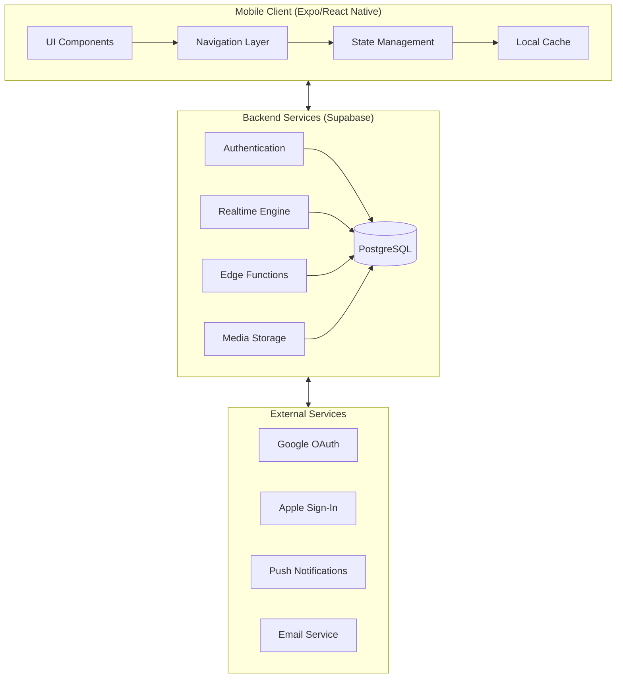

## Architecture Principles

### 1. Community-Centric Design
Every feature and data model revolves around the **Community** as the primary organizational unit. This design enables:
- **Data Isolation**: Each community's data is logically separated
- **Feature Scoping**: Features can be enabled/disabled per community
- **Access Control**: Permissions cascade from community membership

### 2. Mobile-First with Offline Resilience
- Optimistic updates for responsive UX
- Local caching via React Query
- Graceful degradation when offline
- Background sync when connectivity returns

### 3. Feature Flag Architecture
- Communities can toggle optional features (Finance, Polls, Meetings, Tasks)
- Enables gradual rollout and A/B testing
- Supports tiered subscription plans

### 4. Security by Default
- Row Level Security (RLS) on all database tables
- Scoped media access through signed URLs
- Authentication required for all data access

---

## Client Architecture

The mobile application is built with Expo and React Native, using a modular architecture for maintainability and scalability.

### Application Layer Structure

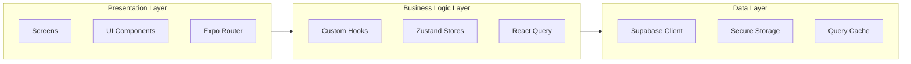

### Directory Structure

```
grove-community/
├── app/                    # Expo Router screens (file-based routing)
│   ├── (auth)/            # Authentication flow screens
│   ├── (tabs)/            # Main tab navigation
│   ├── chat/              # Chat conversation screens
│   ├── community/         # Community management
│   ├── event/             # Event management
│   ├── notifications/     # Notification center
│   ├── profile/           # User profile
│   ├── transaction/       # Finance transactions
│   └── _layout.tsx        # Root layout with providers
├── components/            # Reusable UI components
│   └── ui/               # Core design system components
├── constants/             # App constants and configuration
├── features/              # Feature flag registry
├── hooks/                 # Custom React hooks (data fetching)
├── lib/                   # Utility libraries
├── stores/                # Zustand state stores
├── supabase/              # Database migrations
└── types/                 # TypeScript definitions
```

### State Management Strategy

Grove uses a **hybrid state management** approach:

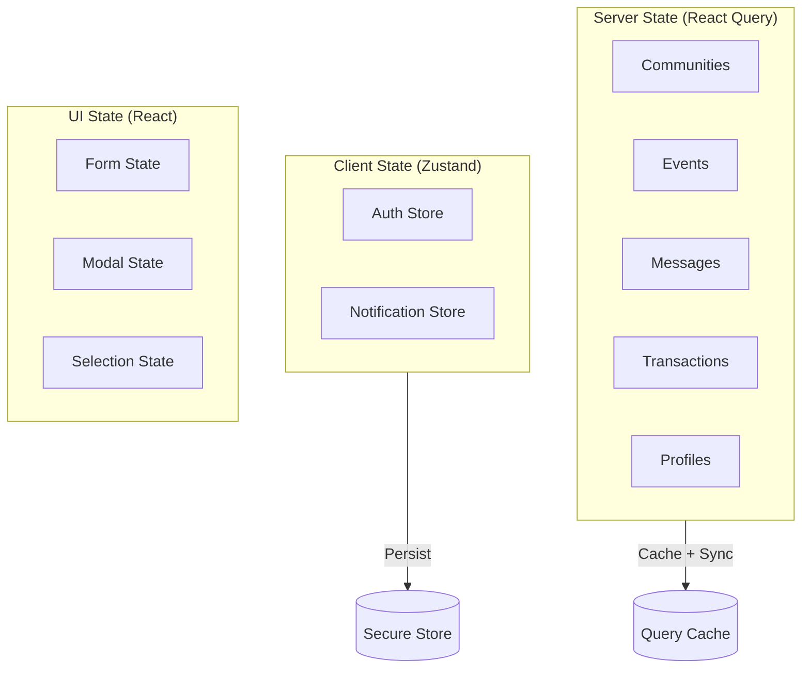

| State Type | Tool | Use Case |
|------------|------|----------|
| **Server State** | TanStack React Query | All data from Supabase (communities, events, messages, etc.) |
| **Auth State** | Zustand + Persist | User session, authentication status |
| **Notification State** | Zustand | Push token, unread counts |
| **UI State** | React useState/useReducer | Forms, modals, selections |

### Navigation Architecture

Grove uses **Expo Router** for file-based navigation with the following structure:

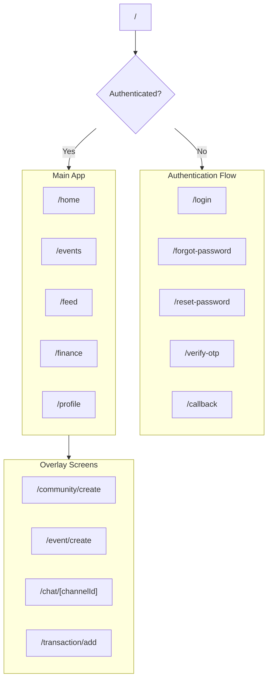

---

## Backend Architecture

Grove's backend is powered by **Supabase**, providing a fully managed PostgreSQL database with authentication, real-time subscriptions, and file storage.

### Backend Service Components

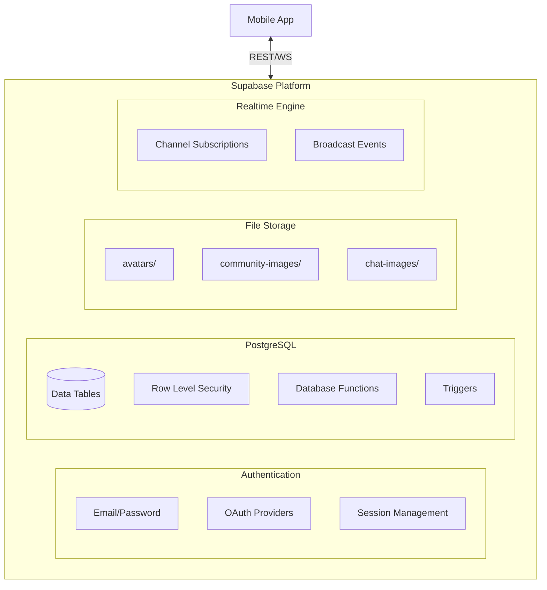

### Database Schema Overview

The database is organized around the community-centric model with clear entity relationships:

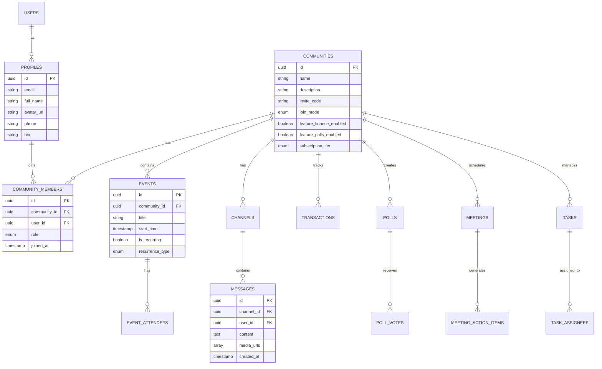

### Row Level Security (RLS) Patterns

All tables implement RLS policies to ensure data isolation and proper authorization:

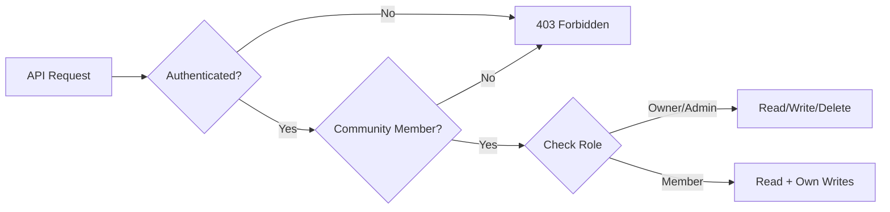

**Common RLS Policy Patterns:**
1. **Community Membership**: Users can only access data for communities they belong to
2. **Role-Based Access**: Admins and owners have elevated permissions
3. **Ownership**: Users can modify their own content (posts, messages, profiles)
4. **Feature Flags**: Data access respects community feature toggles

---

## Module Architecture

Grove features are organized into logical modules, each with clear boundaries and responsibilities.

### Module Dependency Diagram

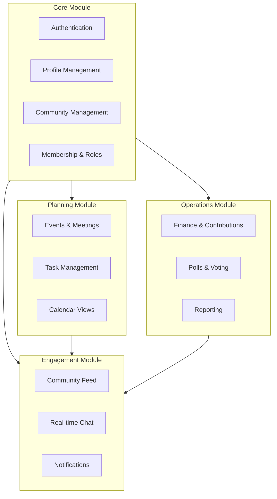

### Feature Module Details

| Module | Components | Status |
|--------|------------|--------|
| **Core** | Auth, Profiles, Communities, Membership | Always enabled |
| **Planning** | Events, Meetings, Tasks | Events always on; others toggleable |
| **Engagement** | Feed, Chat, Notifications | Always enabled |
| **Operations** | Finance, Polls | Toggleable per community |

---

## Integration Architecture

### Authentication Flow

Grove supports multiple authentication methods, all managed through Supabase Auth:

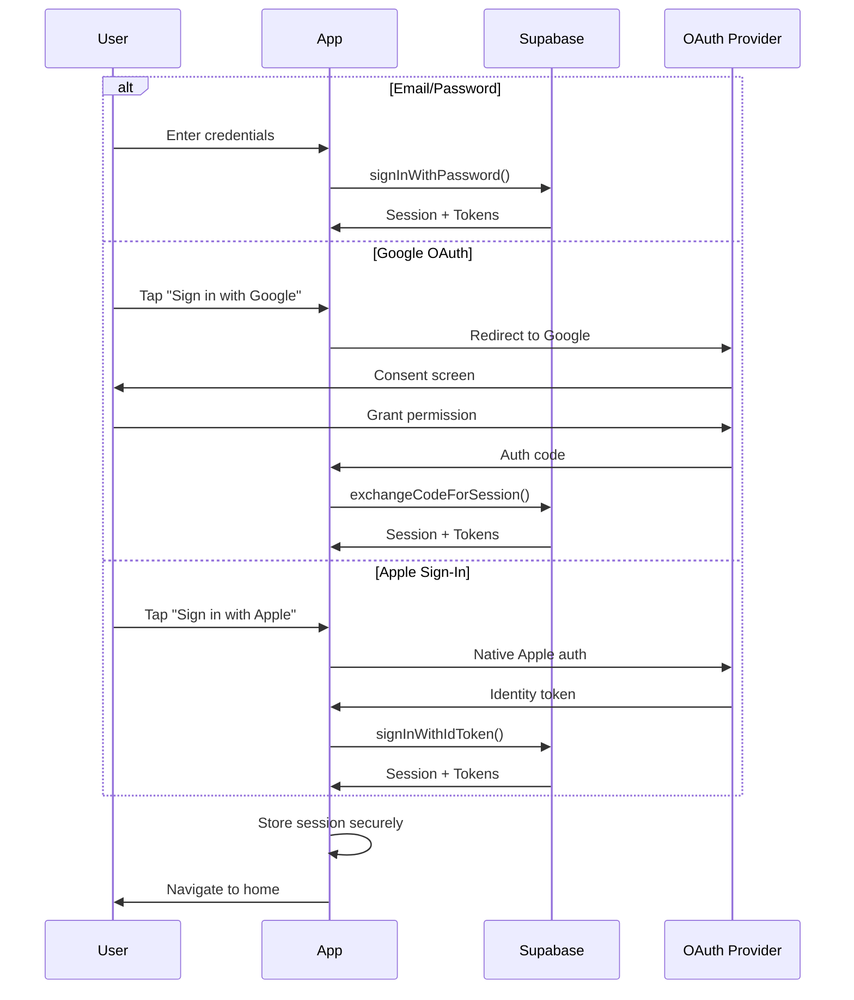

### Real-time Messaging Architecture

Chat messages use Supabase Realtime for instant delivery:

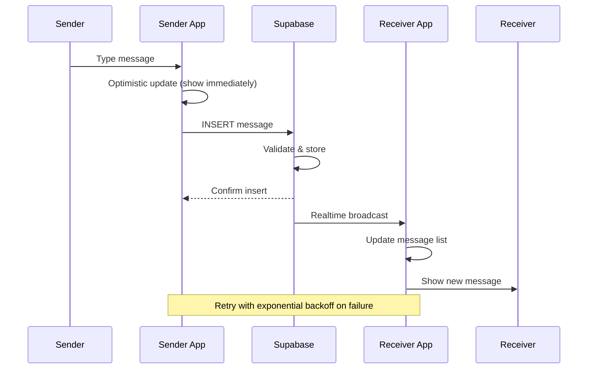

### Push Notification Flow

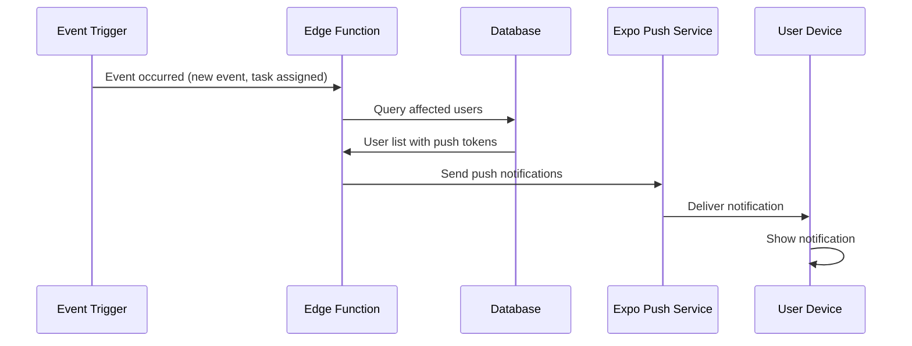

---

## Data Flow Patterns

### Community Join Flow

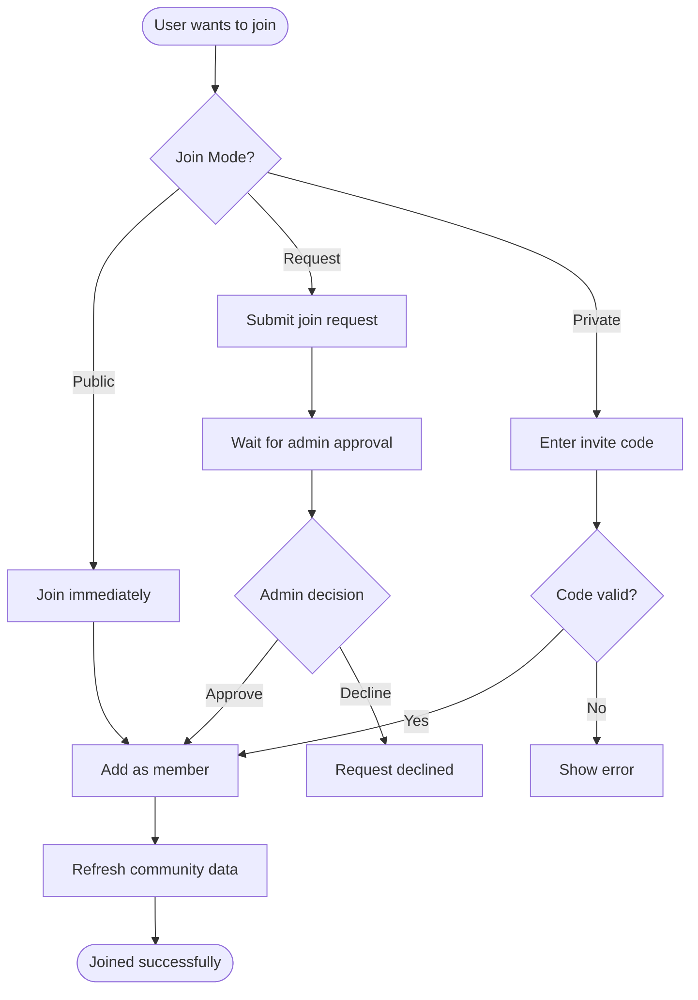

### Event Creation Flow

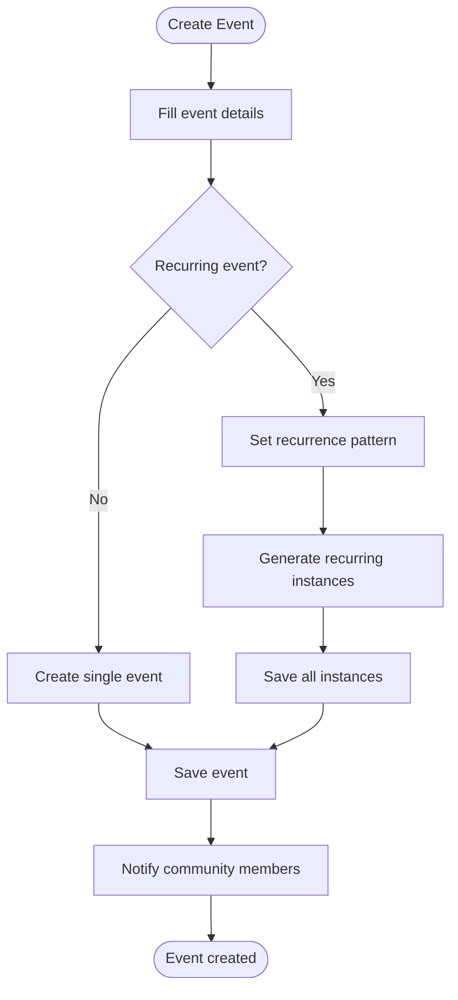

---

## Scalability Considerations

### Current Architecture Limits

| Resource | Free Tier Limit | Notes |
|----------|-----------------|-------|
| Database Size | 500 MB | Sufficient for MVP |
| Storage | 1 GB | Images compressed client-side |
| API Requests | 2M/month | Rate limited per user |
| Realtime Connections | 200 concurrent | Per project |
| Edge Function Invocations | 500K/month | For notifications |

### Scaling Path

1. **Phase 1 (MVP)**: Supabase Free Tier
2. **Phase 2 (Growth)**: Supabase Pro ($25/month)
3. **Phase 3 (Scale)**: Custom PostgreSQL + dedicated services

---

## Security Architecture

### Defense Layers

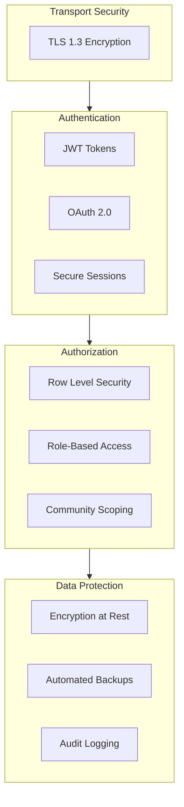

### Security Checklist

- [x] All API calls over HTTPS
- [x] JWT tokens stored in secure storage (Keychain/Keystore)
- [x] Row Level Security on all tables
- [x] Input validation on client and server
- [x] Parameterized queries (no SQL injection)
- [x] Media URLs signed with expiration
- [x] Rate limiting on authentication endpoints

---

## Technology Stack Summary

| Layer | Technology | Purpose |
|-------|------------|---------|
| **Mobile Framework** | Expo SDK 54 | Cross-platform development |
| **UI Framework** | React Native 0.81 | Native mobile UI |
| **Navigation** | Expo Router 6 | File-based routing |
| **Styling** | NativeWind (Tailwind) | Utility-first CSS |
| **Server State** | TanStack React Query 5 | Caching and sync |
| **Client State** | Zustand 5 | Lightweight stores |
| **Backend** | Supabase | PostgreSQL + Auth + Storage |
| **Realtime** | Supabase Realtime | WebSocket subscriptions |
| **Push Notifications** | Expo Notifications | Cross-platform push |
| **Animations** | React Native Reanimated 4 | Performant animations |

---

## Future Architecture Evolution

### Planned Enhancements

1. **Offline-First Sync**: Implement local SQLite with sync engine
2. **Edge Computing**: Move notification logic to edge functions
3. **CDN Integration**: Serve static assets from global CDN
4. **Analytics Pipeline**: Event streaming for product analytics
5. **Payment Integration**: Stripe Connect for community payments
