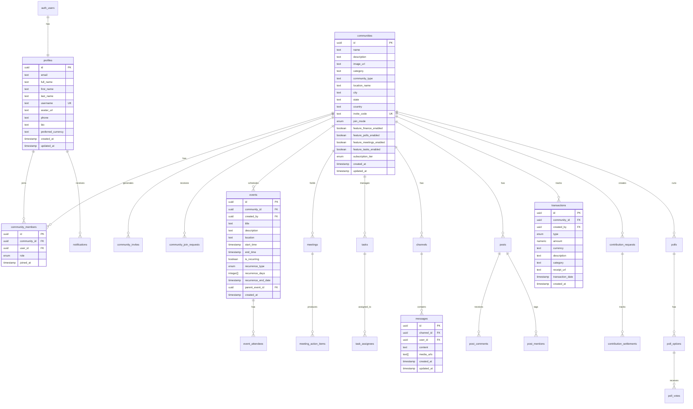
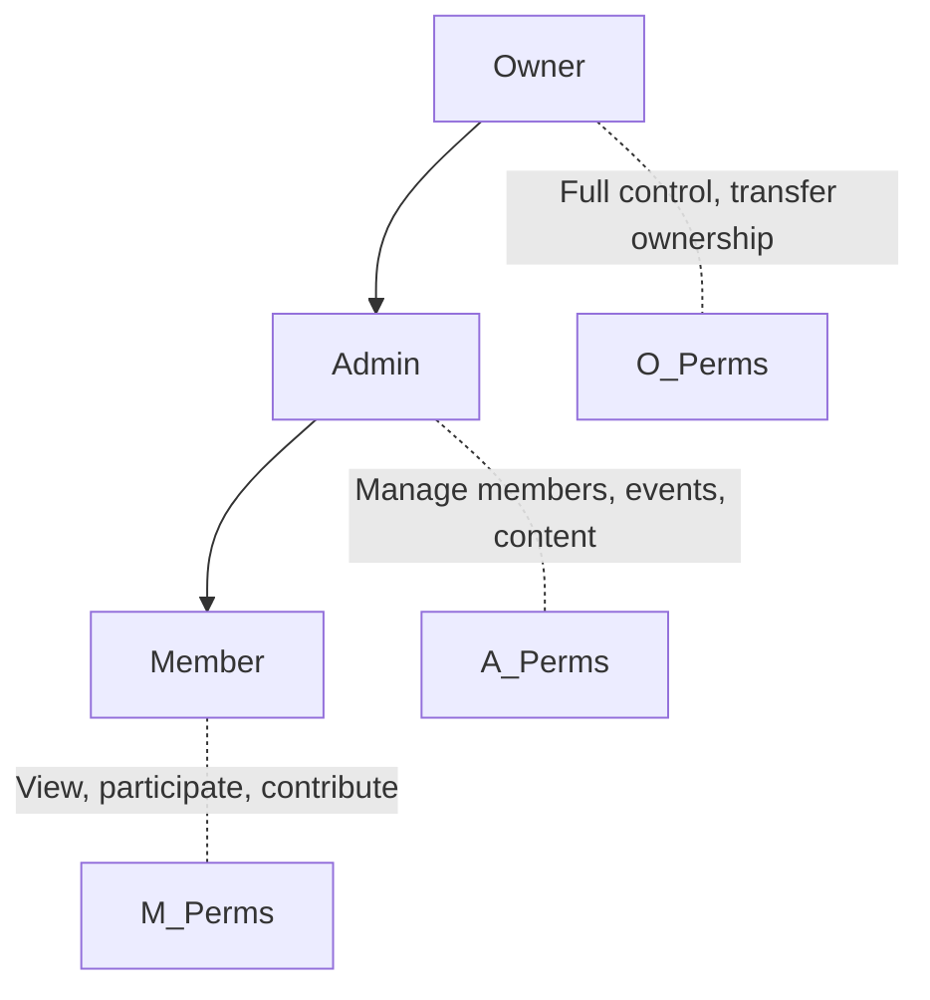
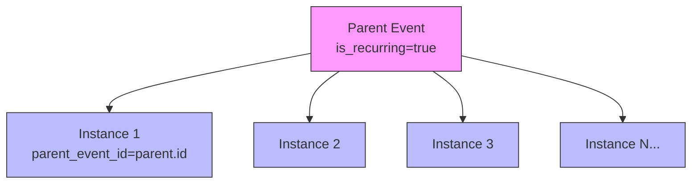
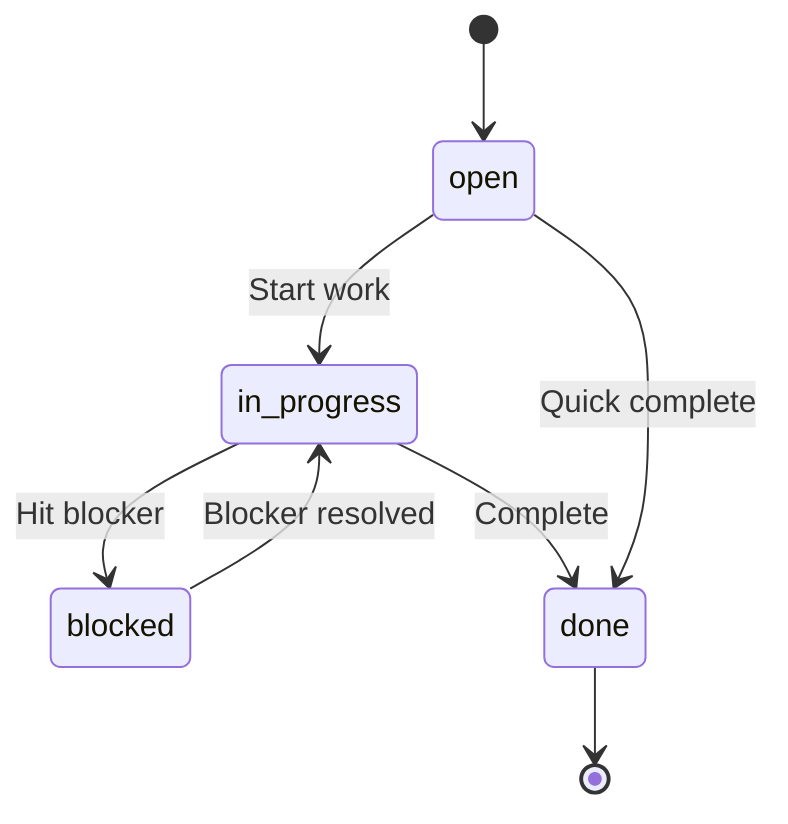
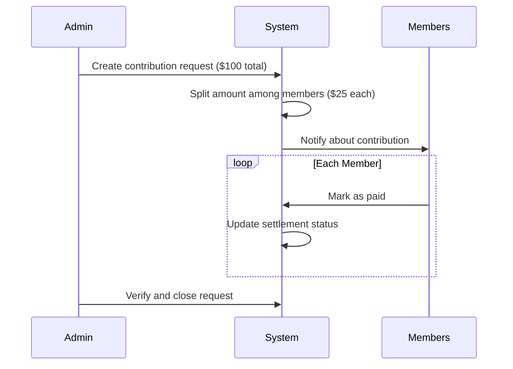

# Database Design

Grove uses **PostgreSQL** via Supabase as its primary data store. This document provides comprehensive documentation of the data model, entity relationships, and schema design decisions.

## Data Model Philosophy

### Core Principles

1. **Community-Centric**: All user data is scoped to communities
2. **Identity Separation**: User identity (auth) is separate from profile data
3. **Soft References**: Preserve data integrity when users leave communities
4. **Audit Ready**: Timestamps on all records for compliance
5. **Feature Extensible**: Schema supports optional feature modules

---

## Entity Relationship Diagram

### Complete Schema Overview



---

## Core Entities

### Profiles Table

The `profiles` table stores user profile information, linked 1:1 with Supabase Auth users.

```sql
CREATE TABLE profiles (
    id UUID PRIMARY KEY REFERENCES auth.users(id) ON DELETE CASCADE,
    email TEXT,
    full_name TEXT,
    first_name TEXT,
    last_name TEXT,
    username TEXT UNIQUE,
    avatar_url TEXT,
    phone TEXT,
    bio TEXT,
    preferred_currency TEXT DEFAULT 'USD',
    created_at TIMESTAMPTZ DEFAULT NOW(),
    updated_at TIMESTAMPTZ DEFAULT NOW()
);
```

**Key Design Decisions:**
- **ID matches auth.users**: Enables direct joins with authentication
- **Username optional**: Users can set a unique username for discovery
- **Soft delete not implemented**: GDPR deletion handled by cascading from auth.users

**Indexes:**
```sql
CREATE UNIQUE INDEX idx_profiles_username ON profiles(username) WHERE username IS NOT NULL;
CREATE INDEX idx_profiles_email ON profiles(email);
```

### Communities Table

The `communities` table is the central entity around which all features are organized.

```sql
CREATE TABLE communities (
    id UUID PRIMARY KEY DEFAULT gen_random_uuid(),
    name TEXT NOT NULL,
    description TEXT,
    image_url TEXT,
    category TEXT,
    community_type TEXT,
    location_name TEXT,
    city TEXT,
    state TEXT,
    country TEXT,
    invite_code TEXT UNIQUE DEFAULT generate_invite_code(),
    join_mode TEXT DEFAULT 'private' CHECK (join_mode IN ('private', 'request', 'public')),

    -- Feature Flags
    feature_finance_enabled BOOLEAN DEFAULT false,
    feature_polls_enabled BOOLEAN DEFAULT false,
    feature_meetings_enabled BOOLEAN DEFAULT false,
    feature_tasks_enabled BOOLEAN DEFAULT false,

    -- Subscription
    subscription_tier TEXT DEFAULT 'free' CHECK (subscription_tier IN ('free', 'pro')),

    created_at TIMESTAMPTZ DEFAULT NOW(),
    updated_at TIMESTAMPTZ DEFAULT NOW()
);
```

**Join Modes Explained:**

| Mode | Description | Use Case |
|------|-------------|----------|
| `private` | Invite code required | Exclusive groups |
| `request` | Anyone can request, admin approves | Semi-public groups |
| `public` | Anyone can join directly | Open communities |

### Community Members Table

Junction table managing the many-to-many relationship between users and communities.

```sql
CREATE TABLE community_members (
    id UUID PRIMARY KEY DEFAULT gen_random_uuid(),
    community_id UUID NOT NULL REFERENCES communities(id) ON DELETE CASCADE,
    user_id UUID NOT NULL REFERENCES profiles(id) ON DELETE CASCADE,
    role TEXT DEFAULT 'member' CHECK (role IN ('owner', 'admin', 'member')),
    joined_at TIMESTAMPTZ DEFAULT NOW(),

    UNIQUE(community_id, user_id)
);
```

**Role Hierarchy:**



| Role | Permissions |
|------|-------------|
| **Owner** | All permissions + delete community + transfer ownership |
| **Admin** | Manage members, events, settings, approve requests |
| **Member** | View content, RSVP, post, comment, contribute |

---

## Planning Entities

### Events Table

Supports both single and recurring events with parent-child relationships.

```sql
CREATE TABLE events (
    id UUID PRIMARY KEY DEFAULT gen_random_uuid(),
    community_id UUID NOT NULL REFERENCES communities(id) ON DELETE CASCADE,
    created_by UUID REFERENCES profiles(id),
    title TEXT NOT NULL,
    description TEXT,
    location TEXT,
    start_time TIMESTAMPTZ NOT NULL,
    end_time TIMESTAMPTZ,
    agenda TEXT,

    -- Recurrence Fields
    is_recurring BOOLEAN DEFAULT false,
    recurrence_type TEXT CHECK (recurrence_type IN ('daily', 'weekly', 'biweekly', 'monthly', 'yearly')),
    recurrence_days INTEGER[], -- 0=Sunday, 6=Saturday
    recurrence_end_date TIMESTAMPTZ,
    parent_event_id UUID REFERENCES events(id) ON DELETE CASCADE,

    created_at TIMESTAMPTZ DEFAULT NOW(),
    updated_at TIMESTAMPTZ DEFAULT NOW()
);
```

**Recurring Event Pattern:**



**Recurrence Generation Function:**
```sql
CREATE OR REPLACE FUNCTION generate_recurring_events(event_id UUID)
RETURNS SETOF events AS $$
    -- Generates individual event instances based on recurrence pattern
    -- Called when a recurring event is created
$$;
```

### Event Attendees Table

Tracks RSVP status for events.

```sql
CREATE TABLE event_attendees (
    id UUID PRIMARY KEY DEFAULT gen_random_uuid(),
    event_id UUID NOT NULL REFERENCES events(id) ON DELETE CASCADE,
    user_id UUID NOT NULL REFERENCES profiles(id) ON DELETE CASCADE,
    status TEXT DEFAULT 'going' CHECK (status IN ('going', 'maybe', 'not_going')),
    created_at TIMESTAMPTZ DEFAULT NOW(),

    UNIQUE(event_id, user_id)
);
```

### Tasks Table

Task management with status workflow.

```sql
CREATE TABLE tasks (
    id UUID PRIMARY KEY DEFAULT gen_random_uuid(),
    community_id UUID NOT NULL REFERENCES communities(id) ON DELETE CASCADE,
    created_by UUID REFERENCES profiles(id),
    title TEXT NOT NULL,
    description TEXT,
    status TEXT DEFAULT 'open' CHECK (status IN ('open', 'in_progress', 'blocked', 'done')),
    due_date TIMESTAMPTZ,
    event_id UUID REFERENCES events(id) ON DELETE SET NULL,
    meeting_id UUID REFERENCES meetings(id) ON DELETE SET NULL,
    created_at TIMESTAMPTZ DEFAULT NOW(),
    updated_at TIMESTAMPTZ DEFAULT NOW()
);

CREATE TABLE task_assignees (
    id UUID PRIMARY KEY DEFAULT gen_random_uuid(),
    task_id UUID NOT NULL REFERENCES tasks(id) ON DELETE CASCADE,
    user_id UUID NOT NULL REFERENCES profiles(id) ON DELETE CASCADE,
    assigned_at TIMESTAMPTZ DEFAULT NOW(),

    UNIQUE(task_id, user_id)
);
```

**Task Status Workflow:**



---

## Engagement Entities

### Channels and Messages Tables

Real-time chat functionality.

```sql
CREATE TABLE channels (
    id UUID PRIMARY KEY DEFAULT gen_random_uuid(),
    community_id UUID NOT NULL REFERENCES communities(id) ON DELETE CASCADE,
    name TEXT NOT NULL DEFAULT 'general',
    description TEXT,
    created_at TIMESTAMPTZ DEFAULT NOW()
);

CREATE TABLE messages (
    id UUID PRIMARY KEY DEFAULT gen_random_uuid(),
    channel_id UUID NOT NULL REFERENCES channels(id) ON DELETE CASCADE,
    user_id UUID NOT NULL REFERENCES profiles(id),
    content TEXT,
    media_urls TEXT[],
    created_at TIMESTAMPTZ DEFAULT NOW(),
    updated_at TIMESTAMPTZ DEFAULT NOW()
);
```

**Message Indexing for Performance:**
```sql
CREATE INDEX idx_messages_channel_created
ON messages(channel_id, created_at DESC);
```

### Posts and Comments Tables

Community feed functionality.

```sql
CREATE TABLE posts (
    id UUID PRIMARY KEY DEFAULT gen_random_uuid(),
    community_id UUID NOT NULL REFERENCES communities(id) ON DELETE CASCADE,
    author_id UUID NOT NULL REFERENCES profiles(id),
    content TEXT NOT NULL,
    media_urls TEXT[],
    created_at TIMESTAMPTZ DEFAULT NOW(),
    updated_at TIMESTAMPTZ DEFAULT NOW()
);

CREATE TABLE post_comments (
    id UUID PRIMARY KEY DEFAULT gen_random_uuid(),
    post_id UUID NOT NULL REFERENCES posts(id) ON DELETE CASCADE,
    author_id UUID NOT NULL REFERENCES profiles(id),
    content TEXT NOT NULL,
    created_at TIMESTAMPTZ DEFAULT NOW()
);

CREATE TABLE post_mentions (
    id UUID PRIMARY KEY DEFAULT gen_random_uuid(),
    post_id UUID NOT NULL REFERENCES posts(id) ON DELETE CASCADE,
    mentioned_user_id UUID NOT NULL REFERENCES profiles(id) ON DELETE CASCADE,
    created_at TIMESTAMPTZ DEFAULT NOW(),

    UNIQUE(post_id, mentioned_user_id)
);
```

---

## Operations Entities

### Transactions Table

Financial record keeping for communities.

```sql
CREATE TABLE transactions (
    id UUID PRIMARY KEY DEFAULT gen_random_uuid(),
    community_id UUID NOT NULL REFERENCES communities(id) ON DELETE CASCADE,
    created_by UUID REFERENCES profiles(id),
    type TEXT NOT NULL CHECK (type IN ('income', 'expense')),
    amount NUMERIC(12, 2) NOT NULL,
    currency TEXT DEFAULT 'USD',
    description TEXT NOT NULL,
    category TEXT,
    receipt_url TEXT,
    transaction_date TIMESTAMPTZ DEFAULT NOW(),
    created_at TIMESTAMPTZ DEFAULT NOW(),
    updated_at TIMESTAMPTZ DEFAULT NOW()
);
```

### Contribution Requests Tables

Group contribution management with per-member tracking.

```sql
CREATE TABLE contribution_requests (
    id UUID PRIMARY KEY DEFAULT gen_random_uuid(),
    community_id UUID NOT NULL REFERENCES communities(id) ON DELETE CASCADE,
    created_by UUID REFERENCES profiles(id),
    title TEXT NOT NULL,
    description TEXT,
    total_amount NUMERIC(12, 2) NOT NULL,
    currency TEXT DEFAULT 'USD',
    due_date TIMESTAMPTZ,
    status TEXT DEFAULT 'open' CHECK (status IN ('open', 'closed')),
    created_at TIMESTAMPTZ DEFAULT NOW()
);

CREATE TABLE contribution_settlements (
    id UUID PRIMARY KEY DEFAULT gen_random_uuid(),
    contribution_request_id UUID NOT NULL REFERENCES contribution_requests(id) ON DELETE CASCADE,
    user_id UUID NOT NULL REFERENCES profiles(id),
    amount_due NUMERIC(12, 2) NOT NULL,
    amount_paid NUMERIC(12, 2) DEFAULT 0,
    is_settled BOOLEAN DEFAULT false,
    settled_at TIMESTAMPTZ,
    created_at TIMESTAMPTZ DEFAULT NOW(),

    UNIQUE(contribution_request_id, user_id)
);
```

**Contribution Flow:**



### Polls Tables

Community voting functionality.

```sql
CREATE TABLE polls (
    id UUID PRIMARY KEY DEFAULT gen_random_uuid(),
    community_id UUID NOT NULL REFERENCES communities(id) ON DELETE CASCADE,
    created_by UUID REFERENCES profiles(id),
    question TEXT NOT NULL,
    expires_at TIMESTAMPTZ,
    is_closed BOOLEAN DEFAULT false,
    created_at TIMESTAMPTZ DEFAULT NOW()
);

CREATE TABLE poll_options (
    id UUID PRIMARY KEY DEFAULT gen_random_uuid(),
    poll_id UUID NOT NULL REFERENCES polls(id) ON DELETE CASCADE,
    option_text TEXT NOT NULL,
    display_order INTEGER DEFAULT 0
);

CREATE TABLE poll_votes (
    id UUID PRIMARY KEY DEFAULT gen_random_uuid(),
    poll_option_id UUID NOT NULL REFERENCES poll_options(id) ON DELETE CASCADE,
    user_id UUID NOT NULL REFERENCES profiles(id),
    created_at TIMESTAMPTZ DEFAULT NOW(),

    UNIQUE(poll_option_id, user_id)
);
```

---

## Access Control

### Row Level Security Policies

All tables implement RLS for data isolation. Here are the key policy patterns:

#### Community Access Policy
```sql
-- Users can only see communities they belong to
CREATE POLICY "Users can view their communities" ON communities
    FOR SELECT
    USING (
        id IN (
            SELECT community_id FROM community_members
            WHERE user_id = auth.uid()
        )
    );
```

#### Member Management Policy
```sql
-- Only admins/owners can manage members
CREATE POLICY "Admins can manage members" ON community_members
    FOR ALL
    USING (
        EXISTS (
            SELECT 1 FROM community_members
            WHERE community_id = community_members.community_id
            AND user_id = auth.uid()
            AND role IN ('owner', 'admin')
        )
    );
```

#### Content Ownership Policy
```sql
-- Users can edit their own messages
CREATE POLICY "Users can update own messages" ON messages
    FOR UPDATE
    USING (user_id = auth.uid());
```

### RLS Policy Matrix

| Table | SELECT | INSERT | UPDATE | DELETE |
|-------|--------|--------|--------|--------|
| profiles | Self or same community | Self only | Self only | N/A (cascade) |
| communities | Members only | Authenticated | Owner/Admin | Owner only |
| community_members | Members | Admin | Admin | Admin (not owner) |
| events | Members | Admin | Creator/Admin | Creator/Admin |
| messages | Channel members | Channel members | Author | Author |
| transactions | Members (if finance on) | Admin | Creator/Admin | Admin |

---

## Database Functions

### Key Stored Procedures

```sql
-- Join community by invite code
CREATE OR REPLACE FUNCTION join_community_by_invite_code(code TEXT)
RETURNS UUID AS $$
DECLARE
    v_community_id UUID;
BEGIN
    SELECT id INTO v_community_id
    FROM communities
    WHERE invite_code = code;

    IF v_community_id IS NULL THEN
        RAISE EXCEPTION 'Invalid invite code';
    END IF;

    INSERT INTO community_members (community_id, user_id, role)
    VALUES (v_community_id, auth.uid(), 'member');

    RETURN v_community_id;
END;
$$ LANGUAGE plpgsql SECURITY DEFINER;

-- Create contribution request with automatic splits
CREATE OR REPLACE FUNCTION create_contribution_request(
    p_community_id UUID,
    p_title TEXT,
    p_description TEXT,
    p_total_amount NUMERIC,
    p_currency TEXT,
    p_due_date TIMESTAMPTZ
)
RETURNS UUID AS $$
DECLARE
    v_request_id UUID;
    v_member_count INTEGER;
    v_split_amount NUMERIC;
BEGIN
    -- Create the request
    INSERT INTO contribution_requests (community_id, created_by, title, description, total_amount, currency, due_date)
    VALUES (p_community_id, auth.uid(), p_title, p_description, p_total_amount, p_currency, p_due_date)
    RETURNING id INTO v_request_id;

    -- Count members and calculate split
    SELECT COUNT(*) INTO v_member_count
    FROM community_members
    WHERE community_id = p_community_id;

    v_split_amount := ROUND(p_total_amount / v_member_count, 2);

    -- Create settlement records for each member
    INSERT INTO contribution_settlements (contribution_request_id, user_id, amount_due)
    SELECT v_request_id, user_id, v_split_amount
    FROM community_members
    WHERE community_id = p_community_id;

    RETURN v_request_id;
END;
$$ LANGUAGE plpgsql SECURITY DEFINER;
```

---

## Performance Optimization

### Index Strategy

```sql
-- High-traffic query indexes
CREATE INDEX idx_community_members_user ON community_members(user_id);
CREATE INDEX idx_community_members_community ON community_members(community_id);
CREATE INDEX idx_events_community_start ON events(community_id, start_time);
CREATE INDEX idx_messages_channel_created ON messages(channel_id, created_at DESC);
CREATE INDEX idx_transactions_community_date ON transactions(community_id, transaction_date DESC);

-- Full-text search indexes
CREATE INDEX idx_communities_search ON communities
    USING GIN(to_tsvector('english', name || ' ' || COALESCE(description, '')));
```

### Query Optimization Tips

1. **Pagination**: Always use cursor-based pagination for large lists
2. **Selective Joins**: Include only needed columns in SELECT
3. **Batch Operations**: Use bulk inserts for recurring event instances
4. **Connection Pooling**: Supabase provides built-in connection pooling

---

## Data Migration Strategy

### Adding New Features

1. Create migration file in `supabase/migrations/`
2. Add tables with default feature flag = false
3. Apply RLS policies
4. Deploy and test
5. Enable for communities gradually

### Schema Versioning

Migrations are tracked and applied sequentially:

```
supabase/migrations/
├── 20240101000000_initial_schema.sql
├── 20240115000000_add_recurring_events.sql
├── 20240201000000_add_polls_feature.sql
├── 20240215000000_add_meetings_feature.sql
└── 20240301000000_add_tasks_feature.sql
```

---

## Data Retention

| Data Type | Retention | Notes |
|-----------|-----------|-------|
| User Profiles | Until account deletion | GDPR compliant |
| Messages | Indefinite | Future: archival after 1 year |
| Transactions | 7 years | Financial compliance |
| Events | Indefinite | Historical reference |
| Notifications | 90 days | Auto-cleanup |
