# Integrations

Grove integrates with various external services to provide authentication, notifications, and future capabilities. This document details all current and planned integrations.

## Integration Architecture

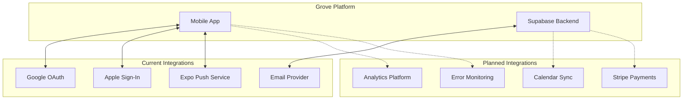

---

## Current Integrations

### 1. Google Sign-In

**Purpose:** Allow users to authenticate using their Google account for quick, secure access.

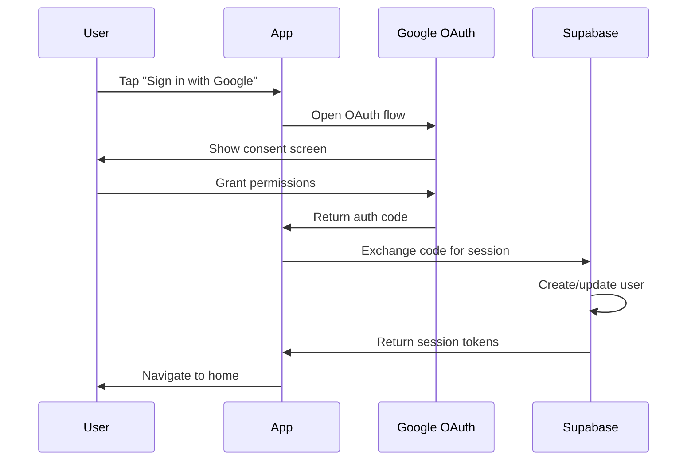

**Configuration:**

| Platform | Requirement |
|----------|-------------|
| iOS | Google OAuth client ID (iOS type) |
| Android | Google OAuth client ID (Android type) |
| Web | Google OAuth client ID (Web type) |

**Implementation:**
```typescript
// Using expo-auth-session
import * as Google from 'expo-auth-session/providers/google';

const [request, response, promptAsync] = Google.useAuthRequest({
  iosClientId: process.env.EXPO_PUBLIC_GOOGLE_IOS_CLIENT_ID,
  androidClientId: process.env.EXPO_PUBLIC_GOOGLE_ANDROID_CLIENT_ID,
});

const handleGoogleSignIn = async () => {
  const result = await promptAsync();
  if (result?.type === 'success') {
    const { data, error } = await supabase.auth.signInWithIdToken({
      provider: 'google',
      token: result.authentication.idToken,
    });
  }
};
```

**Scopes Requested:**
- `openid` - Basic identity
- `email` - User's email address
- `profile` - User's name and photo

---

### 2. Apple Sign-In

**Purpose:** Provide native Apple authentication on iOS devices, required for App Store compliance.

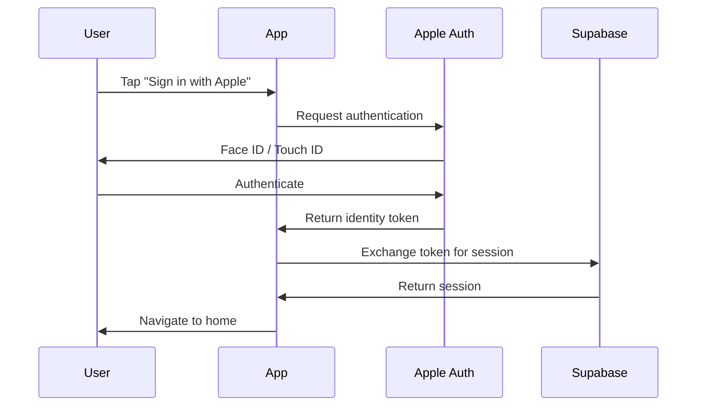

**Configuration:**

| Requirement | Description |
|-------------|-------------|
| Apple Developer Account | Required ($99/year) |
| App ID with Sign In capability | Enable in developer portal |
| Service ID | For web-based Apple Sign-In |

**Implementation:**
```typescript
import * as AppleAuthentication from 'expo-apple-authentication';

const handleAppleSignIn = async () => {
  const credential = await AppleAuthentication.signInAsync({
    requestedScopes: [
      AppleAuthentication.AppleAuthenticationScope.FULL_NAME,
      AppleAuthentication.AppleAuthenticationScope.EMAIL,
    ],
  });

  const { data, error } = await supabase.auth.signInWithIdToken({
    provider: 'apple',
    token: credential.identityToken,
  });
};
```

**Privacy Features:**
- Hide My Email support
- User can share or hide real email
- Name only provided on first sign-in

---

### 3. Push Notifications (Expo)

**Purpose:** Deliver real-time notifications for events, tasks, messages, and community updates.

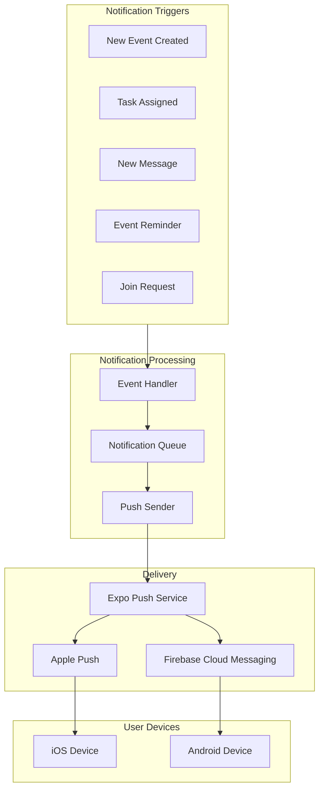

**Notification Types:**

| Type | Trigger | Priority |
|------|---------|----------|
| Event Reminder | 1 hour before event | High |
| Task Assigned | New task assignment | Normal |
| New Message | Chat message in channel | Normal |
| Join Request | User requests to join | Normal |
| Request Approved | Admin approves join | High |
| Contribution Due | Payment reminder | Normal |

**Implementation:**
```typescript
// Register for push notifications
import * as Notifications from 'expo-notifications';

async function registerForPush() {
  const { status } = await Notifications.requestPermissionsAsync();
  if (status !== 'granted') return;

  const token = await Notifications.getExpoPushTokenAsync({
    projectId: Constants.expoConfig.extra.eas.projectId,
  });

  // Store token in database for later use
  await supabase.from('push_tokens').upsert({
    user_id: userId,
    token: token.data,
    platform: Platform.OS,
  });
}

// Handle incoming notifications
Notifications.setNotificationHandler({
  handleNotification: async () => ({
    shouldShowAlert: true,
    shouldPlaySound: true,
    shouldSetBadge: true,
  }),
});
```

**Push Token Management:**
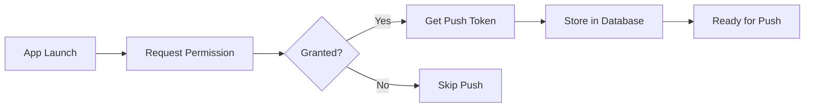

---

### 4. Email Notifications (Supabase)

**Purpose:** Send transactional emails for authentication, invites, and important updates.

**Email Types:**

| Email Type | Trigger | Template |
|------------|---------|----------|
| Welcome | Account creation | Onboarding info |
| Magic Link | Passwordless login | Login link |
| Password Reset | Reset request | Reset link |
| Invite | Community invite | Join link |
| Event Reminder | Upcoming event | Event details |

**Supabase Email Configuration:**
```sql
-- Custom email templates can be set in Supabase Dashboard
-- Authentication > Email Templates

-- Example: Custom invite email
Subject: You're invited to join {{community_name}} on Grove
Body:
Hi {{user_name}},

You've been invited to join {{community_name}} on Grove!

Click here to accept: {{invite_link}}

See you there!
```

---

## Planned Integrations

### 1. Calendar Sync

**Purpose:** Sync Grove events with Google Calendar and Apple Calendar.

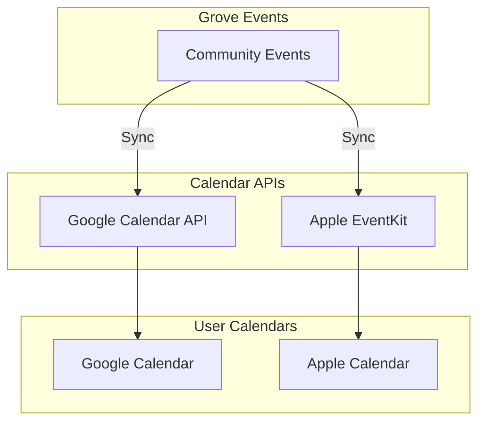

**Planned Features:**
- Two-way sync for event changes
- Automatic RSVP from calendar response
- Calendar availability for event planning
- Recurring event sync

**Implementation Approach:**
```typescript
// Google Calendar (using googleapis)
async function syncToGoogleCalendar(event) {
  const calendar = google.calendar({ version: 'v3', auth });

  await calendar.events.insert({
    calendarId: 'primary',
    resource: {
      summary: event.title,
      description: event.description,
      start: { dateTime: event.start_time },
      end: { dateTime: event.end_time },
      location: event.location,
    },
  });
}

// Apple Calendar (using expo-calendar)
async function syncToAppleCalendar(event) {
  await Calendar.createEventAsync(calendarId, {
    title: event.title,
    notes: event.description,
    startDate: new Date(event.start_time),
    endDate: new Date(event.end_time),
    location: event.location,
  });
}
```

---

### 2. Payment Integration (Stripe)

**Purpose:** Enable online payments for community contributions and dues.

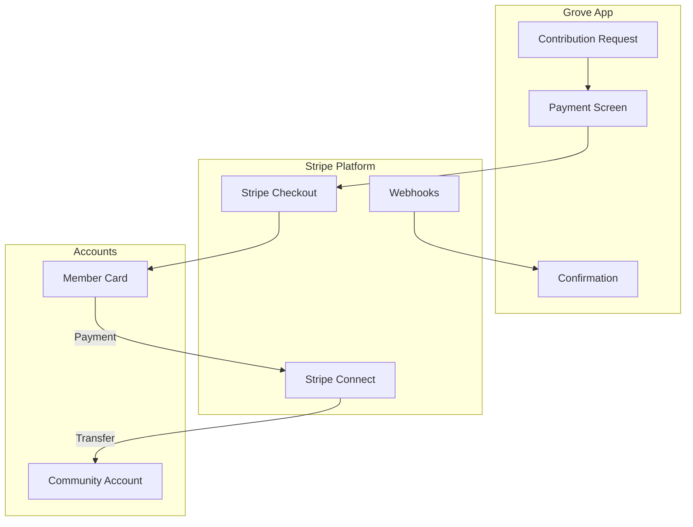

**Planned Features:**
- Stripe Connect for community payouts
- In-app payment UI
- Automatic payment splitting
- Payment history and receipts
- Refund handling

**Phase 2 Scope:**
1. Community admins connect Stripe account
2. Members pay contributions via card
3. Automatic settlement marking
4. Transaction records with Stripe references

---

### 3. Analytics Integration

**Purpose:** Track user behavior, engagement, and app performance.

**Planned Platform:** PostHog (self-hosted option available)

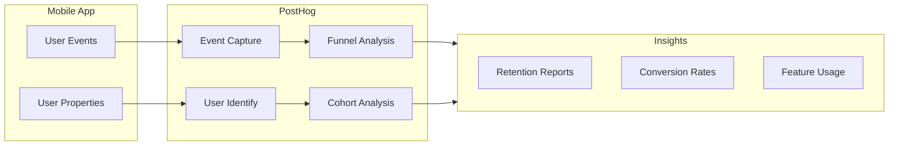

**Key Events to Track:**

| Event | Properties | Purpose |
|-------|------------|---------|
| `user_signed_up` | method, source | Acquisition analysis |
| `community_created` | category, join_mode | Activation tracking |
| `event_created` | is_recurring, has_location | Feature usage |
| `message_sent` | media_attached | Engagement metrics |
| `contribution_paid` | amount, currency | Revenue tracking |

**Implementation:**
```typescript
import posthog from 'posthog-react-native';

// Initialize
posthog.init(POSTHOG_API_KEY, {
  host: POSTHOG_HOST,
});

// Identify user
posthog.identify(userId, {
  email: user.email,
  name: user.full_name,
  created_at: user.created_at,
});

// Track events
posthog.capture('community_created', {
  community_id: community.id,
  category: community.category,
  join_mode: community.join_mode,
});
```

---

### 4. Error Monitoring (Sentry)

**Purpose:** Track and alert on application errors and crashes.

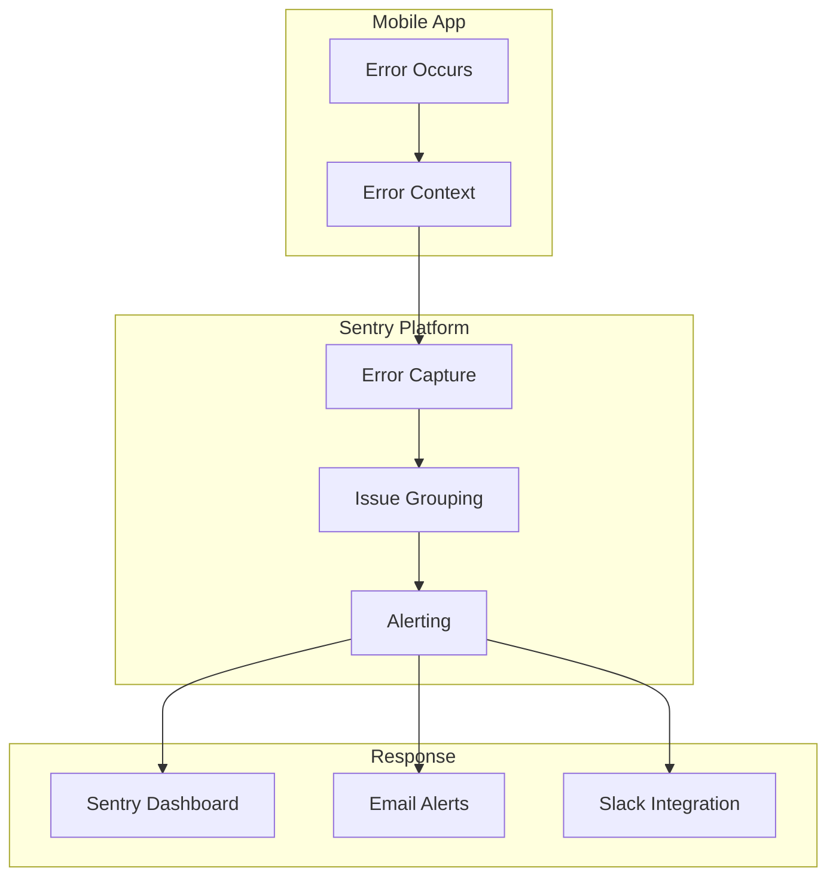

**Implementation:**
```typescript
import * as Sentry from '@sentry/react-native';

Sentry.init({
  dsn: SENTRY_DSN,
  environment: __DEV__ ? 'development' : 'production',
  tracesSampleRate: 0.2,
  attachStacktrace: true,
});

// Set user context
Sentry.setUser({
  id: userId,
  email: user.email,
});

// Capture errors
try {
  await riskyOperation();
} catch (error) {
  Sentry.captureException(error, {
    extra: {
      community_id: communityId,
      action: 'create_event',
    },
  });
}
```

---

## Integration Security

### API Key Management

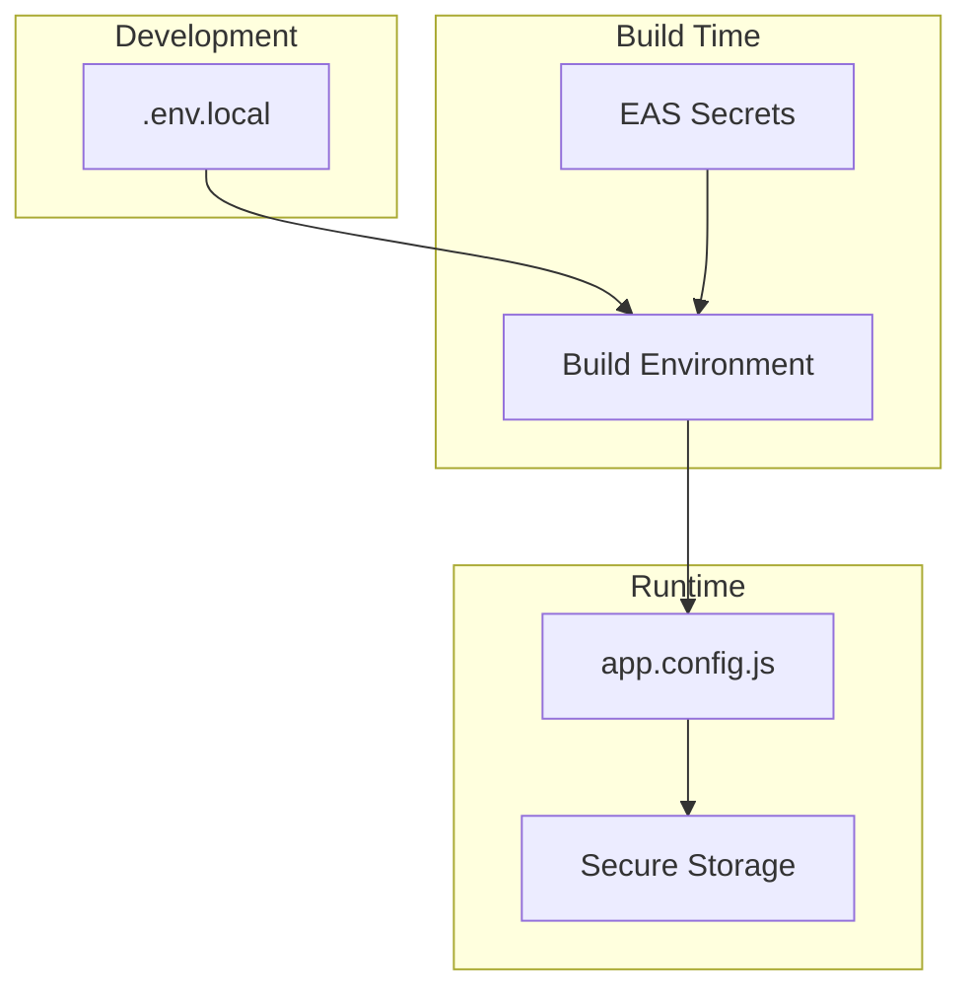

**Secret Storage Strategy:**

| Secret Type | Storage | Access |
|-------------|---------|--------|
| Public API keys | app.config.js | Client-side |
| OAuth client IDs | Environment variables | Build-time |
| Service account keys | EAS Secrets | Build-time only |
| User tokens | expo-secure-store | Runtime only |

### OAuth Security

- State parameter for CSRF protection
- PKCE for mobile OAuth flows
- Token stored in secure storage
- Short-lived access tokens with refresh

---

## Integration Limits

### Current Plan Limits (Supabase Free Tier)

| Service | Limit | Notes |
|---------|-------|-------|
| API Requests | 2M/month | Sufficient for MVP |
| Database | 500 MB | Monitor growth |
| Storage | 1 GB | Compress images |
| Realtime | 200 concurrent | Per project |
| Auth MAUs | 50,000 | Monthly active |

### Expo Push Limits

| Tier | Notifications/Month | Priority Support |
|------|---------------------|------------------|
| Free | 1,000 | No |
| Production | Unlimited | Yes |

---

## Integration Roadmap

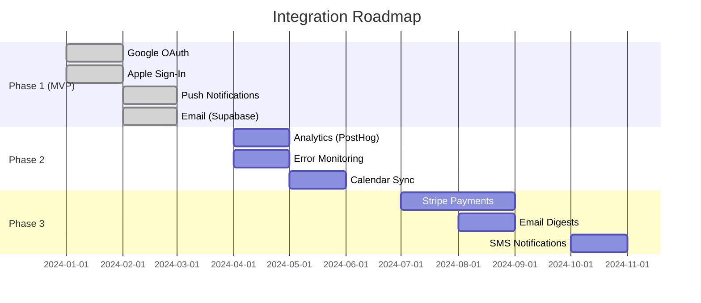

---

## Integration Testing

### Test Accounts

| Service | Test Mode | Notes |
|---------|-----------|-------|
| Google OAuth | Use test users | Add in GCP console |
| Apple Sign-In | Sandbox | Use simulator |
| Stripe | Test mode | Use test API keys |
| Push | Expo dev client | Real device required |

### Integration Health Checks

```typescript
async function checkIntegrations() {
  const results = {
    supabase: await checkSupabase(),
    push: await checkPushPermissions(),
    google: await checkGoogleAuth(),
  };

  return results;
}
```
