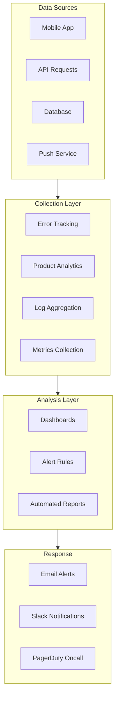
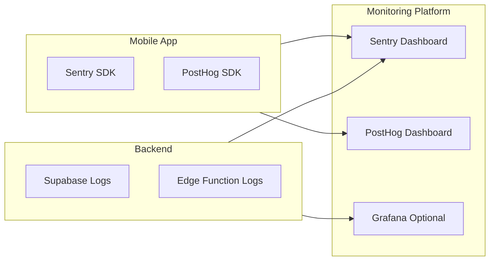
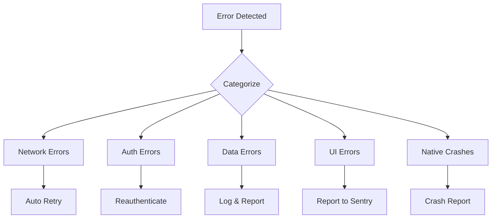
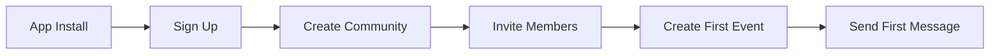
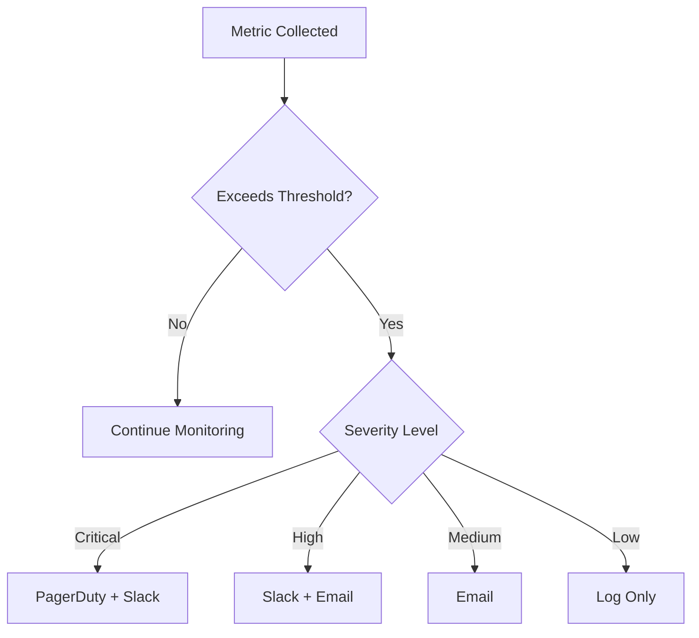
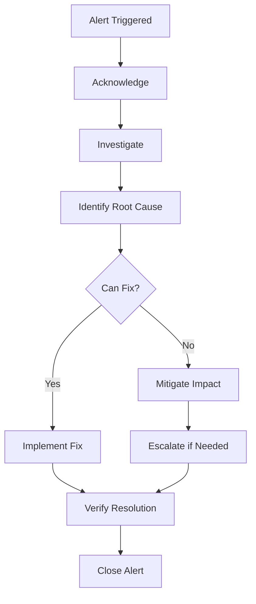
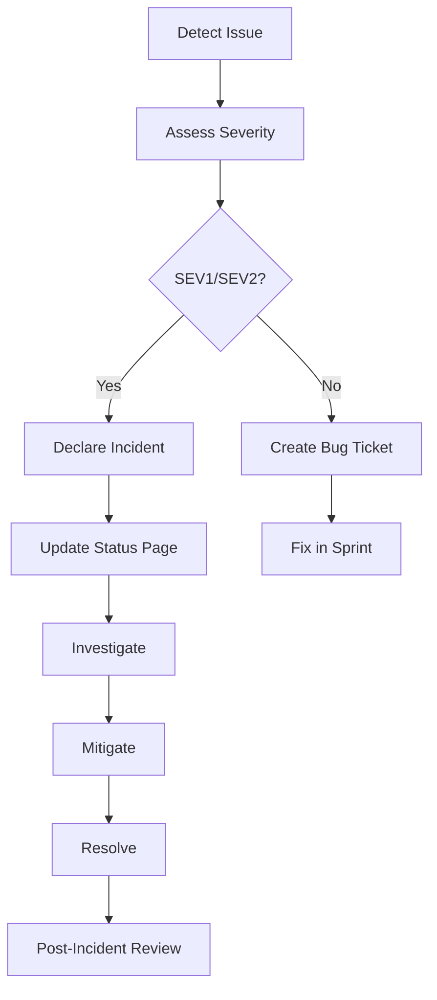
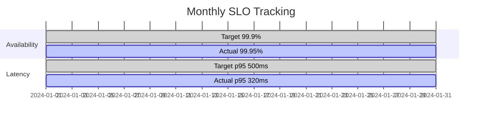

# Observability & Operations

This document defines how Grove is monitored, how incidents are handled, and what operational procedures ensure platform reliability.

## Observability Strategy



---

## Monitoring Stack

### Current Implementation

| Layer | Tool | Status |
|-------|------|--------|
| Error Tracking | Sentry | Planned |
| Analytics | PostHog | Planned |
| Logs | Supabase Dashboard | Active |
| Metrics | Supabase Dashboard | Active |
| Uptime | Supabase Status | Active |

### Planned Stack



---

## Key Metrics

### Application Health Metrics

| Metric | Target | Critical Threshold |
|--------|--------|-------------------|
| App Crash Rate | < 0.1% | > 1% |
| ANR Rate (Android) | < 0.1% | > 0.5% |
| API Error Rate | < 1% | > 5% |
| API Latency (p95) | < 500ms | > 2000ms |
| Auth Success Rate | > 99% | < 95% |

### Business Metrics

| Metric | Description | Tracking |
|--------|-------------|----------|
| Daily Active Users | Unique users per day | PostHog |
| Weekly Active Users | Unique users per week | PostHog |
| Communities Created | New communities per week | Custom |
| Events Created | Events per week | Custom |
| Message Volume | Messages per day | Database |
| User Retention (D1, D7, D30) | Cohort analysis | PostHog |

### Infrastructure Metrics

| Metric | Source | Alert On |
|--------|--------|----------|
| Database Size | Supabase | > 400MB (free tier) |
| Storage Usage | Supabase | > 800MB |
| API Requests | Supabase | > 1.5M/month |
| Realtime Connections | Supabase | > 150 concurrent |
| Edge Function Invocations | Supabase | > 400K/month |

---

## Error Tracking

### Sentry Configuration

```typescript
import * as Sentry from '@sentry/react-native';

Sentry.init({
  dsn: process.env.SENTRY_DSN,
  environment: __DEV__ ? 'development' : 'production',
  tracesSampleRate: 0.2,
  profilesSampleRate: 0.1,
  attachStacktrace: true,
  enableAutoSessionTracking: true,
  sessionTrackingIntervalMillis: 30000,
  beforeSend(event) {
    // Scrub sensitive data
    if (event.user) {
      delete event.user.email;
    }
    return event;
  },
});
```

### Error Categories



### Error Severity Levels

| Level | Definition | Response Time | Examples |
|-------|------------|---------------|----------|
| Critical | Service down, data loss | Immediate | Auth broken, DB unreachable |
| High | Major feature broken | 4 hours | Chat not working, events fail |
| Medium | Minor feature issue | 24 hours | Image upload fails sometimes |
| Low | Cosmetic, edge case | 1 week | UI glitch on specific device |

---

## Analytics

### Event Taxonomy

**User Events:**

```typescript
// Authentication
analytics.track('user_signed_up', { method: 'email' | 'google' | 'apple' });
analytics.track('user_signed_in', { method: 'email' | 'google' | 'apple' });
analytics.track('user_signed_out');

// Communities
analytics.track('community_created', { category, join_mode });
analytics.track('community_joined', { method: 'invite' | 'request' | 'public' });
analytics.track('community_left', { reason });

// Events
analytics.track('event_created', { is_recurring, has_location });
analytics.track('event_rsvp', { status: 'going' | 'maybe' | 'not_going' });

// Engagement
analytics.track('message_sent', { has_media: boolean });
analytics.track('post_created', { has_media: boolean });
analytics.track('comment_added');

// Finance
analytics.track('transaction_added', { type: 'income' | 'expense' });
analytics.track('contribution_created', { amount, member_count });
```

### Funnel Analysis

**Core User Journey:**



**Expected Conversion Rates:**

| Step | Target |
|------|--------|
| Install → Sign Up | > 60% |
| Sign Up → Create Community | > 40% |
| Create Community → Invite | > 70% |
| Invite → First Event | > 50% |

### Retention Cohorts

| Metric | Target | Healthy |
|--------|--------|---------|
| Day 1 Retention | > 40% | > 50% |
| Day 7 Retention | > 20% | > 30% |
| Day 30 Retention | > 10% | > 15% |

---

## Logging

### Log Levels

| Level | Usage | Example |
|-------|-------|---------|
| ERROR | Unexpected failures | API call failed, exception |
| WARN | Degraded operation | Retry succeeded, rate limited |
| INFO | Significant events | User action, state change |
| DEBUG | Development only | Internal state, calculations |

### Structured Logging

```typescript
// Log format
const log = {
  timestamp: new Date().toISOString(),
  level: 'INFO',
  message: 'Event created',
  context: {
    user_id: 'uuid',
    community_id: 'uuid',
    event_id: 'uuid',
    is_recurring: true,
  },
  metadata: {
    app_version: '1.0.0',
    platform: 'ios',
    device: 'iPhone 14',
  },
};
```

### Log Retention

| Log Type | Retention | Purpose |
|----------|-----------|---------|
| Error logs | 90 days | Debugging |
| Auth logs | 30 days | Security |
| API logs | 7 days | Performance |
| Debug logs | 1 day | Development |

---

## Alerting

### Alert Rules



### Alert Configurations

| Alert | Condition | Severity | Channel |
|-------|-----------|----------|---------|
| High Error Rate | > 5% for 5 min | Critical | PagerDuty |
| API Latency Spike | p95 > 2s for 5 min | High | Slack |
| Auth Failures | > 10% for 10 min | High | Slack |
| Database Near Limit | > 90% capacity | High | Email |
| Low Disk Space | < 10% remaining | Medium | Email |
| Unusual Traffic | > 3x normal | Medium | Slack |

### Alert Response



---

## Incident Management

### Incident Severity

| Level | Definition | Response | Communication |
|-------|------------|----------|---------------|
| SEV1 | Complete outage | All hands | Status page + Social |
| SEV2 | Major degradation | Primary oncall | Status page |
| SEV3 | Minor issue | Best effort | Internal only |
| SEV4 | Cosmetic | Next sprint | Internal only |

### Incident Response Process



### On-Call Rotation

| Role | Responsibility | Escalation |
|------|----------------|------------|
| Primary | First responder | 15 min response |
| Secondary | Backup if primary unavailable | 30 min response |
| Engineering Lead | Major incidents | As needed |

---

## Dashboards

### Operations Dashboard

**Sections:**
1. **Health Overview**
   - Current error rate
   - API latency (p50, p95, p99)
   - Active users
   - System status

2. **Trends**
   - Error rate over time
   - Request volume
   - User activity

3. **Alerts**
   - Active alerts
   - Recent incidents
   - Threshold status

### Product Dashboard

**Sections:**
1. **User Metrics**
   - DAU/WAU/MAU
   - New signups
   - Retention cohorts

2. **Feature Usage**
   - Communities created
   - Events scheduled
   - Messages sent
   - Transactions logged

3. **Funnels**
   - Onboarding completion
   - Activation rate
   - Feature adoption

---

## Health Checks

### Automated Checks

```typescript
// Health check endpoint
async function healthCheck() {
  const checks = {
    database: await checkDatabase(),
    auth: await checkAuth(),
    storage: await checkStorage(),
    realtime: await checkRealtime(),
  };

  const healthy = Object.values(checks).every(c => c.status === 'ok');

  return {
    status: healthy ? 'healthy' : 'degraded',
    checks,
    timestamp: new Date().toISOString(),
  };
}
```

### Check Schedule

| Check | Frequency | Timeout |
|-------|-----------|---------|
| Database connectivity | 1 min | 5 sec |
| Auth service | 5 min | 10 sec |
| Storage access | 5 min | 10 sec |
| Realtime connection | 1 min | 5 sec |

---

## Runbooks

### Common Issues

#### High Error Rate

```
SYMPTOMS: Error rate > 5%
POSSIBLE CAUSES:
1. API changes without client update
2. Database connection issues
3. Third-party service outage

STEPS:
1. Check Sentry for error distribution
2. Review recent deployments
3. Check Supabase status
4. Roll back if deployment-related
5. Escalate to engineering lead if unresolved
```

#### Slow API Response

```
SYMPTOMS: p95 latency > 2 seconds
POSSIBLE CAUSES:
1. Database query performance
2. High traffic spike
3. N+1 queries

STEPS:
1. Check Supabase query performance
2. Review slow query logs
3. Check for traffic anomalies
4. Enable query caching if needed
5. Scale resources if traffic-related
```

#### Auth Failures

```
SYMPTOMS: Auth success rate < 95%
POSSIBLE CAUSES:
1. OAuth provider issues
2. Token validation errors
3. Rate limiting

STEPS:
1. Check OAuth provider status
2. Review auth error messages
3. Check for rate limiting
4. Verify API keys are valid
5. Contact provider if their issue
```

---

## Service Level Objectives (SLOs)

| Metric | SLO | Error Budget |
|--------|-----|--------------|
| Availability | 99.9% | 43 min/month |
| API Latency (p95) | < 500ms | N/A |
| Error Rate | < 1% | N/A |
| Push Delivery | 95% within 10s | 5% delayed |

### SLO Tracking



---

## Capacity Planning

### Current Limits

| Resource | Limit (Free) | Current | Runway |
|----------|--------------|---------|--------|
| Database | 500 MB | 50 MB | 10x |
| Storage | 1 GB | 100 MB | 10x |
| API Requests | 2M/month | 100K | 20x |
| Realtime | 200 concurrent | 10 | 20x |

### Scaling Triggers

| Metric | Upgrade Trigger | Action |
|--------|-----------------|--------|
| Database > 400 MB | High | Upgrade to Pro |
| Storage > 800 MB | High | Upgrade to Pro |
| API > 1.5M/month | Medium | Monitor closely |
| Users > 1000 DAU | Low | Plan upgrade |
