# Technical Overview

Grove is a **mobile-first community platform** designed to help local groups, clubs, and organizations coordinate their activities without the complexity of enterprise software. This document provides a comprehensive technical overview of the platform's design philosophy, core capabilities, and technology choices.

## Platform Vision

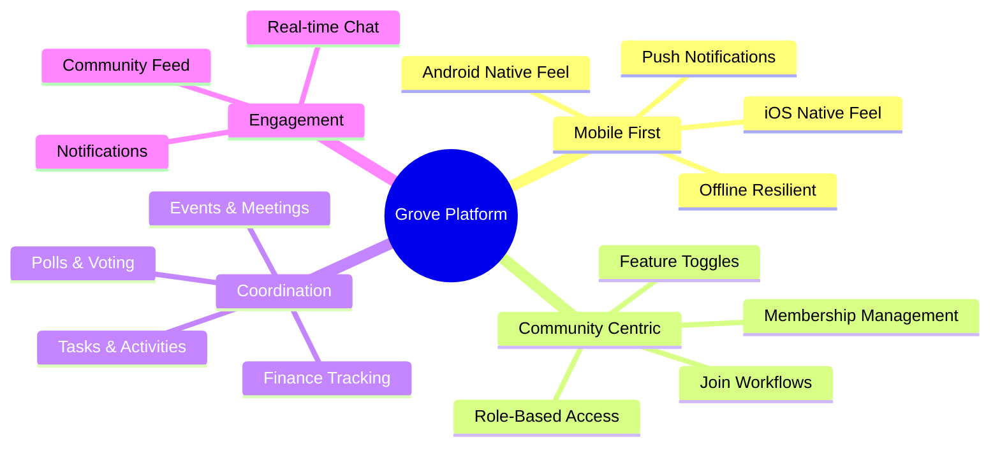

## Guiding Principles

### 1. Ship Quickly Without Sacrificing Reliability

Grove uses managed services (Supabase, Expo) to minimize infrastructure overhead while maintaining enterprise-grade reliability:

| Aspect | Approach |
|--------|----------|
| **Database** | Managed PostgreSQL with automatic backups |
| **Authentication** | Supabase Auth with OAuth providers |
| **Storage** | Supabase Storage with CDN |
| **Builds** | EAS Build for iOS and Android |
| **Updates** | OTA updates via EAS Update |

### 2. Keep the Data Model Simple and Extensible

The database schema follows a **community-centric** design where:
- Communities are the top-level organizing entity
- All features are scoped to communities
- Users can belong to multiple communities with different roles
- New features can be added without schema redesign

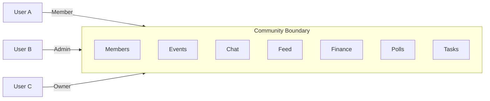

### 3. Support Feature Flags for Optional Modules

Not all communities need all features. Grove implements **toggleable feature modules**:

| Feature | Default | Toggleable |
|---------|---------|------------|
| Events | Enabled | No |
| Chat | Enabled | No |
| Feed | Enabled | No |
| Finance | Disabled | Yes |
| Polls | Disabled | Yes |
| Meetings | Disabled | Yes |
| Tasks | Disabled | Yes |

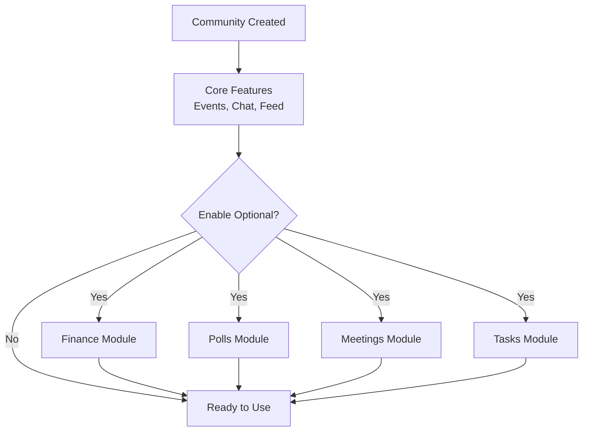

### 4. Treat Privacy and Trust as First-Class Requirements

Security is built into every layer:

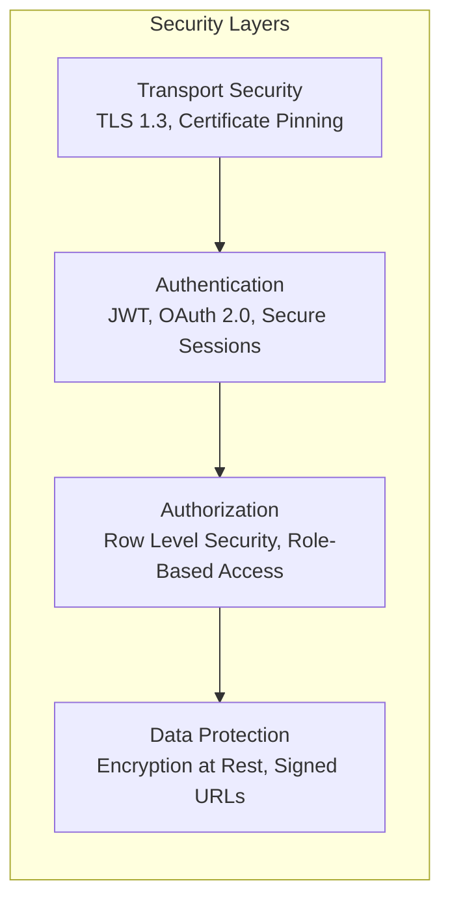

---

## Core Components

### Mobile Client

The mobile application is the primary interface for Grove users.

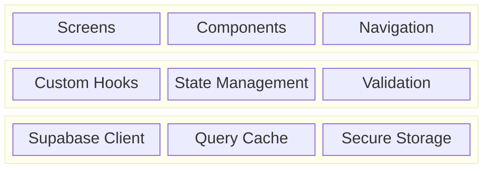

**Key Technologies:**
- **Expo SDK 54**: Managed workflow for rapid development
- **React Native 0.81**: Cross-platform native UI
- **Expo Router 6**: File-based navigation
- **NativeWind**: Tailwind CSS for React Native
- **React Query**: Server state management
- **Zustand**: Client state management

### Backend Services

Supabase provides a complete backend infrastructure:

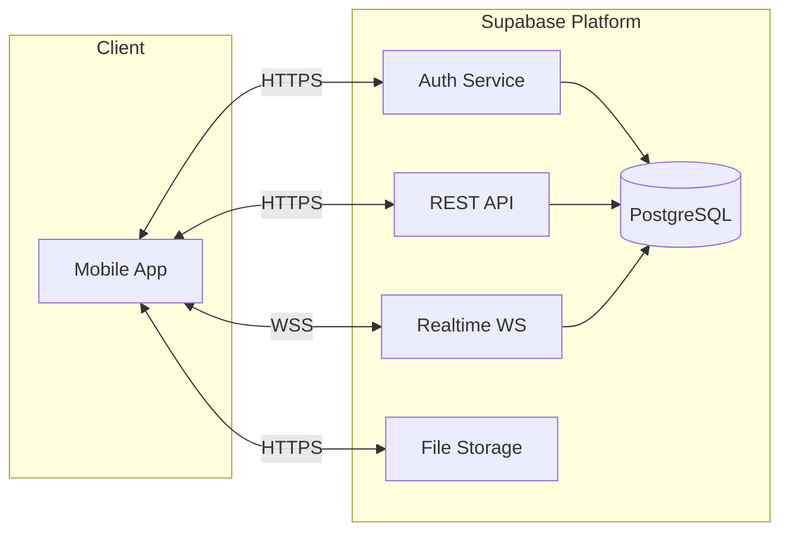

**Backend Capabilities:**
- **PostgreSQL Database**: Full SQL with RLS
- **Authentication**: Email, OAuth, Magic Links
- **Real-time**: WebSocket subscriptions
- **Storage**: File uploads with access control
- **Edge Functions**: Serverless compute

### Notification Delivery

Push notifications keep users engaged:

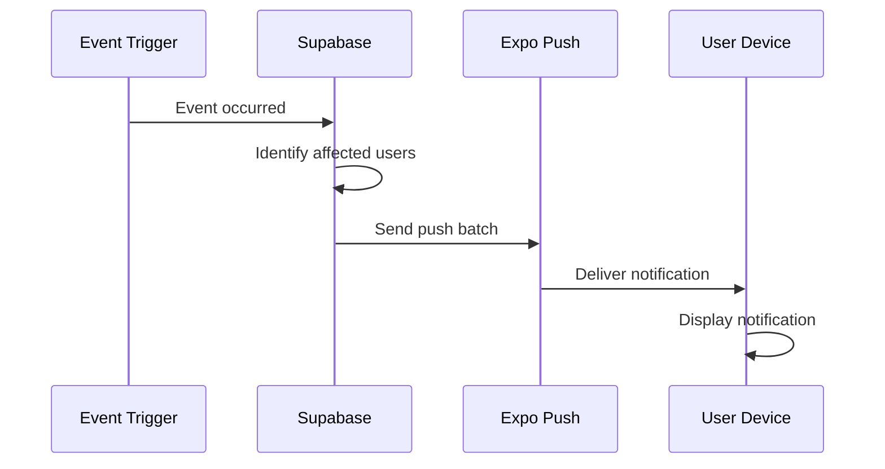

---

## Application Architecture

### Layer Diagram

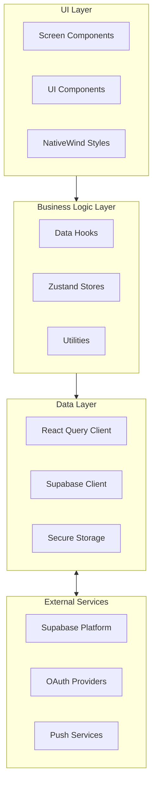

### Feature Module Organization

Each major feature follows a consistent structure:

```
features/
├── events/
│   ├── hooks/          # useEvents, useEvent, useEventMutations
│   ├── components/     # EventCard, EventList, EventForm
│   ├── screens/        # EventListScreen, EventDetailScreen
│   └── types/          # TypeScript interfaces
├── chat/
│   ├── hooks/          # useMessages, useSendMessage
│   ├── components/     # MessageList, MessageInput
│   └── screens/        # ChatScreen
└── finance/
    ├── hooks/          # useTransactions, useContributions
    ├── components/     # TransactionCard, ContributionCard
    └── screens/        # FinanceScreen, AddTransactionScreen
```

---

## Data Flow Patterns

### Read Operations (Queries)

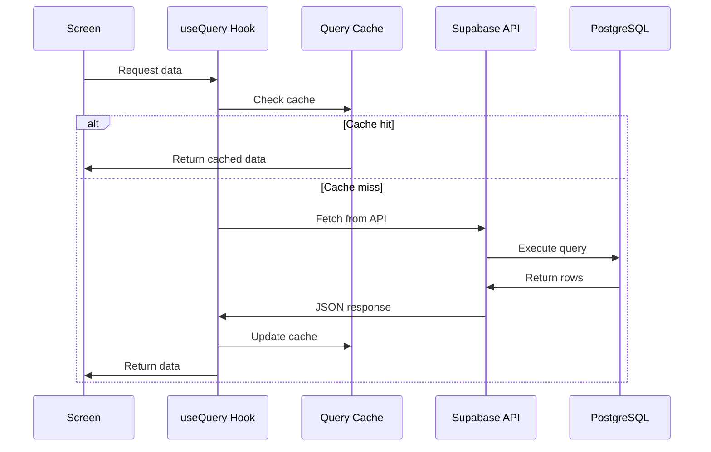

### Write Operations (Mutations)

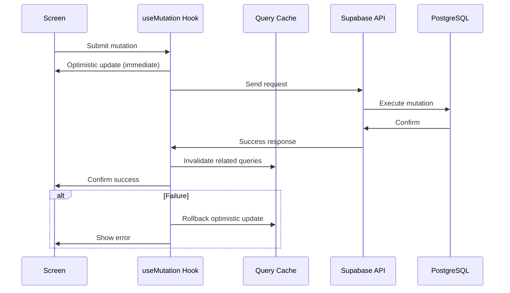

### Real-time Subscriptions

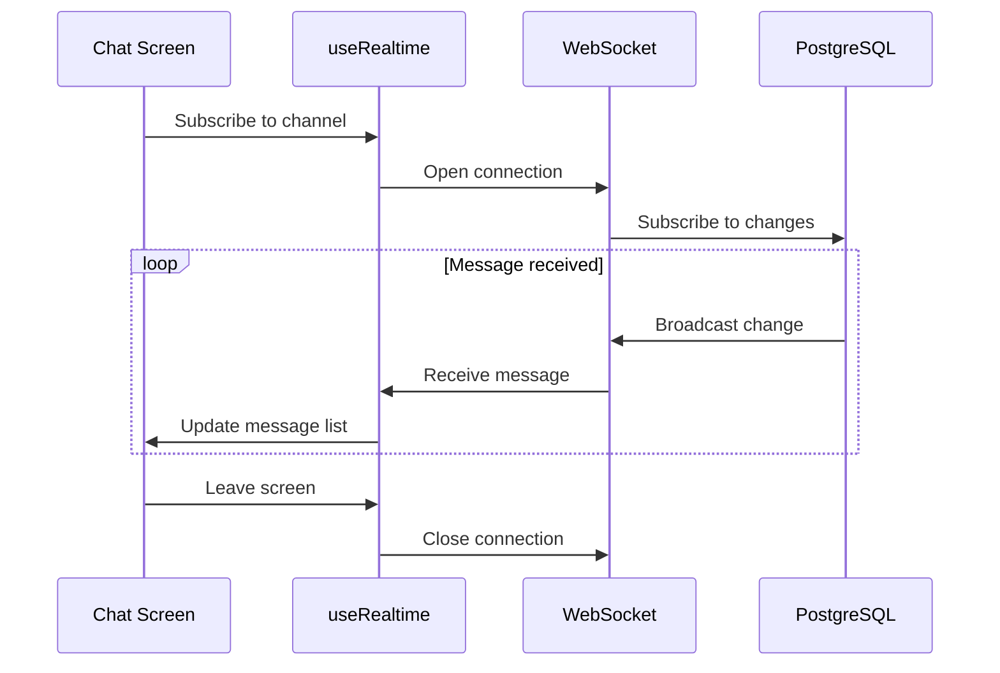

---

## Authentication System

### Supported Authentication Methods

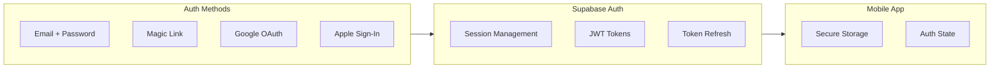

### Authentication Flow

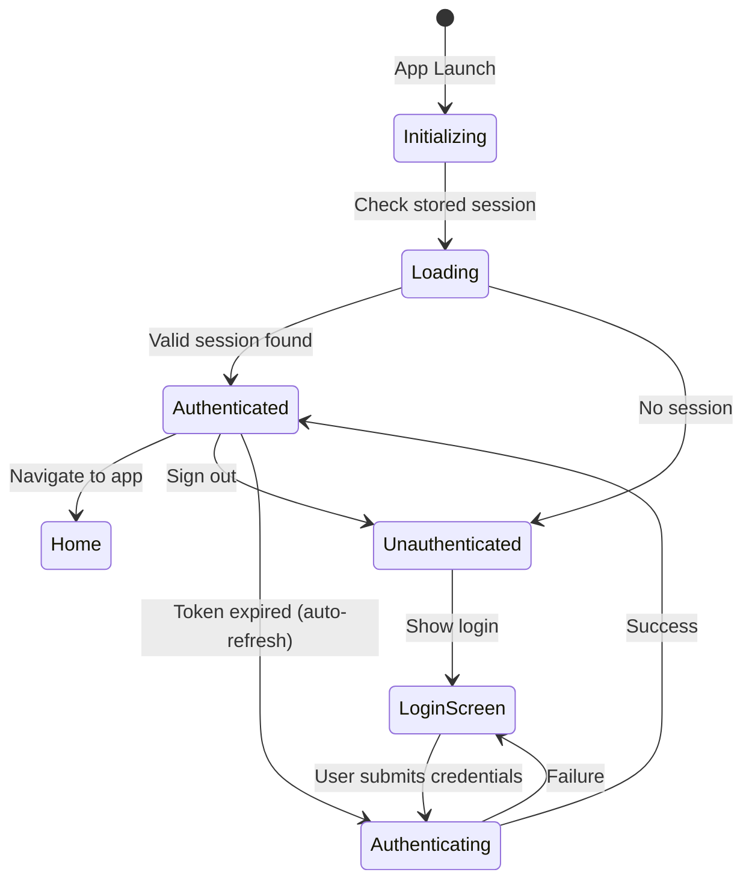

### Session Management

| Token Type | Storage | Expiration | Refresh |
|------------|---------|------------|---------|
| Access Token | Memory | 1 hour | Automatic |
| Refresh Token | Secure Storage | 1 week | On access token expiry |

---

## Performance Optimization

### Client-Side Strategies

1. **Query Caching**: React Query caches API responses
2. **Optimistic Updates**: Immediate UI feedback for mutations
3. **Image Optimization**: Compressed uploads, cached downloads
4. **List Virtualization**: Only render visible items
5. **Lazy Loading**: Load screens on demand

### Backend Strategies

1. **Database Indexes**: Optimized for common queries
2. **Connection Pooling**: Managed by Supabase
3. **Row Level Security**: Efficient policy evaluation
4. **CDN for Storage**: Static assets served from edge

### Performance Targets

| Metric | Target | Current |
|--------|--------|---------|
| App Launch | < 2s | ~1.5s |
| Screen Transition | < 300ms | ~200ms |
| API Response (p95) | < 500ms | ~300ms |
| Image Load | < 1s | ~600ms |

---

## Error Handling

### Error Categories

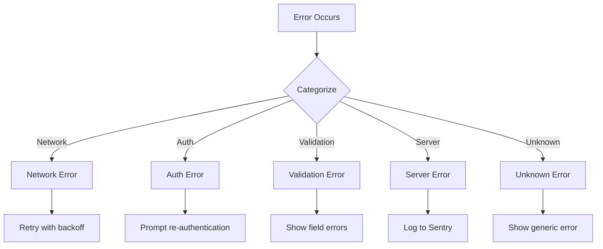

### Error Handling Strategy

| Error Type | User Experience | Technical Action |
|------------|-----------------|------------------|
| Network offline | Show offline banner | Queue for retry |
| Auth expired | Redirect to login | Clear tokens, refresh |
| Validation | Inline field errors | Prevent submission |
| Server 500 | Toast with retry | Log to monitoring |
| Rate limited | "Try again later" | Exponential backoff |

---

## Development Workflow

### Local Development

```bash
# Install dependencies
npm install

# Start development server
npm start

# Run on iOS simulator
npm run ios

# Run on Android emulator
npm run android
```

### Build Pipeline

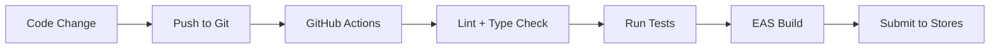

### Environment Configuration

| Environment | Database | Auth Providers | Features |
|-------------|----------|----------------|----------|
| Development | Local/Staging | Test accounts | All enabled |
| Preview | Staging | OAuth sandbox | All enabled |
| Production | Production | Live OAuth | Feature flags |

---

## Monitoring and Observability

### Current Implementation

- **Error Tracking**: Sentry (planned)
- **Analytics**: PostHog (planned)
- **Logs**: Supabase Dashboard
- **Performance**: React Native Performance Monitor

### Monitoring Dashboard (Planned)

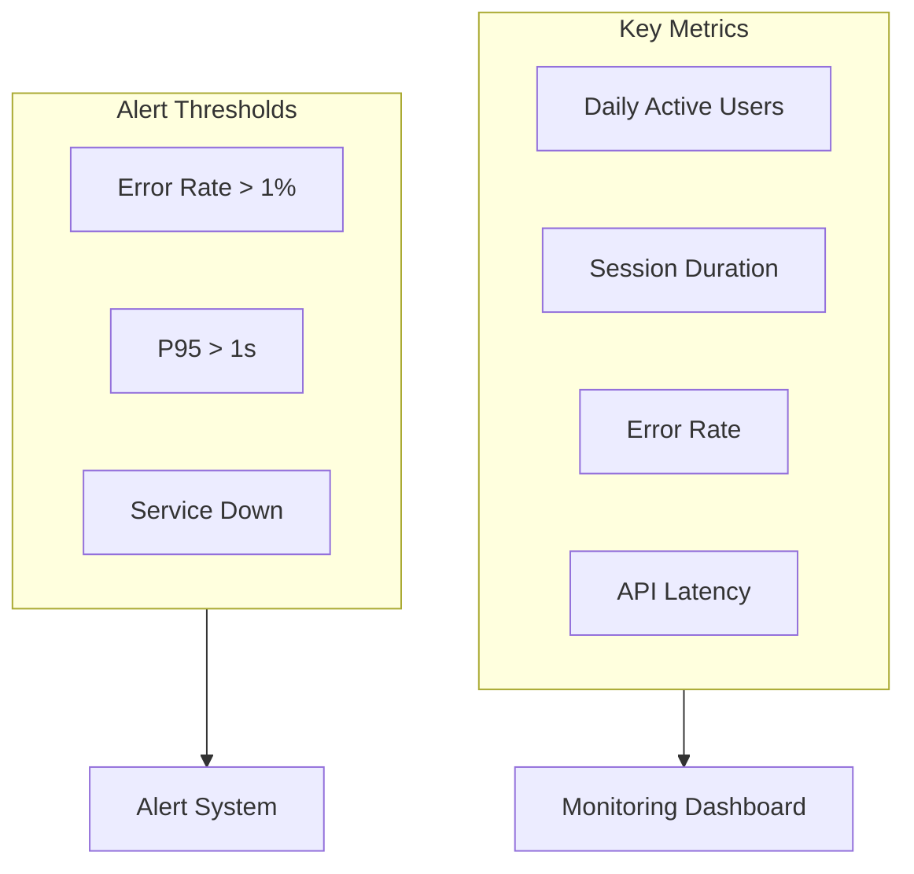

---

## Deployment Architecture

### Current Deployment

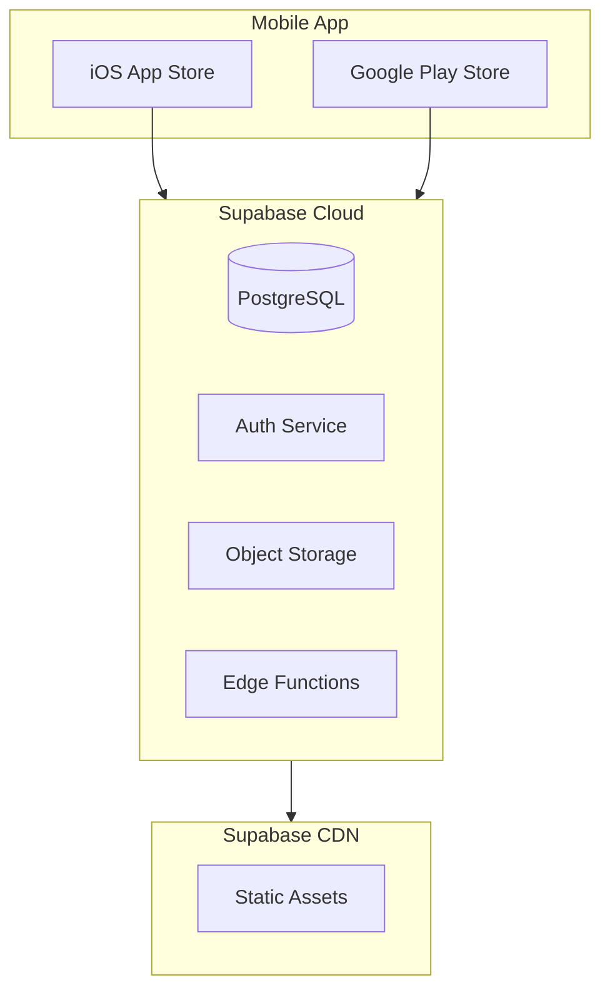

### Release Process

1. **Development**: Feature branches, local testing
2. **Preview**: EAS Preview builds for testers
3. **Beta**: TestFlight (iOS) / Internal Testing (Android)
4. **Production**: Staged rollout to app stores

---

## Future Technical Roadmap

### Phase 2 Enhancements

- [ ] Offline-first with local SQLite sync
- [ ] Enhanced push notification targeting
- [ ] In-app analytics integration
- [ ] Performance monitoring with Sentry

### Phase 3 Scale

- [ ] Multi-region database replication
- [ ] Advanced caching with Redis
- [ ] Payment integration (Stripe Connect)
- [ ] Calendar sync (Google/Apple Calendar)

---

## Technical Decisions Log

| Decision | Choice | Rationale |
|----------|--------|-----------|
| Mobile Framework | Expo/React Native | Cross-platform, rapid development |
| Backend | Supabase | Managed PostgreSQL, built-in auth |
| State Management | React Query + Zustand | Server vs client state separation |
| Styling | NativeWind | Familiar Tailwind syntax |
| Navigation | Expo Router | File-based, type-safe |
| Real-time | Supabase Realtime | Integrated with database |
| Push | Expo Notifications | Cross-platform, EAS integration |
