# Security & Privacy

Grove is built with security and privacy as fundamental requirements, not afterthoughts. This document outlines our security architecture, data protection measures, and privacy controls.

## Security Philosophy

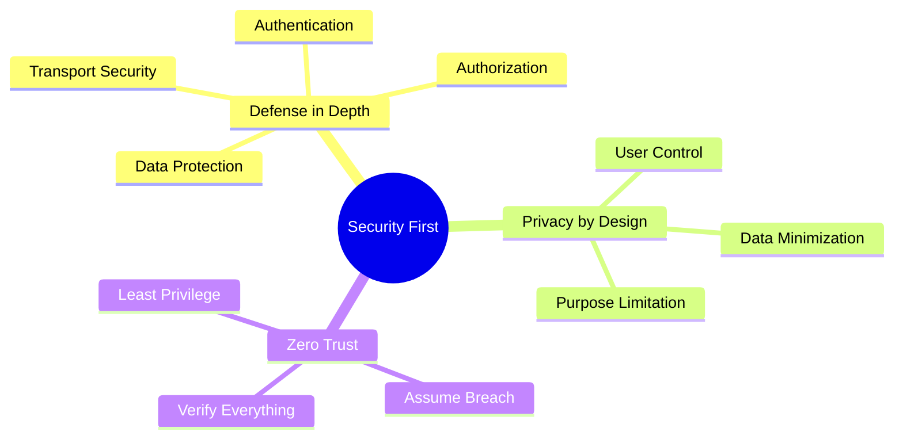

---

## Security Architecture

### Defense in Depth

Grove implements multiple security layers to protect user data:

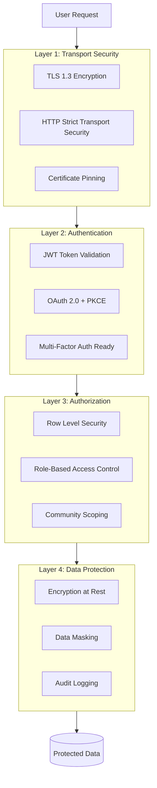

### Security Controls Matrix

| Layer | Control | Implementation | Status |
|-------|---------|----------------|--------|
| Transport | TLS 1.3 | Supabase managed | Active |
| Transport | HSTS | Supabase default | Active |
| Auth | JWT tokens | Supabase Auth | Active |
| Auth | OAuth 2.0 | Google, Apple | Active |
| Auth | Password hashing | bcrypt | Active |
| Authz | Row Level Security | PostgreSQL RLS | Active |
| Authz | Role-based access | Owner/Admin/Member | Active |
| Data | Encryption at rest | Supabase managed | Active |
| Data | Signed URLs | Storage access | Active |
| Monitoring | Audit logs | Planned | Planned |

---

## Authentication Security

### Authentication Flow

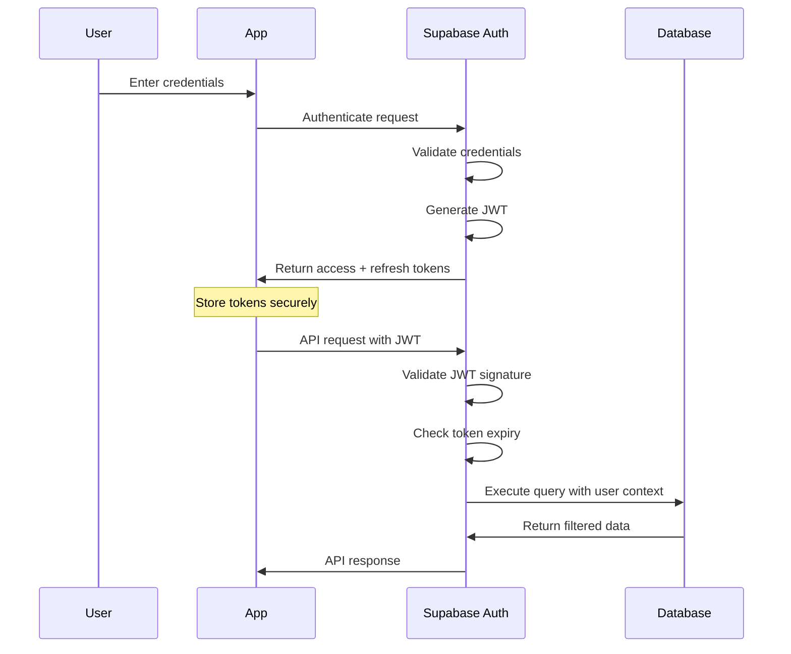

### Token Security

**Token Types:**

| Token | Lifetime | Storage | Refresh |
|-------|----------|---------|---------|
| Access Token | 1 hour | Memory | Auto-refresh |
| Refresh Token | 7 days | Secure Storage | On expiry |

**Secure Storage Implementation:**
```typescript
// iOS: Keychain
// Android: EncryptedSharedPreferences
import * as SecureStore from 'expo-secure-store';

await SecureStore.setItemAsync('refresh_token', token, {
  keychainAccessible: SecureStore.WHEN_UNLOCKED_THIS_DEVICE_ONLY,
});
```

### Password Requirements

- Minimum 8 characters
- No maximum limit
- Hashed with bcrypt (cost factor 10)
- No password stored in plaintext

### OAuth Security (PKCE)

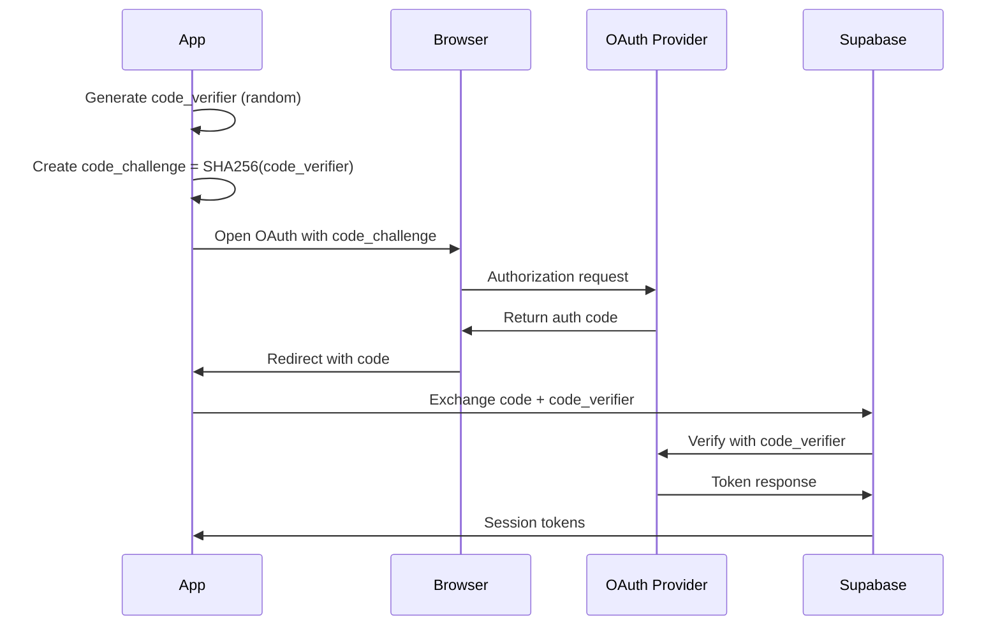

---

## Authorization Security

### Row Level Security (RLS)

Every table in Grove has RLS policies that enforce access control at the database level:

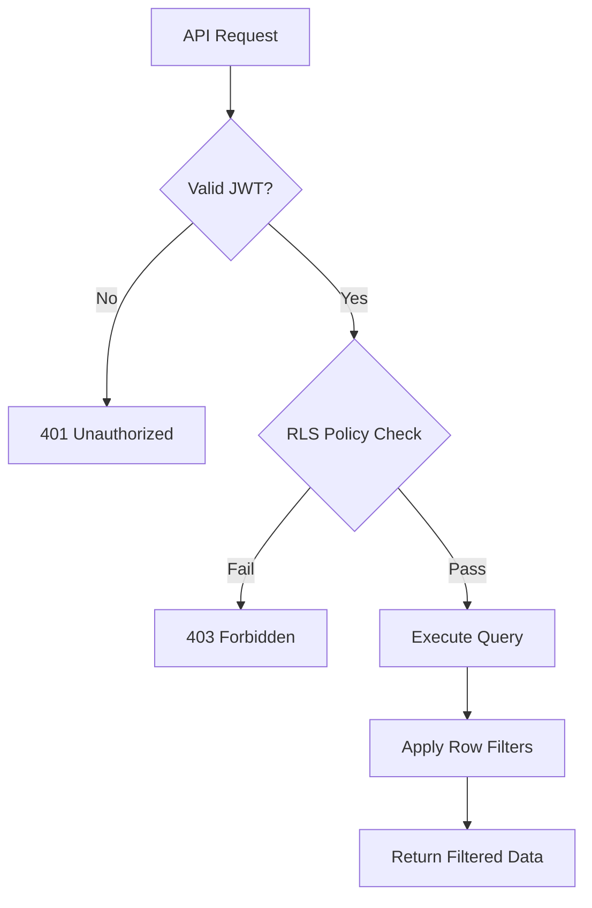

**Example RLS Policies:**

```sql
-- Users can only view communities they belong to
CREATE POLICY "community_member_select"
ON communities FOR SELECT
USING (
  id IN (
    SELECT community_id FROM community_members
    WHERE user_id = auth.uid()
  )
);

-- Only community owners can delete communities
CREATE POLICY "community_owner_delete"
ON communities FOR DELETE
USING (
  id IN (
    SELECT community_id FROM community_members
    WHERE user_id = auth.uid() AND role = 'owner'
  )
);

-- Users can only update their own profile
CREATE POLICY "profile_owner_update"
ON profiles FOR UPDATE
USING (id = auth.uid());
```

### Role-Based Access Control

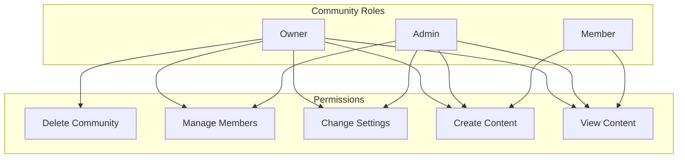

**Permission Matrix:**

| Action | Owner | Admin | Member |
|--------|-------|-------|--------|
| Delete community | Yes | No | No |
| Transfer ownership | Yes | No | No |
| Manage members | Yes | Yes | No |
| Change settings | Yes | Yes | No |
| Create events | Yes | Yes | No |
| Create posts | Yes | Yes | Yes |
| Send messages | Yes | Yes | Yes |
| View content | Yes | Yes | Yes |
| RSVP to events | Yes | Yes | Yes |

---

## Data Protection

### Encryption

**In Transit:**
- All API calls over HTTPS (TLS 1.3)
- WebSocket connections use WSS
- No sensitive data in query parameters

**At Rest:**
- Database encryption managed by Supabase
- Storage buckets encrypted
- Backups encrypted

### Sensitive Data Handling

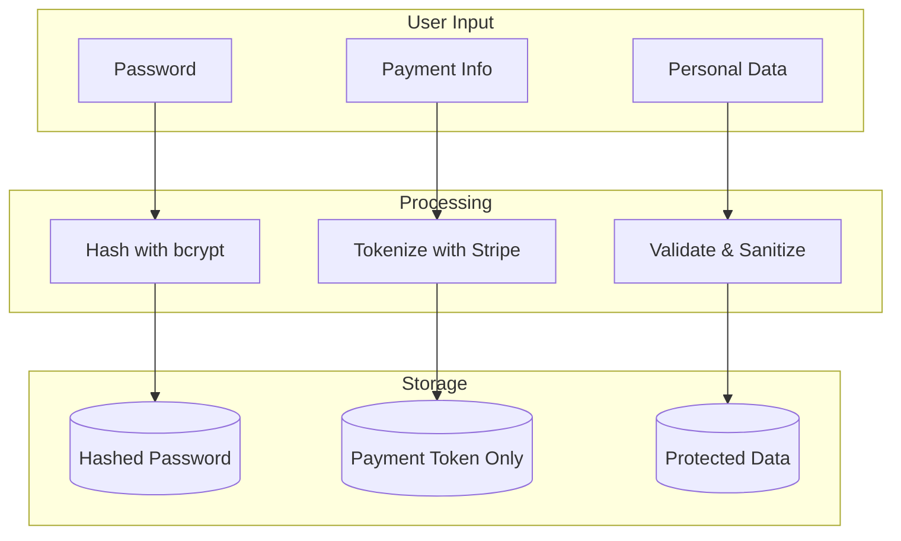

### Media Security

**Storage Access Control:**
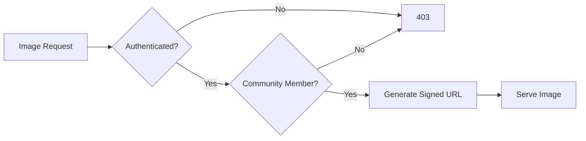

**Signed URL Implementation:**
```typescript
// Generate signed URL with expiration
const { data } = supabase.storage
  .from('community-images')
  .createSignedUrl(path, 3600); // 1 hour expiry
```

---

## Privacy Controls

### Data Minimization

Grove only collects data necessary for the service:

| Data Type | Purpose | Retention |
|-----------|---------|-----------|
| Email | Authentication, notifications | Account lifetime |
| Name | Display in community | Account lifetime |
| Avatar | Profile display | Account lifetime |
| Messages | Community communication | Indefinite |
| Transactions | Finance tracking | 7 years (compliance) |

### User Privacy Rights

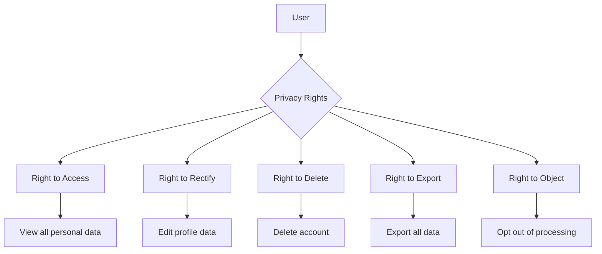

### Privacy Features

1. **Profile Visibility**
   - Profile visible only to community members
   - Can hide email from other members
   - No public profile pages (MVP)

2. **Data Access**
   - Users can view all their data
   - Export functionality planned
   - Account deletion available

3. **Communication Preferences**
   - Push notification controls
   - Email notification preferences
   - Per-community notification settings

---

## Compliance

### GDPR Readiness

| Requirement | Status | Implementation |
|-------------|--------|----------------|
| Lawful basis | Ready | Consent + Legitimate interest |
| Data minimization | Ready | Only necessary data collected |
| Purpose limitation | Ready | Clear purposes documented |
| Right to access | Ready | Profile view in app |
| Right to rectification | Ready | Edit profile in app |
| Right to erasure | Ready | Account deletion |
| Data portability | Planned | Export feature |
| Privacy by design | Ready | Built into architecture |

### Data Processing

**Third-Party Processors:**

| Processor | Purpose | Data Shared | DPA |
|-----------|---------|-------------|-----|
| Supabase | Backend infrastructure | All user data | Yes |
| Google Cloud | OAuth, infrastructure | Auth data | Yes |
| Apple | Apple Sign-In | Auth data | Yes |
| Expo | Push notifications | Push tokens | Yes |

---

## Threat Model

### Identified Threats

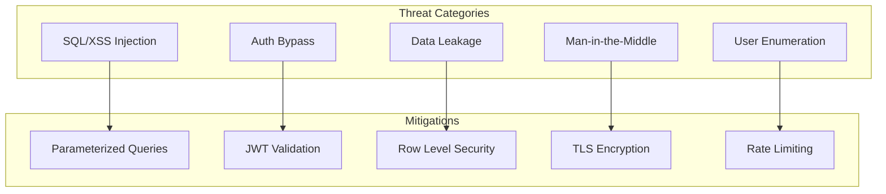

### Security Controls by Threat

| Threat | Risk | Mitigation | Status |
|--------|------|------------|--------|
| SQL Injection | High | Parameterized queries via Supabase | Mitigated |
| XSS | Medium | React Native (no DOM) | N/A |
| CSRF | Medium | SameSite cookies, token auth | Mitigated |
| Auth bypass | High | RLS, JWT validation | Mitigated |
| Data exposure | High | RLS policies, scoped access | Mitigated |
| Brute force | Medium | Rate limiting, lockout | Partial |
| Token theft | Medium | Secure storage, short expiry | Mitigated |

---

## Security Monitoring

### Current Monitoring

- Supabase Dashboard: API usage, errors
- Authentication logs: Sign-in attempts
- Storage logs: Access patterns

### Planned Monitoring

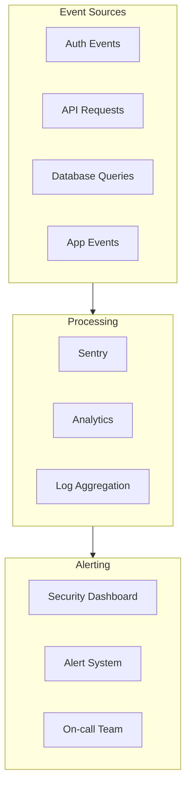

### Security Events to Monitor

| Event | Severity | Action |
|-------|----------|--------|
| Multiple failed logins | High | Temporary lockout |
| Unusual API patterns | Medium | Review and alert |
| RLS policy violations | High | Log and investigate |
| Token refresh failures | Low | Monitor trends |
| Mass data access | High | Alert immediately |

---

## Incident Response

### Response Plan

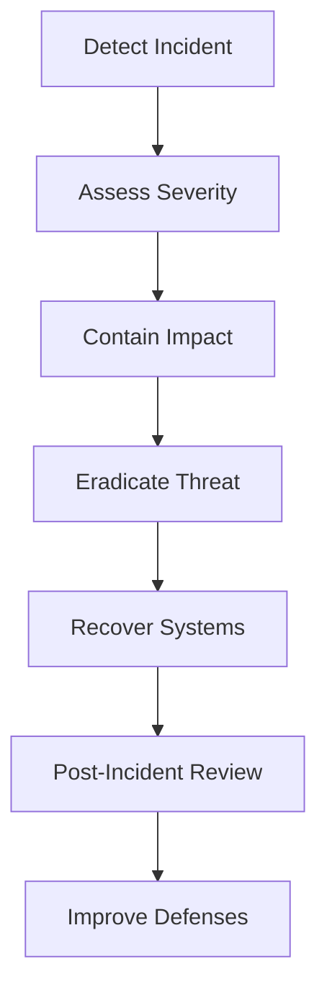

### Severity Levels

| Level | Definition | Response Time |
|-------|------------|---------------|
| Critical | Active data breach | Immediate |
| High | Security vulnerability | 4 hours |
| Medium | Potential exposure | 24 hours |
| Low | Minor issue | 1 week |

---

## Security Checklist

### Pre-Launch Security

- [x] TLS enabled on all endpoints
- [x] JWT token validation
- [x] RLS policies on all tables
- [x] Password hashing with bcrypt
- [x] OAuth with PKCE
- [x] Secure token storage
- [x] Input validation
- [ ] Rate limiting configured
- [ ] Audit logging enabled
- [ ] Security monitoring setup
- [ ] Incident response plan tested

### Ongoing Security

- [ ] Quarterly security review
- [ ] Dependency vulnerability scanning
- [ ] Penetration testing (annual)
- [ ] Security training for team
- [ ] Privacy policy updates
