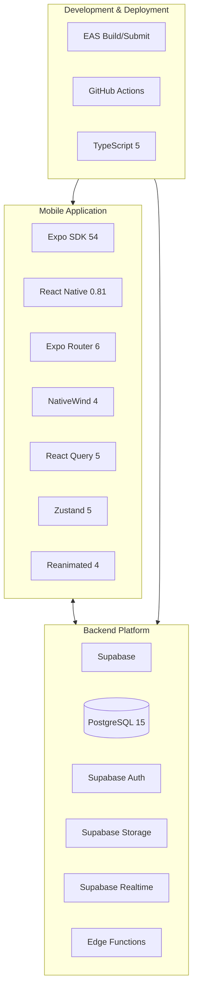
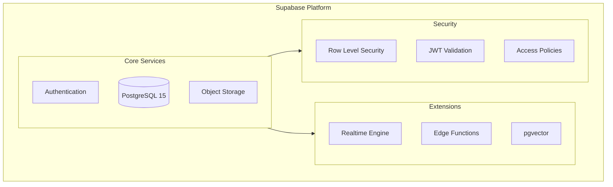

# Technology Stack

This document provides a comprehensive breakdown of all technologies, frameworks, and tools used in the Grove platform, along with the rationale for each choice.

## Stack Overview



---

## Mobile Technology Stack

### Core Framework

#### Expo SDK 54

**Why Expo?**
- Managed workflow reduces native complexity
- Over-the-air updates for quick fixes
- Unified build system (EAS)
- Rich ecosystem of pre-built modules

```json
{
  "expo": "~54.0.0",
  "expo-router": "~6.0.0",
  "expo-dev-client": "~6.0.0"
}
```

**Key Expo Modules Used:**

| Module | Version | Purpose |
|--------|---------|---------|
| expo-router | 6.0.0 | File-based navigation |
| expo-secure-store | 15.0.0 | Secure credential storage |
| expo-image-picker | 16.0.0 | Photo/video selection |
| expo-notifications | 0.32.0 | Push notifications |
| expo-haptics | 15.0.8 | Touch feedback |
| expo-image | 2.1.0 | Optimized image loading |
| expo-apple-authentication | 7.2.0 | Apple Sign-In |
| expo-auth-session | 6.1.0 | OAuth flows |

#### React Native 0.81

**Why React Native?**
- Native performance with JavaScript
- Large community and ecosystem
- Shared codebase for iOS and Android
- Strong TypeScript support

**New Architecture Enabled:**
```json
{
  "expo": {
    "newArchEnabled": true
  }
}
```

Benefits of New Architecture:
- Improved performance via TurboModules
- Better JavaScript/Native interop
- Reduced memory footprint

---

### Navigation

#### Expo Router 6

**File-Based Routing:**
```
app/
├── (auth)/
│   ├── login.tsx
│   └── forgot-password.tsx
├── (tabs)/
│   ├── _layout.tsx
│   ├── index.tsx
│   └── events/
│       └── index.tsx
└── community/
    └── [id]/
        └── index.tsx
```

**Features Used:**
- Nested layouts with `_layout.tsx`
- Dynamic routes with `[param]`
- Route groups with `(group)`
- Modal presentation
- Deep linking with `grove://` scheme

**Type-Safe Navigation:**
```typescript
// Automatically generated types
import { router } from 'expo-router';

router.push('/community/123');
router.push({
  pathname: '/event/[id]',
  params: { id: eventId }
});
```

---

### Styling

#### NativeWind 4 (Tailwind CSS)

**Why NativeWind?**
- Familiar Tailwind syntax
- Utility-first approach
- Consistent design system
- Responsive design support

**Configuration:**
```javascript
// tailwind.config.js
module.exports = {
  content: ['./app/**/*.{js,jsx,ts,tsx}', './components/**/*.{js,jsx,ts,tsx}'],
  theme: {
    extend: {
      colors: {
        primary: {
          DEFAULT: '#2D6A4F',
          50: '#E8F5EF',
          // ... full palette
        },
        secondary: '#52B788',
        accent: '#E07A5F',
      },
    },
  },
};
```

**Usage Example:**
```tsx
<View className="flex-1 bg-white p-4">
  <Text className="text-xl font-bold text-primary">
    Welcome to Grove
  </Text>
  <Pressable className="bg-primary rounded-lg py-3 px-4 mt-4">
    <Text className="text-white text-center">Get Started</Text>
  </Pressable>
</View>
```

---

### State Management

#### TanStack React Query 5

**Server State Management:**
```typescript
// Fetching communities
const { data, isLoading, error } = useQuery({
  queryKey: ['communities', userId],
  queryFn: () => fetchCommunities(userId),
  staleTime: 5 * 60 * 1000, // 5 minutes
});

// Mutation with optimistic update
const createEvent = useMutation({
  mutationFn: createEventApi,
  onMutate: async (newEvent) => {
    await queryClient.cancelQueries(['events']);
    const previous = queryClient.getQueryData(['events']);
    queryClient.setQueryData(['events'], (old) => [...old, newEvent]);
    return { previous };
  },
  onError: (err, newEvent, context) => {
    queryClient.setQueryData(['events'], context.previous);
  },
  onSettled: () => {
    queryClient.invalidateQueries(['events']);
  },
});
```

**Query Key Strategy:**

| Data Type | Query Key Pattern |
|-----------|-------------------|
| User communities | `['communities', userId]` |
| Single community | `['community', communityId]` |
| Community events | `['community-events', communityId]` |
| Channel messages | `['channel-messages', channelId]` |
| User profile | `['profile', userId]` |

#### Zustand 5

**Client State Management:**
```typescript
// stores/auth-store.ts
interface AuthState {
  user: User | null;
  session: Session | null;
  isLoading: boolean;
  isAuthenticated: boolean;
  signIn: (email: string, password: string) => Promise<void>;
  signOut: () => Promise<void>;
}

export const useAuthStore = create<AuthState>()(
  persist(
    (set, get) => ({
      user: null,
      session: null,
      isLoading: true,
      isAuthenticated: false,
      signIn: async (email, password) => {
        const { data, error } = await supabase.auth.signInWithPassword({
          email,
          password,
        });
        if (data.session) {
          set({ session: data.session, user: data.user, isAuthenticated: true });
        }
      },
      signOut: async () => {
        await supabase.auth.signOut();
        set({ session: null, user: null, isAuthenticated: false });
      },
    }),
    {
      name: 'auth-storage',
      storage: createJSONStorage(() => secureStorage),
    }
  )
);
```

---

### Animations

#### React Native Reanimated 4

**Use Cases:**
- Screen transitions
- Pull-to-refresh animations
- Button press effects
- List item animations

**Example - Press Scale Effect:**
```typescript
import Animated, {
  useSharedValue,
  useAnimatedStyle,
  withSpring,
} from 'react-native-reanimated';

function PressableScale({ children, onPress }) {
  const scale = useSharedValue(1);

  const animatedStyle = useAnimatedStyle(() => ({
    transform: [{ scale: scale.value }],
  }));

  return (
    <Pressable
      onPressIn={() => {
        scale.value = withSpring(0.95);
      }}
      onPressOut={() => {
        scale.value = withSpring(1);
      }}
      onPress={onPress}
    >
      <Animated.View style={animatedStyle}>
        {children}
      </Animated.View>
    </Pressable>
  );
}
```

---

## Backend Technology Stack

### Supabase Platform



#### PostgreSQL 15

**Features Used:**
- Full SQL queries with joins
- JSONB for flexible data
- Array types for lists
- Generated columns
- Full-text search
- Triggers for automation

**Example Table:**
```sql
CREATE TABLE communities (
    id UUID PRIMARY KEY DEFAULT gen_random_uuid(),
    name TEXT NOT NULL,
    description TEXT,
    settings JSONB DEFAULT '{}',
    feature_flags TEXT[] DEFAULT '{}',
    created_at TIMESTAMPTZ DEFAULT NOW()
);
```

#### Supabase Auth

**Supported Providers:**

| Provider | Implementation |
|----------|----------------|
| Email/Password | Native Supabase |
| Magic Link | Native Supabase |
| Google | OAuth 2.0 |
| Apple | Sign In with Apple |

**Client Integration:**
```typescript
// lib/supabase.ts
import { createClient } from '@supabase/supabase-js';
import * as SecureStore from 'expo-secure-store';

const supabase = createClient(SUPABASE_URL, SUPABASE_ANON_KEY, {
  auth: {
    storage: {
      getItem: SecureStore.getItemAsync,
      setItem: SecureStore.setItemAsync,
      removeItem: SecureStore.deleteItemAsync,
    },
    autoRefreshToken: true,
    persistSession: true,
  },
});
```

#### Supabase Storage

**Buckets Configuration:**

| Bucket | Access | Max Size | Allowed Types |
|--------|--------|----------|---------------|
| avatars | Authenticated | 5 MB | image/* |
| community-images | Authenticated | 10 MB | image/* |
| chat-images | Authenticated | 5 MB | image/* |

**Upload Flow:**
```typescript
async function uploadAvatar(uri: string, userId: string) {
  const filename = `${userId}/avatar.jpg`;
  const response = await fetch(uri);
  const blob = await response.blob();

  const { data, error } = await supabase.storage
    .from('avatars')
    .upload(filename, blob, {
      cacheControl: '3600',
      upsert: true,
    });

  return supabase.storage.from('avatars').getPublicUrl(filename);
}
```

#### Supabase Realtime

**WebSocket Subscriptions:**
```typescript
// Real-time chat messages
useEffect(() => {
  const channel = supabase
    .channel(`messages:${channelId}`)
    .on(
      'postgres_changes',
      {
        event: 'INSERT',
        schema: 'public',
        table: 'messages',
        filter: `channel_id=eq.${channelId}`,
      },
      (payload) => {
        // Add new message to list
        setMessages((prev) => [...prev, payload.new]);
      }
    )
    .subscribe();

  return () => {
    supabase.removeChannel(channel);
  };
}, [channelId]);
```

---

## Development Tools

### TypeScript 5.6

**Configuration:**
```json
{
  "compilerOptions": {
    "strict": true,
    "target": "ESNext",
    "lib": ["ESNext"],
    "jsx": "react-native",
    "moduleResolution": "bundler",
    "paths": {
      "@/*": ["./*"]
    }
  }
}
```

**Type Safety Benefits:**
- Catch errors at compile time
- Better IDE autocomplete
- Self-documenting code
- Refactoring confidence

### Build & Deployment

#### EAS (Expo Application Services)

**eas.json Configuration:**
```json
{
  "build": {
    "development": {
      "developmentClient": true,
      "distribution": "internal"
    },
    "preview": {
      "distribution": "internal",
      "android": {
        "buildType": "apk"
      }
    },
    "production": {
      "autoIncrement": true
    }
  },
  "submit": {
    "production": {
      "ios": {
        "appleId": "developer@example.com",
        "ascAppId": "123456789"
      },
      "android": {
        "serviceAccountKeyPath": "./google-credentials.json"
      }
    }
  }
}
```

**Build Commands:**
```bash
# Development build
eas build --platform all --profile development

# Preview build (APK for testing)
eas build --platform android --profile preview

# Production build
eas build --platform all --profile production

# Submit to stores
eas submit --platform all
```

---

## Dependency Overview

### Production Dependencies

```json
{
  "@supabase/supabase-js": "^2.94.0",
  "@tanstack/react-query": "^5.90.20",
  "zustand": "^5.0.0",
  "expo": "~54.0.0",
  "expo-router": "~6.0.0",
  "react-native": "0.81.5",
  "nativewind": "^4.0.0",
  "react-native-reanimated": "~4.1.1",
  "expo-image": "~2.1.0",
  "expo-secure-store": "~15.0.0",
  "expo-notifications": "~0.32.0",
  "expo-haptics": "~15.0.8"
}
```

### Development Dependencies

```json
{
  "typescript": "~5.6.2",
  "@types/react": "~19.0.0",
  "tailwindcss": "^3.4.0",
  "prettier": "^3.0.0",
  "eslint": "^8.0.0"
}
```

---

## Technology Decision Matrix

| Category | Chosen | Alternatives Considered | Rationale |
|----------|--------|------------------------|-----------|
| Mobile Framework | Expo | Flutter, Native | Faster development, OTA updates |
| UI Framework | React Native | Flutter | Larger ecosystem, JS expertise |
| Navigation | Expo Router | React Navigation | Type-safe, file-based |
| Styling | NativeWind | StyleSheet, Styled Components | Tailwind familiarity |
| State (Server) | React Query | SWR, Apollo | Robust caching, mutations |
| State (Client) | Zustand | Redux, Context | Simpler API, less boilerplate |
| Backend | Supabase | Firebase, Custom | PostgreSQL, open source |
| Auth | Supabase Auth | Auth0, Firebase Auth | Integrated with backend |
| Realtime | Supabase Realtime | Socket.io, Pusher | Integrated, PostgreSQL triggers |

---

## Performance Characteristics

### Bundle Size

| Platform | Size | Notes |
|----------|------|-------|
| iOS | ~45 MB | With Hermes |
| Android | ~35 MB | AAB format |

### Runtime Performance

| Metric | Target | Achieved |
|--------|--------|----------|
| JS Bundle Load | < 1s | ~600ms |
| Initial Render | < 2s | ~1.5s |
| Navigation | < 300ms | ~200ms |
| API Response | < 500ms | ~300ms |

### Memory Usage

| Scenario | iOS | Android |
|----------|-----|---------|
| Idle | ~80 MB | ~60 MB |
| Active Chat | ~120 MB | ~100 MB |
| Image Heavy | ~150 MB | ~130 MB |

---

## Upgrade Path

### Current → Next Major Versions

| Technology | Current | Next | Migration Effort |
|------------|---------|------|------------------|
| Expo | 54 | 55 | Low (automated) |
| React Native | 0.81 | 0.82 | Low |
| React Query | 5 | 6 | Medium |
| Supabase JS | 2.x | 3.x | Medium |

### Long-term Considerations

1. **Web Support**: Expo Router supports web, can add later
2. **Desktop**: React Native Windows/macOS if needed
3. **Backend Migration**: Supabase is PostgreSQL-compatible
